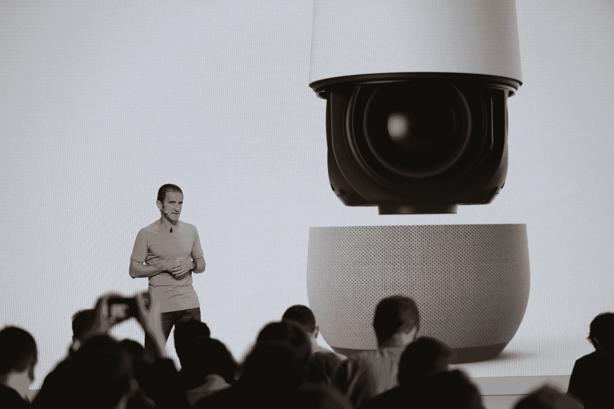
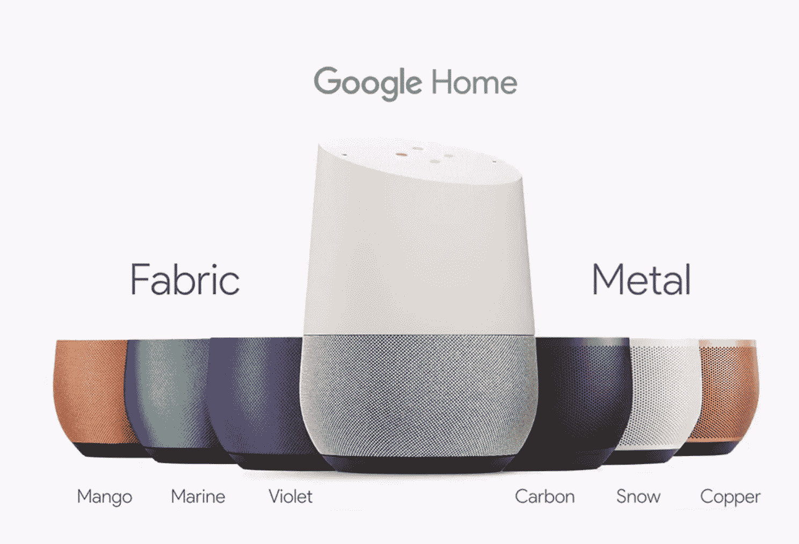

# Google Home 将于今日上市，售价 129 美元，11 月 4 日发货 

> 原文：<https://web.archive.org/web/https://techcrunch.com/2016/10/04/say-hello-to-google-home/>

谷歌主页(Google Home)是该公司对亚马逊(Amazon)的回应(Echo)的回应(T1)，在今年早些时候的谷歌 I/O 开发者大会(Google I/O developer conference)上正式亮相(T4)。从那以后，我们很少听说谷歌的声控个人助理。今天，在谷歌的年度硬件活动上，该公司终于向我们提供了更多细节。

Google Home 售价 129 美元(免费试用 YouTube red 六个月),今天在谷歌在线商店开始销售。它将于 11 月 4 日发货。

谷歌的马里奥·奎罗斯(Mario Queiroz)今天表示，我们的家与其他环境不同。所以像 Echo 一样，Google Home 结合了一个无线扬声器和一组麦克风，可以监听你的语音命令。家里有一个静音按钮，设备顶部有四个 led，这样你就知道它什么时候在听你说话；否则你不会在上面找到任何其他的物理按键。

因为谷歌希望家是你可以轻松放入客厅的东西，所以你可以从不同颜色的底座中选择，这将有助于你将家与室内设计的其他部分相匹配(尽管整体设计最适合帕洛阿尔托一个世纪中叶艾希勒的客厅)。谷歌辩称，它的设计灵感来自酒瓶和蜡烛，它将为这个家提供总共七个不同的底座。

然而，Google Home 真正要做的是 Google Assistant——我们目前所知的 Google Now 的下一代对话版本。如果 Google Home 上的 Google Assistant 有点像我们在 Google Allo 中看到的第一个以文本为中心的服务版本，那么它将为用户带来喜悦(当它做对时)和彻底的沮丧(当它做错时)。正如谷歌新的 Allo 聊天应用程序向我们展示的那样，谷歌助手经常无法回答你的问题。在屏幕上，这意味着谷歌可以向你显示链接，但在家里，它会读出谷歌搜索的片段。

【T2

谷歌今天强调，该公司希望能够将其服务个性化到我们都拥有“自己的谷歌”的程度。《谷歌助手之家》显然就是为此而生的。

一个新的助手功能，“我的一天”，也给你一个当前天气，通勤时间和你的日程安排摘要(假设你选择了)的早晨更新。

众所周知，谷歌在这方面起步较晚。凭借其 Echo 设备系列，亚马逊已经垄断了这种设备的大部分早期采用者市场。这一早期领先优势意味着亚马逊的 Echo 系列也适用于绝大多数智能家居设备，无论是 Nest 恒温器还是飞利浦 Hue 灯(亚马逊甚至将 Echo 与这些第三方设备捆绑销售)。

不出所料，谷歌已经与 Nest、Phillips、三星和 IFTTT 合作，支持他们的智能家居设备。合作伙伴并不多，但 IFTTT 本身已经支持了相当多的设备，谷歌可以搭上这个顺风车。

  

至于音乐，Google Home 将内置对 Google Play Music、Spotify、Pandora 等的支持。你也可以设置一个默认的音乐服务，这样你就不必总是告诉谷歌你想在“Spotify”上播放一首歌谷歌还指出，Home 的音乐搜索由谷歌提供支持，因此它可以理解相对复杂的查询。Google Home 上的音乐也将支持播客收听，因为它是一个 cast 设备，你可以从任何其他支持 Cast 的设备上向它传输音乐。

Home 直接与谷歌的 Chromecasts 和支持 Cast 的电视集成。目前，这主要意味着观看 YouTube 视频，但谷歌表示，它很快也会支持网飞。

[https://web.archive.org/web/20221118113306if_/https://www.youtube.com/embed/w-e_TPSUnbo?feature=oembed](https://web.archive.org/web/20221118113306if_/https://www.youtube.com/embed/w-e_TPSUnbo?feature=oembed)

视频

在过去几年中，谷歌主要致力于为智能家居设备创建协议，通过收购 Nest，它表明了自己成为市场主要参与者的意图。然而，在谷歌的领导下，Nest 停滞不前，尽管谷歌推出了 Chromecast 等热门产品，并推出了 OnHub 路由器，成为 Echo 竞争对手的核心产品，但其产品似乎缺乏重点。

随着 Home 的出现，这种趋势可能最终会改变。Google Home 最终为其产品提供了基于客厅的中心，像 Echo 一样，它相对来说是面向未来的，因为它的智能在云中。凭借其 Cast 协议，谷歌现在也有办法将家庭与其他设备联系起来，包括其非常成功的 Chromecast 加密狗。

这意味着它的硬件——尤其是麦克风——必须工作得非常好，不过，在我们对它做出任何结论之前，我们必须花一些时间亲自动手。谷歌辩称，其麦克风是“同类中最好的”，扬声器将提供丰富的低音。