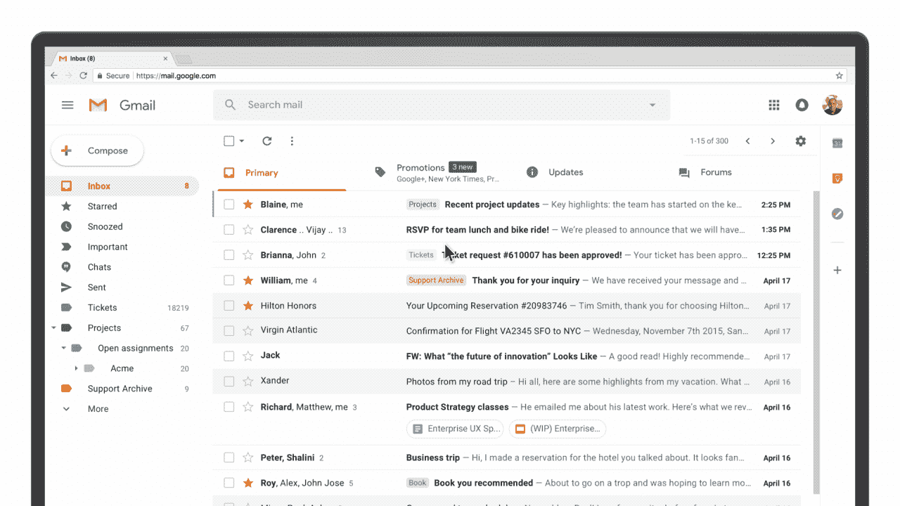
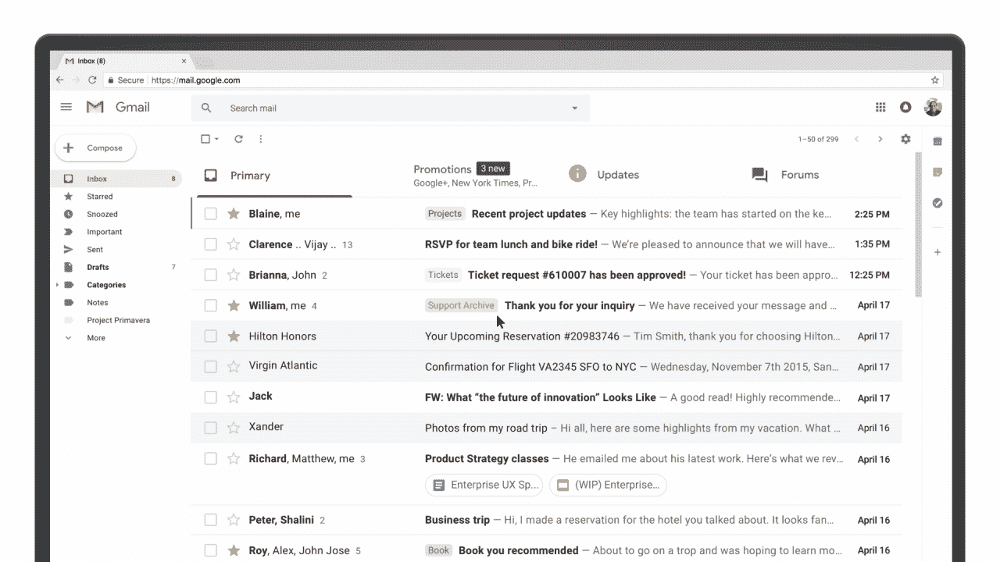

# 向更智能的新 Gmail 问好

> 原文：<https://web.archive.org/web/https://techcrunch.com/2018/04/25/say-hello-to-the-new-gmail-with-self-destructing-messages-email-snoozing-offline-mode-and-more/>

今天，谷歌推出了多年来最大的 Gmail 改版。该公司将在旗舰 Gmail 服务中引入许多(但不是全部)它在收件箱中试用的功能，并增加了一些新功能。关于这些新功能，我们在本月早些时候[首先](https://web.archive.org/web/20230311152801/https://techcrunch.com/2018/04/12/heres-what-the-new-gmail-looks-like/) [报道了](https://web.archive.org/web/20230311152801/https://techcrunch.com/2018/04/13/google-is-testing-self-destructing-emails-in-new-gmail/)，该公司也为这项服务引入了一个更新的设计，尽管如果你以前使用过 Gmail，你会有宾至如归的感觉。

如果你跟随[关注了最近几周的爆料](https://web.archive.org/web/20230311152801/https://techcrunch.com/2018/04/13/google-is-testing-self-destructing-emails-in-new-gmail/)，没有一个新功能会让你惊讶。谷歌将收件箱的一些功能引入 Gmail 也不足为奇。然而，在今天发布之前试用新服务时，让我感到惊讶的是，一些在泄露中没有得到太多关注的功能，包括内置谷歌日历的新的一致侧边栏、任务和保持集成，可能是这里最有用的新增功能之一。

但是让我们从头开始。新的 Gmail 有许多新功能。你可能注意到的第一件事是可以直接从收件箱里对邮件采取行动。就像在收件箱中一样，当你悬停在电子邮件上而不点击它时，你现在会看到图标来存档和删除邮件，并将其标记为已读(从未阅读过)。这里还有一个新的“小睡”功能的链接。

当你试图暂停一封邮件时，Gmail 会给你一个选项，让你在当天晚些时候、明天、本周晚些时候、周末或下周重新打开它。如果你喜欢干净的收件箱，这是一个保持收件箱空着的好方法，而且你可以放心，一封重要的电子邮件会重新出现在你的队列中。奇怪的是，打盹功能只能在收件箱中使用。当你真的在读一封邮件的时候，根本没有办法找到它。

如果你像我一样，不在乎收件箱有多乱，那么新的“轻推”功能就能派上用场。在这里，谷歌利用其人工智能计算出一条消息可能对你很重要，并重新显示它以提醒你跟进或回复。

谷歌现在也在使用这些相同的人工智能将智能回复功能带到网络上，你可能从 Gmail 移动应用程序中熟悉这一功能。

此更新中的另一个主要新功能是“机密模式”这里的想法很简单:当你写一封电子邮件时，你可以选择收件人能够阅读邮件的时间。收件人将无法转发、复制和粘贴、下载或打印内容。你当然不能阻止任何人给屏幕拍照，但更重要的是，如果任何人黑了收件人的账户，那封载有你机密信息的电子邮件将会消失。为了增加安全性，您还可以在这里添加第二因素身份验证，收件人必须收到带有谷歌生成的密码的短信才能阅读电子邮件。

Gmail 的其他新功能包括高优先级通知和退订建议，高优先级通知只会在谷歌认为新邮件非常非常重要时通知你，退订建议会在你似乎停止阅读某个时事通讯的消息时提醒你退订(毕竟，低打开率是时事通讯出版商的克星，所以如果你离开，他们不会介意)。

但是等等，还有更多(我有没有提到这是一个重大更新？).Gmail 也获得了一个新的内置离线模式，因为它现在是一个完全成熟的渐进式网络应用程序。例如，你可以存储长达 90 天的电子邮件并进行搜索。这项新功能将在未来几周内推出。

也许我最喜欢的新功能——也是收件箱中没有的功能——是新的右侧边栏，它预装了一个智能的谷歌日历小部件，让你可以查看一天的活动，并让你从收件箱中添加新的活动。

侧边栏还提供了用于记笔记的 Google Keep(虽然遗憾的是，它看起来不像可以将笔记附加到电子邮件中，甚至可以放入笔记中)和 Google Tasks。任务实际上与你的电子邮件有点联系，因为你可以将电子邮件拖放到侧边栏来创建新任务。就我个人而言，我使用 Trello 插件(所有常规的 Gmail 插件仍然可以在新的 Gmail 上使用)，但我相信人们会发现这有很多用途。

所有这些新功能都得到新设计的支持，这本身更像是一次更新，而不是一场革命。像以前一样，您可以在三种密度设置之间进行选择:默认、舒适和紧凑。默认设置是最有趣的选项，因为它还有一个新特性:附件夹。现在，新的 Gmail 不再只是在收件箱中显示标准的回形针来表示电子邮件链中包含附件，而是在收件箱视图中的邮件预览下方突出显示附件。

 与 Gmail 的收件箱不同，你不会在这里看到图片的完整预览，但你可以在不打开邮件的情况下直接点击附件。

值得指出的是，许多标准的 Gmail 功能没有任何用处。例如，您仍然可以使用优先收件箱和明星信息。您仍然可以将电子邮件分类并过滤到不同的文件夹/类别中。如果你喜欢谷歌对促销邮件、社交媒体更新、时事通讯等的自动过滤。，那你也还可以用那些。尽管没有人真正理解谷歌的社交网站计划到底是什么，但它仍然在你的收件箱里。

遗憾的是，我最喜欢的收件箱功能之一是[旅行邮件自动分组](https://web.archive.org/web/20230311152801/https://support.google.com/inbox/answer/6228360?hl=en)(想想航班确认、汽车和酒店预订等。)合并成一个包，还没有转移到 Gmail。也许这一天会到来。

新设计现在正在向普通 Gmail 用户推出。像往常一样，你可以先来回切换。然后，在未来的某个时候，谷歌会将所有用户切换到新的设计。对于企业用户，G 套件管理员必须通过注册 G 套件早期采用者计划来启用这些新功能。