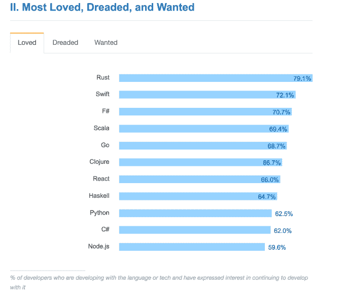

# Scala 是新的金童 

> 原文：<https://web.archive.org/web/https://techcrunch.com/2016/06/14/scala-is-the-new-golden-child/>

克里斯·麦金莱撰稿人

克里斯·麦金莱是的高级数据科学家

[DataScience](https://web.archive.org/web/20230209131833/http://www.datascience.com/)

.

数据科学社区中的工具发展很快，为一项工作选择正确的工具——更不用说职业生涯了——经常会产生分歧。你应该努力掌握哪些工具？难度、相关性和潜力之间的适当平衡是什么？

如果还没有的话， [Scala](https://web.archive.org/web/20230209131833/http://www.scala-lang.org/) 应该在你的学习清单上或者接近清单的顶端——去年秋天，当我离开博士后岗位，考虑离开学术界进入科技行业时，我看到了明确的证据。

在我开始找工作的时候，我决定在做出任何职业决定之前，广泛撒网，和许多公司交谈。我最初的想法是通过《麻省理工科技评论》列出的 2015 年最具创新性的 50 家公司[来申请每家公司的数据科学家职位。我最终采访了 54 家公司，并对其中的 24 家进行了技术采访。](https://web.archive.org/web/20230209131833/https://www.technologyreview.com/lists/companies/2015/)

我做的技术筛选通常持续一个小时，涉及两到四个编码问题，我在一辆 [REPL](https://web.archive.org/web/20230209131833/http://scala-repl.org/code/welcome) 中实施，面试官在一旁观看。概率和统计问题要么留到现场面试，要么完全取消(尽管我可能通过了，因为我有博士学位)。

除了少数例外，Python 显然不被人喜欢。当然，从来没有人明确告诉我不能用 Python 解决问题。编码环境总是有一个 Python 解释器，但面试官通常会建议我使用“编译语言”(即 Java)，他们会提出用 Python 很难解决的数据结构问题。例如，我经常看到的一个问题是:

*跟踪整数流中第 k 个最大的元素。*

这是一个经典的堆问题。然而，Python 没有合适的集合库，所以为了解决这个问题，我会尝试导入一个专门的模块，比如 heapq，它通常不包含在面试环境中。这造成了一个尴尬的局面。即使我最终解决了一个问题，反馈也是不冷不热的。

> 如果你只有扳手的话，你可以用它来钉钉子。但是你最好花些时间学习如何使用锤子。

效果非常显著，在我的第一周之后，我决定尝试在 Scala 中做我的技术屏幕。我这样做违背了几个朋友的建议，他们建议我忍气吞声，用 Java。我一直在玩 Scala 的一个附带项目( [PageRanking Soundcloud](https://web.archive.org/web/20230209131833/https://github.com/cem3394/ante) )，比起 Java，我更喜欢 Scala，尤其是在实时编码环境中。我想既然我不打算马上找工作，我可以取消自己几次资格。

我的发现令我吃惊。首先，面试官实际上鼓励我使用 Scala，即使他们并不熟悉这种语言。他们会相信 REPL 会审核我的代码，并利用这段时间来解决更一般的问题。第二，放映的基调完全改变了——它们明显变得更加乐观和散漫。

审查人员会聊起编程语言，然后在 Twitter 上关注我。我开始享受这个过程。我在 LinkedIn 和 AngelList 上添加了 Scala 和 Spark。这导致我收到的外来兴趣数量明显上升，尤其是来自招聘人员的兴趣。技术屏幕变得更加以 Scala 为中心。

起初，我认为这种效果是保罗·格拉厄姆[关于编程语言的著名观点](https://web.archive.org/web/20230209131833/http://paulgraham.com/pypar.html)的一个例子(有趣的是，他在 2004 年写这篇文章时指的是 Python):

*如果你想得到一份好工作，要学习的语言是人们不仅仅为了得到一份工作而学习的语言。*

有大量证据表明，开发人员对 Scala 的兴趣正在上升。Stack Overflow 最近的开发者调查将 Scala 列为最受欢迎的语言之一:

然而，在许多情况下，他们感兴趣的更接近的原因是 Spark，它最近超过了 Hadoop，获得了最活跃的开源数据处理项目的称号。Spark 本质上是分布式 Scala 它使用了 [Scala-esque](https://web.archive.org/web/20230209131833/http://www.dreamincode.net/forums/topic/377716-a-functional-programming-primer-for-spark/) 的思想(闭包、不变性、惰性求值等等)。)通篇。Java 和 Python APIs 在语义上与系统的核心设计创新相去甚远。

此外，与 Java 不同，Scala 让 Spark 的实验变得不那么痛苦。Vladimir Rokhlin 曾经说过，您对工具链的熟悉程度是您调试代码能力的主要决定因素。越难检查的东西，你越不可能去检查。探索性数据分析和建模也是如此:使用 Hadoop 很难采取快速、迭代的方法来分析和建模 TB 级和 Pb 级的数据集。

另一方面，使用本机实现语言在 Spark 中工作所获得的生产率提升是难以估量的。对于小型测试和大型作业，对于批量数据或流数据，对于特别分析或生产机器学习模型，您可以使用相同的 API(通常是相同的代码)。

> (数据科学家的)工具在我们的领域来来去去相对较快；想法不那么。

Scala 和 Spark 还会教你有用的抽象——特别是关于现代函数式编程，通用分布式数据分析中最强大的编程范例。在一个并行性和抽象性日益增加的时代，不理解这些将会使你处于竞争劣势。相反，如果你能像单子一样思考相对深刻的思想，你将在未来的许多年里很好地解决分布式数据科学中的难题。

理论上，你可以用 Python 或 R 学习这些抽象——它们绝不是 Scala 特有的。例如，Hadley Wickham(R studio 的首席科学家和 R 数据科学社区的神经中枢)最近开始用 R 中的单子做实验。

但实际上你可能不会，因为单子和[其他现代函数抽象](https://web.archive.org/web/20230209131833/http://programmers.stackexchange.com/questions/279316/what-exactly-makes-the-haskell-type-system-so-revered-vs-say-java)在 Python 或 R 中实际上是不存在的——这两种语言在 SLOC 或处理的字节方面都不是为可伸缩性而设计的。

相比之下，为了在 Scala 中完成任何有意义的事情，你将被迫吸收一大堆将在未来几年对你的专业有帮助的想法，即使你转向其他语言。这有助于你避免陷入局部最优——如果你只有一把扳手，你可以用它来敲钉子。但是你最好花些时间学习如何使用锤子。

这是一个很好的教育策略——它本质上与麻省理工学院在 Scheme 中教授他们的[计算机科学导论课](https://web.archive.org/web/20230209131833/https://en.wikipedia.org/wiki/Structure_and_Interpretation_of_Computer_Programs)时使用的策略相同。像这样的教育策略对数据科学家来说很重要，因为工具在我们的领域来来去去相对较快；想法不那么。因此，你要学习的工具是那些富有前瞻性思想的容器。

Scala 和 Spark 正是如此；此外，它们现在处于最佳状态，作为同类最佳的工业工具，它们已经彻底去风险化，但尚未占据主导地位。这实际上创造了一个申请人的市场——Scala 和 Spark 在美国需求很大，无论是一般需求还是具体的数据科学角色。

最终，我的 Scala 知识让我在洛杉矶的一家初创公司找到了工作，除了 Spark 之外，我每天都在使用它。我并不孤单:Scala 已经被网飞、LinkedIn 和 Twitter 这样的公司大量使用，每天都有更多的企业 [接受它](https://web.archive.org/web/20230209131833/https://angel.co/jobs#find/f!%7B%22keywords%22%3A%5B%22Scala%22%5D%7D)。因此，如果你正在寻求增长知识和工作前景，现在是一个选择一些新工具的好时机——那些为可扩展性而设计的工具。