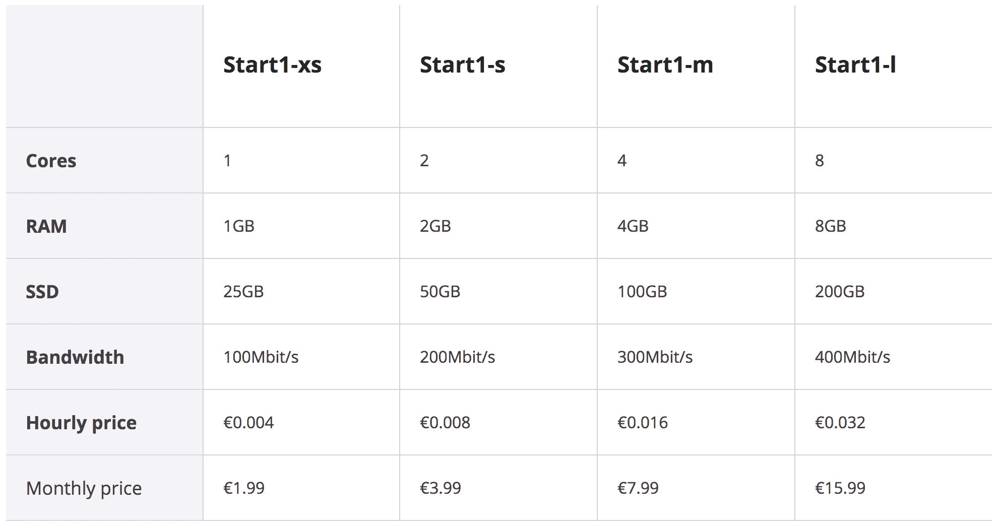

# Scaleway 推出每月 2.40 美元的更新云服务器 

> 原文：<https://web.archive.org/web/https://techcrunch.com/2018/05/03/scaleway-launches-updated-cloud-servers-for-2-40-per-month/>

# Scaleway 推出每月 2.40 美元的更新云服务器

法国云托管公司 [Scaleway](https://web.archive.org/web/20221129125536/https://www.scaleway.com/) 宣布[为其云产品提供新的服务器](https://web.archive.org/web/20221129125536/https://blog.online.net/2018/05/03/introducing-scaleway-nextgen-nvme-cloud-servers-with-hot-snapshots/)。虽然该公司的产品已经相当便宜，但 Scaleway 更进一步，价格从每月 1.99€(约合每月 2.40 美元)起。

以这个价格，您可以获得一台 x86 服务器，它具有 1 个内核、1GB 内存、25GB 固态硬盘、100 兆位/秒的带宽和无限传输能力。两倍的价格，你得到两倍的规格，等等。这个新的 Start1 云服务器系列有四层。

Scaleway 首次将 NVMe 用于其固态硬盘存储。 [NVMe](https://web.archive.org/web/20221129125536/https://en.wikipedia.org/wiki/NVM_Express) 是一种存储协议，在处理存储驱动器上的读写指令时，它应该比 SATA 快得多。它是为固态硬盘设计的，iMac Pro 现在用的就是固态硬盘。Scaleway 也在使用 DDR4 来提高 RAM 性能。

总的来说，Scaleway 认为每个内核的性能应该会提高 50%。这些新服务器已经在巴黎的数据中心投入使用，很快也将在阿姆斯特丹投入使用。

除了这些新服务器，Scaleway 还在测试版中推出了热快照。借助该功能，您可以在虚拟机运行时拍摄其快照。然后，您可以使用完全相同的快照启动另一台服务器。它为自动化和备份开辟了许多可能性。

该公司最近还承诺[会有一个更好的 ImageHub](https://web.archive.org/web/20221129125536/https://blog.online.net/2018/04/19/scaleway-feature-improvements-custom-kernel-security-group-live-reload-imagehub-packer/) 进行更多更新。例如，几周前发布的新的 Ubuntu 长期支持版本现在可以在大多数服务器上使用。Scaleway 还支持 [Terraform](https://web.archive.org/web/20221129125536/https://www.terraform.io/docs/providers/scaleway/) 来协调您的云基础设施。

现有的 x86 云服务器正在被淘汰。高端 x86 云服务器和 ARMv8 云服务器还在徘徊。裸机 ARMv7 和 x86 服务器也仍然可用。

Scaleway 是法国主要互联网服务提供商之一 Iliad 的云托管部门。该部门最近获得了新的现金流入，以进入下一个层次。在这些产品更新之后，你可以期待在未来几个月的国际化举措。