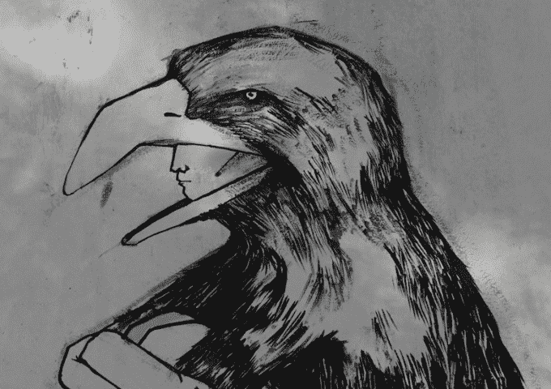
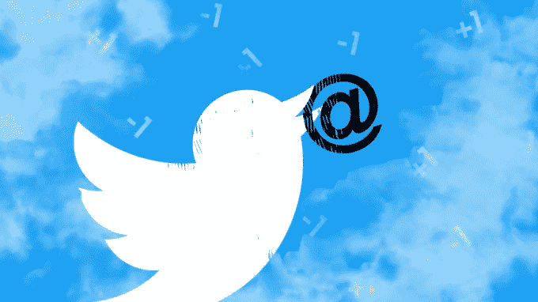
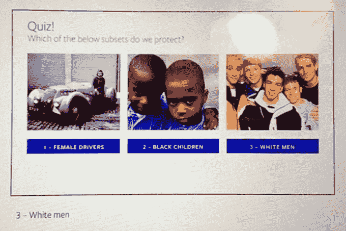

# 被“言论自由”压制的 

> 原文：<https://web.archive.org/web/https://techcrunch.com/2017/10/16/scaling-civility/>

固执地支持“言论自由”和运营一个全球社交网络进行公民公共讨论之间存在着根本性的矛盾。Twitter 正在为此苦苦挣扎。脸书也在苦苦挣扎。增加一点透明度，或者希望普通公民做正确的事情，都不能解决这个问题。

美国建国所依据的言论自由原则并没有考虑到我们现代的相互联系，也没有适应这一原则。这个想法是任何人都可以说出他们的信仰，而不会因此被监禁。并不是每个地方的人都必须听它。

在街上大喊大叫，在街头演说，在广播里漫步，在电视上吹喇叭。那些不同意你或者你谴责的人仍然有权利走开或者改变频道。但是在今天的社交网络上，骚扰者、流氓和极端分子可以找到你。

## 在“言论自由”的幌子下允许虐待，实际上是通过允许犯罪者迫使受害者保持沉默，直到他们撤退，从而废除了言论自由。从这些应用程序。从他们的原因。从他们的信仰。

公民言论自由被牺牲，换来的是仇恨、堕落和威胁。如果他们的信念立即被喊了下去，谁还能恭敬地为他们说话呢？多年来，妇女和有色人种一直受到[这种](https://web.archive.org/web/20221208043734/https://www.salon.com/2016/08/09/normani-kordeis-twitter-abuse-the-troll-problem-keeps-getting-worse-especially-for-women-and-people-of-color/) [方式](https://web.archive.org/web/20221208043734/https://www.dailydot.com/irl/leslie-jones-twitter-abuse/)的攻击，多年来[一直要求](https://web.archive.org/web/20221208043734/https://beta.techcrunch.com/2014/10/18/gamergate-tactics/)[改变](https://web.archive.org/web/20221208043734/http://www.takepart.com/article/2016/11/18/harassment-twitter)。白人男性在很大程度上控制着这些服务和传统媒体，是时候将他们作为袖手旁观的盟友并采取实际行动了。作为一名白人男性记者，我在这个问题上做得不够。

规则必须改变。执行必须变得更加严格和更加一致。但是，这些新的通信设施的经营者也必须坚持言论自由的精神，而不是字面意思。这将需要具有挑战性、混乱、昂贵和低效的解决方案。换句话说，人类的解决方案。

生硬算法的全面修复是不够的。同理心必须参与创造新的规则，审查报告和呼吁，并建立工具来扩展我们对人性的理解，而不是取代它。

文明是混乱和审查之间的一根钢索。

不育不是解决办法。极权主义的反乌托邦和无政府主义的一样多。这些社交网络的领导者对越过安全界限进入审查制度保持谨慎是正确的。推特和脸书不应该成为真相警察或思想警察。

但目前的平衡倾向于混乱，一个由强人和愤怒的暴民统治的景观。我们没有明确的自上而下的审查，而是隐含的对等审查。也不是真正的言论自由。

实际上，Twitter 需要改变回复的方式，因为它们是滥用的主要载体。滥用者可以@回复您并显示在您的通知中，即使您没有遵循他们。如果你屏蔽或静音他们，他们可以创建一个新的一次性帐户，并继续滥用。如果你屏蔽了所有你不关注的人的通知，你就切断了与陌生人或潜在朋友进行体贴讨论的联系——这本来是这些服务的核心附加值。

防止这种@ reply 滥用的一个强有力的方法是阻止那些没有完整注册有效电话号码、没有表现出足够遵守规则的行为或被举报违反政策的帐户将其回复显示在收件人的通知中。

这至少会使骚扰者更难继续他们的虐待，并创造新的一次性帐户，绕过以前的封锁和禁令，以传播仇恨。

脸书的内容节制培训手册解释说，“白人”不受仇恨言论的影响，但“黑人儿童”不受影响图片来自 [ProPublica](https://web.archive.org/web/20221208043734/https://www.propublica.org/article/facebook-hate-speech-censorship-internal-documents-algorithms?utm_campaign=sprout&utm_medium=social&utm_source=facebook&utm_content=1498662906)

脸书需要重新评估其仇恨言论法规，该法规允许一些公然贬损的内容在审查积极分子的同时继续存在。根据脸书的内容版主[培训文件](https://web.archive.org/web/20221208043734/https://www.propublica.org/article/facebook-hate-speech-censorship-internal-documents-algorithms?utm_campaign=sprout&utm_medium=social&utm_source=facebook&utm_content=1498662906),“白人”不受辱骂性言论的保护，因为这两个词都是人的“受保护类别”，而“黑人儿童”不是，因为年龄不受保护，使种族保护无效。七十个民权和种族正义团体[向](https://web.archive.org/web/20221208043734/https://www.theguardian.com/technology/2017/jan/18/facebook-moderation-racial-bias-black-lives-matter)脸书请愿要求变革。与此同时，巨魔之前已经大量报道了活动人士的[个人资料](https://web.archive.org/web/20221208043734/https://beta.techcrunch.com/2016/12/22/facebook-ban-leslie-mac/)和[页面](https://web.archive.org/web/20221208043734/http://observer.com/2017/05/facebook-atheist-ex-muslim-blocked/)，目的是让他们暂停活动。

脸书对内容调节的色盲和音盲的方法必须被彻底改革，以采用一种交叉模型，这种模型是由谁经常是受害者的更多背景形成的。如果自动化系统不能可靠地识别什么是正确的，那么强制执行的决定就需要向人类提出来。

五年来，这些平台上的滥用行为一直很猖獗。上面的[承诺](https://web.archive.org/web/20221208043734/https://www.theguardian.com/technology/2013/aug/03/twitter-rules-abuse-rape-bomb-threats)到[破解](https://web.archive.org/web/20221208043734/https://www.washingtonpost.com/news/the-intersect/wp/2014/11/06/unprecedented-partnership-will-tackle-abuse-of-women-on-twitter/?utm_term=.89a93c761641) [下来](https://web.archive.org/web/20221208043734/https://www.usatoday.com/story/tech/news/2017/02/07/twitter-says-it-is-cracking-down-on-abuse-again/97574368/)已经发出差不多一样久了。本周，Twitter 首席执行官杰克·多西再次发誓要加强执行力度。

但是社交网络再也不能在“言论自由”的标签下隐藏骚扰了。在这个时候，冷静的讨论比以往任何时候都更重要，以确保健康的民主，不能让侵略战胜诚信。

社交网络不能因为害怕失去用户而对骚扰手软。短期的煽动性参与不应优先于长期包容所有愿意参与民间在线社区的声音。只有到那时，通过敌意强加的沉默才会被解除。