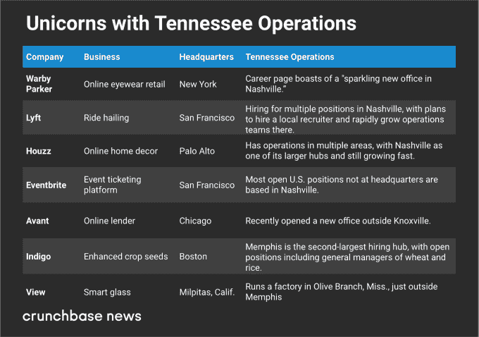
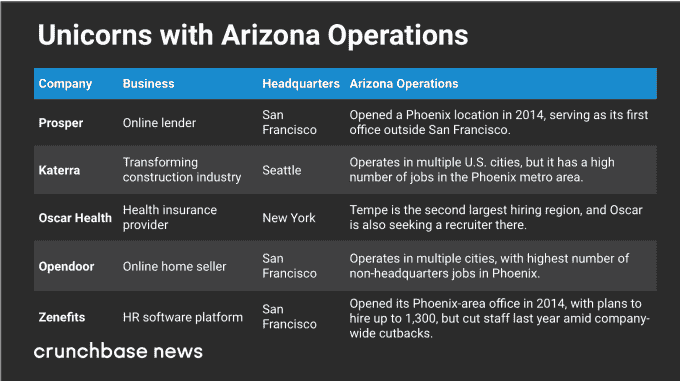

# 规模不断扩大的初创公司正在这些城市建立二级中心 

> 原文：<https://web.archive.org/web/https://techcrunch.com/2018/06/02/scaling-startups-are-setting-up-secondary-hubs-in-these-cities/>

乔安娜·格拉斯纳撰稿人

More posts by this contributor

在 Amazon.com 高调寻求第二总部的过程中，美国的市长们在过去的九个月里相互绊倒，以讨好它。

然而，更不为人知的是，一个类似的故事正在创业领域上演。许多最有价值的风险投资支持的公司正走出其高成本的总部，在较小的城市建立二级中心。

他们要去哪里？纳什维尔很受欢迎。凤凰也是。波特兰和罗利也有一些工作机会。许多公司也有大量的远程招聘，寻找拥有令人垂涎的技能但不想被调动的候选人。

这些是 Crunchbase News 对美国独角兽企业[的地理招聘行为进行分析后得出的一些结论。由于这些公司大多位于高成本地区，如旧金山湾区、波士顿和纽约，我们正在研究是否有一种在更小、更便宜的城市设立办事处的模式。(有关调查技术的更多信息，请参见下面的方法部分。)。)](https://web.archive.org/web/20221209140426/https://www.crunchbase.com/lists/us-unicorns/2b182d30-b87c-47c4-aec8-dce5fc18d4d2/organization.companies)

以下是一些热点地区的情况。

## 纳什维尔

一个令人惊讶的发现是纳什维尔在创业办公室的次要地点中的突出地位。

我们发现至少有四家独角兽公司在纳什维尔的办事处规模不断扩大，另外三家在田纳西州其他城市或周边地区的业务也在不断增长。以下是一些热爱田纳西的创业公司:

当我们提到纳什维尔对独角兽的欢迎令人惊讶时，这主要是因为这座城市并不以科技初创公司或风险投资的主要中心而闻名。也就是说，它有很多属性，是二级办公室的实用和理想的位置。

纳什维尔的吸引力包括高生活质量评级、不断增长的人口和经济、温和的气候和大量现场音乐。尽管纳什维尔的房地产市场在过去几年里一直在上涨，但房价和整体生活成本仍远低于硅谷和纽约。工人的额外津贴:田纳西州没有工资所得税。

## 凤凰

凤凰城是初创公司的另一个热门选择，特别是寻求低成本客户服务中心和其他需要大量员工的业务的西海岸公司。

在下图中，我们看到了这座沙漠城市中拥有大量员工的五家独角兽企业:

负担能力、扩张的便利性和大量的就业人口看起来是凤凰城吸引力的重要因素。住房和总体生活成本比沿海大城市便宜得多。而且有足够的空间伸展。

一篇关于新办公室开张的文章也提到了低工作流失率是凤凰城吸引人的地方，这是一个有趣的概念。像旧金山和纽约这样的创业中心有很多跳槽的人，尤其是那些拥有热门技能的人。规模公司可能会寻找以年而不是月来衡量工作任期的人。

## 这些不是唯一的地方

纳什维尔和凤凰城并不是独角兽公司设立二级办公室的唯一热点。许多其他城市也出现了一些大规模的创业活动。

先说北卡罗来纳州。众所周知，三角研究区有很多 STEM 毕业生，所以总部设在其他地方的高科技公司可能仍然想要一个本地基地是有道理的。一家这样的公司是网络安全独角兽公司 [Tanium](https://web.archive.org/web/20221209140426/https://www.crunchbase.com/organization/tanium) ，它在这个领域有很多技术职位空缺。另一个是软件容器化技术开发商 Docker T6，该公司在罗利有职位空缺。

奥兰多大都会区脱颖而出主要是因为最近估值达到 50 亿美元的零费用股票和加密交易平台 Robinhood。这家总部位于硅谷的公司在奥兰多郊区的玛丽湖有大量的空缺职位，包括人力资源和合规工作。

与此同时，波特兰刚刚吸引了另一只热爱加密的独角兽，数字货币交易平台[比特币基地](https://web.archive.org/web/20221209140426/https://www.crunchbase.com/organization/coinbase)。这家总部位于旧金山的公司最近在俄勒冈市开设了一个办事处，目前正在招聘中。

## 任何有屏幕的地方

但是，你不一定要去某个特定的地方才能在许多快速发展的初创公司找到工作。许多独角兽公司都有大量的远程职位，包括本地可能难以填补的专业技术职位。

[GitHub](https://web.archive.org/web/20221209140426/https://www.crunchbase.com/organization/github#section-overview) 是一个开发工具的公司，开发者可以用它来进行远程项目合作，它在实践它的代码方面做得特别好。这家总部位于旧金山的公司有相当数量的工程职位对远程工作者开放，其他部门也有一些针对远程工作者的职位。

其他有少量远程开放机会的公司包括硅谷的网络安全提供商 CrowdStrike、企业软件开发商 Apttus 和 Docker。

## 不是每个人都这样做

当然，并不是每个独角兽都在开设大型二级办公室。许多人更喜欢让员工离家更近，试图用别致的工作场所和丰厚的福利来吸引员工。其他公司发现，当他们扩张时，去另一个高成本的地方是有战略意义的。

尽管如此，二级中心现象可能会部分缓解一些人的抱怨，即一些地区攫取了过多的风险资本。虽然独角兽的总部仍然集中在少数几个城市，但至少它们也在其他地方展开翅膀，提供更多的就业机会。

#### 方法学

在此分析中，我们关注了在北美其他城市设有二级办事处的美国独角兽公司。我们从 125 家美国公司的名单开始，查看他们网站上的空缺职位，重点是工作地点。

我们排除了与代表当地市场相关的工作机会。例如，一家旧金山公司在芝加哥寻找销售代表，向芝加哥客户销售产品，但这不算数。相反，我们为处理核心业务的团队成员寻找空缺，包括工程、财务和公司范围的客户支持。我们还排除了北美以外的二级办事处。

此外，我们主要寻找向低成本领域扩张的公司。在很多情况下，我们确实看到一些公司在其他高成本地区战略性地增加员工，比如纽约和硅谷。

最后一点要注意的是德克萨斯州的奥斯汀。我们确实看到了一些其他地方的独角兽公司在奥斯汀有职位空缺。然而，我们没有将这座城市包括在上面的部分中，因为奥斯汀虽然比硅谷的成本更低，但它本身也可能是一个大型、成熟的技术和创业中心。