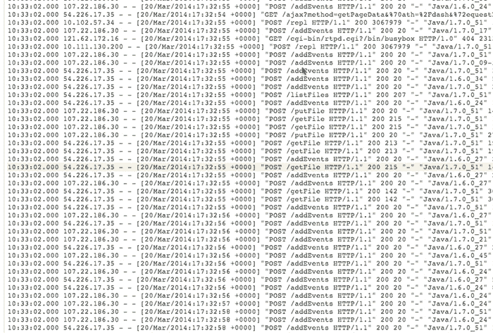

# Scalyr 为其日志监控和分析服务 TechCrunch 筹集了 210 万美元的种子资金

> 原文：<https://web.archive.org/web/https://techcrunch.com/2015/04/22/scalyr-raises-2-1m-seed-round-for-its-log-monitoring-system/>

日志监控服务 Scalyr 今天宣布，它已经获得了由 Susa Ventures 领投的 210 万美元的种子资金。Scalyr 是一家日志监控服务公司，可以让开发者更深入地了解他们的应用程序的运行情况(或者为什么没有运行)。这一轮的其他参与者包括彭博测试版、谷歌风投和谢帕洛风投。

这是一个非常杰出的投资者群体，起初这似乎是一个有点深奥的产品，但 Scalyr 的创始人史蒂夫·纽曼之前创建了 Writely，然后他将该公司出售给谷歌，并形成了谷歌文档的基础。

纽曼告诉我，Scalyr 最初的想法实际上是在他在谷歌工作期间形成的。像其他企业一样，谷歌使用各种工具来运行其服务，所有这些工具都有自己的工具集来跟踪性能和诊断问题。纽曼说:“我们使用服务器日志和其他数据，但是从一个工具跳到另一个工具并关联许多不同的东西的工作量变得很大。”

Scalyr 背后的想法是从服务器日志中获取所有这些数据，以及各种指标、错误报告和其他性能数据，并通过一个工具运行它，您可以从中获取可操作的数据。像 [Splunk](https://web.archive.org/web/20221208193535/http://www.splunk.com/) 和 [Loggly](https://web.archive.org/web/20221208193535/https://www.loggly.com/) 这样的服务提供类似的日志管理服务，但是纽曼说这些工具让人们很容易看到趣闻轶事，很难将它们汇总成一个概览。他还指出，他也不认为 New Relic 是竞争对手，因为该公司的重点往往是性能，而 Scalyr 更关注错误。

日志文件可能会很快变得非常大，分析它们需要相当多的计算能力。该团队为其服务构建了一个新的[数据管理引擎](https://web.archive.org/web/20221208193535/http://blog.scalyr.com/2014/05/searching-20-gbsec-systems-engineering-before-algorithms/)来处理所有这些数据。

Scalyr 团队已经为这项服务工作了大约三年。两年前，他们进行了一次低调的发布，但在与早期客户合作、改进和验证产品时，他们决定低调行事。既然团队有了这笔额外的资金，它也准备好迎接更多的客户。

纽曼告诉我，他对核心产品的状态感到满意，但该公司计划推出更多连接器，以便开发人员可以从更多来源获取数据(今天，它提供了一个代理，开发人员可以安装在他们的机器上，并支持 Heroku 和亚马逊的 RDS 和 CloudWatch 服务等)。纽曼告诉我，他的目标之一也是给用户更多的指导，帮助他们弄清楚应该运行什么样的查询来充分利用他们的数据。

目前，Scalyr 是一个四人团队，但公司计划用新的资金再雇佣几个人。