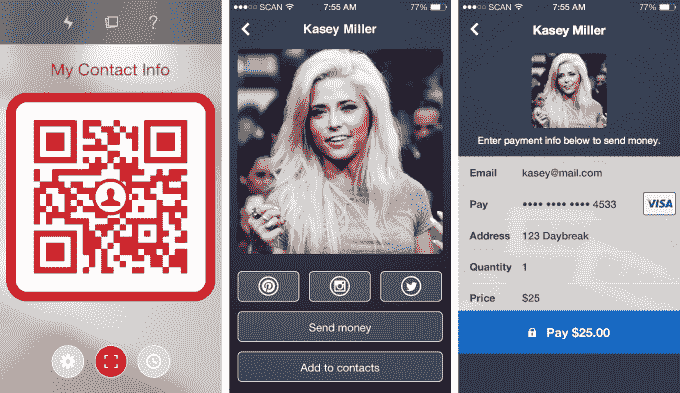

# 扫描制作二维码身份剧

> 原文：<https://web.archive.org/web/https://techcrunch.com/2014/07/02/scan-makes-a-qr-identity-play/>

试图通过二维码将实体企业与用户联系起来的公司 Scan 正步入身份和支付领域。

新版 Scan 的应用程序增加了一个“代码钱包”，可以用来存储你扫描或经常使用的代码。它还可以存储您可以在设备上生成的个人身份代码。

事实上，Scan 的每个用户，到目前为止超过 7500 万，一旦他们更新了应用程序，就会有一个个人二维码可供他们使用。这个代码有效地充当了一个身份，他们可以用它来引导人们访问社交媒体档案、Instagram 帐户、个人网页等等。

Scan 创始人加勒特·吉(Garrett Gee)表示，这应该会降低人们的门槛，因为他们以前可能从来不知道他们可以使用二维码来创建一个易于转移的身份。

结合他们去年年底首次推出的扫描支付技术，用户将能够向他人提供该代码，直接接受支付。朋友欠你几块钱？让他们扫描你的代码然后给你钱。

举个例子，这是 Serena Martineau 的[扫描页面，她是一名自由摄影师，使用 Scan 来推广她的业务并直接接受付款。](https://web.archive.org/web/20230401015123/https://scan.me/7kr4m2)

[Scan](https://web.archive.org/web/20230401015123/http://www.crunchbase.com/organization/scan) 已经[从 Entree](https://web.archive.org/web/20230401015123/https://techcrunch.com/2013/10/09/thing/) 、Menlo Ventures、Google Ventures、Charles River Ventures、Start Fund、Social + Capital Partnership、Transmedia Capital、Ludlow Ventures 和天使 Ariel Poler、AngelList 的 Naval Ravikant、Raptor Group 的 Jim Pallotta 和 Troy Carter 共融资 1520 万美元。

Scan 仍然是 App Store 中最受欢迎的代码阅读器之一，每天有大约 50，000 个新安装。Scan 在 2012 年推出了其商业页面，现在已经有 15 万个商业页面使用其网站来创建和管理代码。网站上每天使用大约 80，000 个代码。虽然 Scan 也可以读取条形码进行价格核对，但 Gee 最近告诉我，iOS 设备上大约 65%的扫描都是二维码。

这些代码中的每一个都与某种类型的操作相关联，这实际上是 Scan 带来的核心内容。二维码技术被滥用的情况数不胜数，但一些最严重的错误在于没有在扫描时给人们一个离散的操作。

如果你扫描了一个代码，然后毫无目的地被转到了一个网站上，那么你已经被这个代码的创建者打败了。通过为企业和现在的个人创建一个框架，为用户提供专注的体验，Scan 是 QR tech 的最佳开端。

如果 Scan 想成为任何类型的身份提供者，它都有自己的工作要做。但这是一个创新时机已经成熟的领域，所以我很想看看这将如何实现。数字身份是我们面临的最大的未解决问题之一，我预计几乎所有的专业公司都会很快在这个领域有所作为。尝试弄清楚这一点——并推进其连接数字和物理空间的哲学——似乎是 Scan 的一个好方向。

具有讽刺意味的是，对于像 Scan 这样的公司来说，最好的事情之一就是像苹果这样的公司在库存相机中加入代码读取功能。被 Sherlocked 实际上可以极大地促进 Scan 的业务。毕竟，Scan 的秘密在于它如何处理扫描后的动作，而不一定是扫描本身。

当然，这里还有其他机会，因为信标的扩散推动了超本地、上下文准确的交互。Gee 表示，Scan 正在使用 beacon 技术，但目前没有任何信息可以分享。

此外，值得注意的是，信标背后没有多年的滥用，这种滥用促使二维码成为一种技术笑点。

该应用程序在 iOS 和 Android 上都可用[这里](https://web.archive.org/web/20230401015123/https://scan.me/download)。