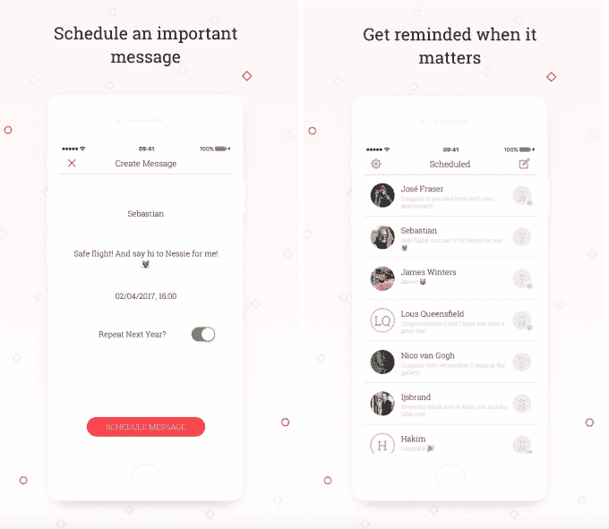

# Scheduled 是一个新的应用程序，可以让你安排你的短信

> 原文：<https://web.archive.org/web/https://techcrunch.com/2017/03/30/scheduled-is-a-new-app-that-lets-you-schedule-your-text-messages/>

想记得跟朋友说生日快乐，祝好运或者恭喜？凌晨 1 点，你突然想到有一个客户的后续问题？想写一封发自内心的感谢信以便日后收到吗？不幸的是，无论是短信还是包括 iMessage 在内的大多数消息应用都不允许你提前起草文本，并安排在稍后的日期发送出去。但是一个名为 [Scheduled](https://web.archive.org/web/20230328073542/https://scheduledapp.co/) 的新 iOS 应用程序可以帮上忙。

需要澄清的是，该应用程序实际上并没有为*自动*发送安排文本。

为此，你需要黑掉你的 iPhone，改用越狱应用中的[。苹果官方不允许这项功能。](https://web.archive.org/web/20230328073542/https://techcrunch.com/2017/03/30/twitter-stops-counting-replies-towards-its-140-characters/)

Scheduled 所做的是提供一个 App Store 认可的安排文本的工作区。

该应用程序本身简单易用。

您首先从通讯录中选择要发送短信的人，然后编写要发送的短信，并选择提醒您发送短信的时间。当该时间到来时，Scheduled 会向您发送推送通知，以便您可以返回应用程序发送文本。

发送后，快速滑动会从应用程序的队列中删除提醒。

然而，Scheduled 不仅适用于 SMS 或 iMessage，它还支持 Telegram、WhatsApp、Messenger、Twitter 等消息应用程序，并允许你复制消息文本，将其粘贴到你选择的任何其他应用程序中。它也可以用来提醒你电子邮件或电话。

接下来，计划增加对 LinkedIn 和 Slack 的支持，并将在某个时候对发送流程、Apple Watch 集成和 Android 支持进行一些调整。

平心而论，App Store 上也有其他短信日程安排应用，但 Scheduled 的界面与我之前见过的相比，干净现代。

[gallery ids="1471056，1471057，1471058"]

该应用程序本身是 Brthrs Agency 的产品，这是一家位于荷兰阿姆斯特丹郊外的数字机构，它将客户工作和创业公司 T2 投资 T3 结合在一起。由 Sebastiaan Kooijman 和 Robert Keus 组成的团队告诉 TechCrunch，Scheduled 目前是一个自举公司项目。他们正在考虑让它成为自己的创业公司，如果它获得牵引力的话。

该团队表示，如果你想在队列中添加四条或更多的消息，赚钱的计划是收取 0.99 美元。

当然，在几天前该应用发布后，许多用户已经在要求自动发送功能，但这不是苹果允许的。

“我们正在调查[自动发送]的选项，”Keus 说，“但从技术角度来看很难。我们的理念是支持人们思考，”他补充道。"当我们有了自动发送功能，人们就可以像机器人一样行动了."

同意。

预定目前是 iTunes 应用商店上的一个[免费下载。](https://web.archive.org/web/20230328073542/https://itunes.apple.com/us/app/scheduled-a-reminder-for-your-messenger/id1145815975)