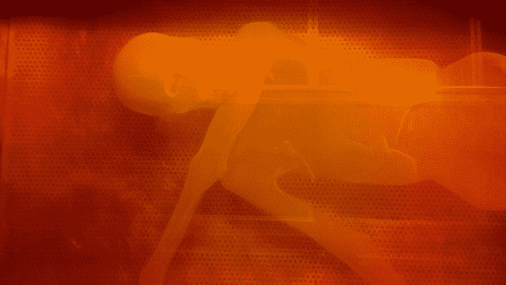

# 科学家现在可以 3D 打印木乃伊冰人奥兹 

> 原文：<https://web.archive.org/web/https://techcrunch.com/2016/02/17/scientists-can-now-3d-print-otzi-the-mummified-ice-man/>

# 科学家现在可以 3D 打印木乃伊冰人奥兹

奥兹，对于那些不了解他们的 5300 年木乃伊的人来说，死于奥地利和意大利边境的 Hauslabjoch 附近的阿尔卑斯山中并被冷冻。他的身体是欧洲保存最好的人类木乃伊之一，现在他正在接受 3D 打印改造。

研究人员和工程师与 3D 打印公司[materialize](https://web.archive.org/web/20221025222343/http://www.materialise.com/)合作，完美扫描 Otzi。这使得研究人员可以一遍又一遍地 3D 打印他饱受折磨的骨架，在《新星》有趣的一集中，一位艺术家将创造一个完美的木乃伊复制品，供[研究人员和潜在的博物馆参观者研究。](https://web.archive.org/web/20221025222343/http://www.pbs.org/wgbh/nova/ancient/iceman-reborn.html)对奥兹来说，他是在意大利的一个气候可控的地下室里度过的，这样他就不会堕落。

工程师们不得不从头开始重建奥兹的一些部件，多亏了 3D 建模技术，这一壮举成为可能。从发布:

The 冰人第一次接受 CT 扫描形式的标准医学成像。因为身体的某些部分不见了，Materialise 的工程师们不得不费力地重新创造那些丢失的元素。其中一个缺失的部分是奥兹的一些肋骨，一名工程师不得不通过镜像 3-matic 中现有的其他肋骨来设计回身体。一旦身体被捕捉为一个单一的连续图像，Materialise 工程团队就开始制作世界上唯一的冰人复制品。Materialise 使用其专利的 mammoth 立体平版印刷机，从液态树脂的琥珀浴中重现了这个 5 英尺 5 英寸的复制品。世界著名的古艺术家加里·斯塔布接下来开始制作 3D 树脂模型。经过一层又一层的材料和油漆，斯塔布给冰人复制品添加了栩栩如生的最后一笔，以至于有些人很难看出原作和复制品之间的任何差异。

《新星》这一集今晚将在公共广播公司播出。目前还不清楚奥茨是否会在节目中死而复生，像《权力的游戏:白行者》那样袭击摄制组，但所有迹象都指向“不会”