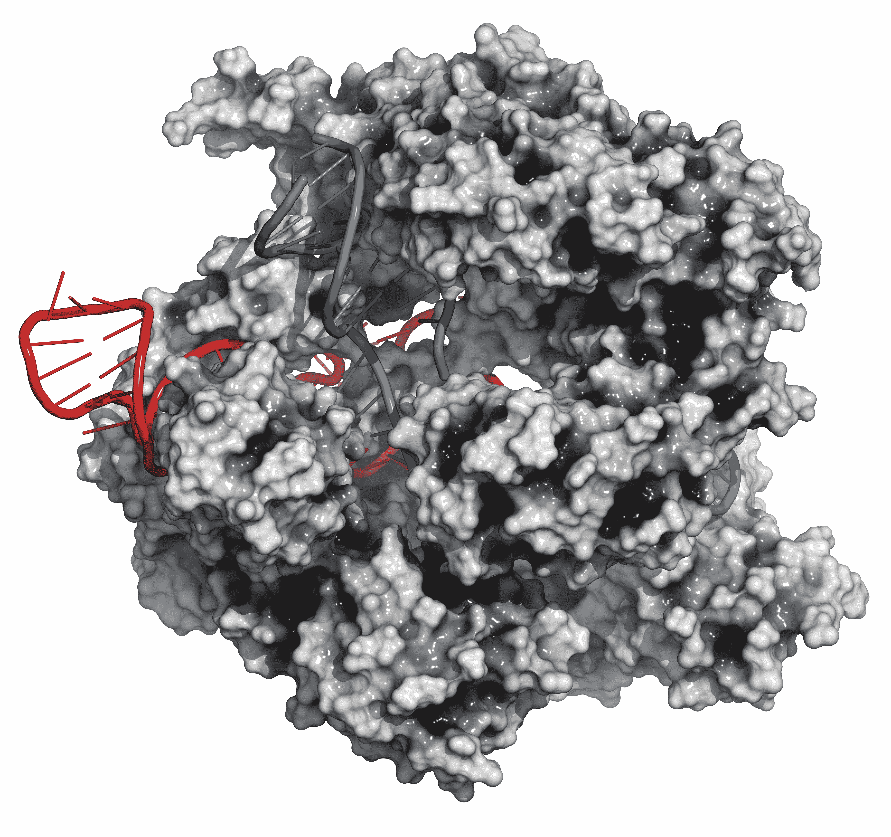

# 科学家们已经向 RNA 编辑迈进了一步，这可能是 CRISPR TechCrunch 的下一个阶段

> 原文：<https://web.archive.org/web/https://techcrunch.com/2018/09/20/scientists-have-moved-one-step-closer-to-rna-editing-which-could-be-the-next-stage-of-crispr/>

著名的索尔克 T2 研究所的研究人员报告说，他们已经成功绘制出一种 CRISPR 酶的分子结构，这种酶可以让科学家更精确地操纵细胞内的功能。

在过去的几年里，CRISPR-Cas9 抓住了公众的想象力，因为它能够以一种可能纠正单个细胞内部缺陷的方式编辑遗传密码，这种方式可能会治愈突变，并防止许多疾病的出现。

具体来说，Cas9 酶的作用有点像剪刀，剪去遗传密码的片段，并用替换物替换它们。但这些酶的目标是 DNA，而 DNA 是生物体发展的基本组成部分，人们越来越担心，使用这种酶从本质上对细胞的 DNA 进行重新编程可能弊大于利。

正如《科学美国人》的这篇报道所阐明的:

> 周一发表的研究表明，这只是巨大冰山的一角:该研究得出结论，CRISPR-Cas9 可能导致比专家想象的更大的基因浩劫，可能足以威胁到有一天将接受基于 CRISPR 的治疗的患者的健康。
> 
> 这一结果紧随两项[研究](https://web.archive.org/web/20221025222736/https://www.statnews.com/2018/06/11/crispr-hurdle-edited-cells-might-cause-cancer/)而来，这两项研究发现了一个相关的问题:一些 CRISPR-d 细胞可能缺失了一个关键的抗癌机制，因此能够引发肿瘤。

来自化脓性链球菌的 CRISPR-CAS9 基因编辑复合物。Cas9 核酸酶蛋白使用指导 RNA 序列在互补位点切割 DNA。Cas9 蛋白:白色表面模型。DNA 片段:蓝梯漫画。RNA:红梯子漫画。照片由盖蒂图片社提供

索尔克研究所的新发现发表在杂志 [Cell](https://web.archive.org/web/20221025222736/http://email.prnewswire.com/wf/click?upn=QyYRPiBOTIcirwKg1IwCPQSWMmJDKOJh0loiyKAc6J5U8dvoSQhCb25Ry58okN0hRfRa1NkLo4vDLdOcr5lwH4AWr7TvfbdDj5s3o0OYXiVL4ZGvB1rLV9urmSwAqZvWGWTAdNOLFWKc98evT0NoGbt6S9F1bPI2I2VnB0K-2BVbTqysTzMJHJSSgk6P6UVSuDkwXzs2106NcHktFWMbaO7Nw6i47MBymhl5mCUZk6QNOIME14TsQ-2FRIB-2BPeYjbKpaw04C9fO0851Ow4GkZvMXhp0ueIiKkaK4-2BaDp-2BbpwPKo-3D_rSgD2USBfTqTu1HeLmlIx-2B2nAsIZ582NWGyj-2Bm-2FPZNtP24OTVs7zWuv01VfYFDcdfrD-2B1Axs4U-2BT6wBnn-2BadHw8XFQhdLgDKtn7TA2ZPrqVHaKJMCdwOdifmd6hnNDtow4b0lIHo0RsEa-2BRdHLAx8iTiicHuwS6yYmCSvNYEzeWt7WqsUdwex0XY29fEN0i0OohuaBnNckjzwQXt9TpTz-2F75OrLC-2FmlwRmvlGoUQcwPNPC2I9-2FrGvLbJvXhMAIz17Q5CrbxVTSDwKx1bX5EM-2BUa-2F2dRmgG0M1flf-2BQjSG5ZZqS2po1fMfkvrICEnvS4A) 上，提供了 CRISPR-Cas13d 的详细分子结构，这是一种可以靶向 RNA 而不是 DNA 的酶。

曾经被认为只是 DNA 中编码的细胞操作指令的传递机制，现在已知 RNA 像酶一样进行生化反应，并在细胞中发挥自己的调节功能。通过识别一种可以针对细胞运作机制而不是细胞功能整体计划的酶，科学家应该能够提出风险更低的更高度精细的治疗方法。

更简单地说，拥有编辑工具可以让科学家修改基因的活动，而不会对基因本身做出永久的-潜在危险的-改变，这似乎是一个很好的探索选择。

“DNA 是不变的，但总是在变化的是从 DNA 中复制的 RNA 信息，” Salk 副研究员 Silvana Konermann 说，他是霍华德休斯医学研究所 Hanna Gray 研究员，也是该研究的第一作者之一。“能够通过直接控制 RNA 来调节这些信息，对于影响细胞的命运具有重要意义。”

今年早些时候，Salk 的研究人员首次确定了他们称为 CRISPR-Cas13d 的酶家族，并提出这种替代系统可以识别和切割 RNA。他们的第一项工作是围绕痴呆症的治疗，该团队表明，这种工具可以用来纠正痴呆症患者细胞中的蛋白质失衡。

“在我们之前的论文中，我们发现了一个新的 CRISPR 家族，可以用来直接在人类细胞内设计 RNA，”Helmsley- Salk 研究员 Patrick Hsu 说，他是这项新工作的另一位通讯作者。“现在我们已经能够可视化 Cas13d 的结构，我们可以更详细地了解这种酶是如何被引导到 RNA 的，以及它是如何切割 RNA 的。这些见解使我们能够改进系统，使过程更加有效，为治疗基于 RNA 的疾病的新策略铺平了道路。”

这篇论文的其他作者是来自索尔克的 Nicholas J. Brideau 和 Peter Lotfy 白石生物医学研究所的吴；斯克里普斯研究所的斯科特·j·诺维克、蒂莫西·斯特拉特恩伯格和帕特里克·r·格里芬。