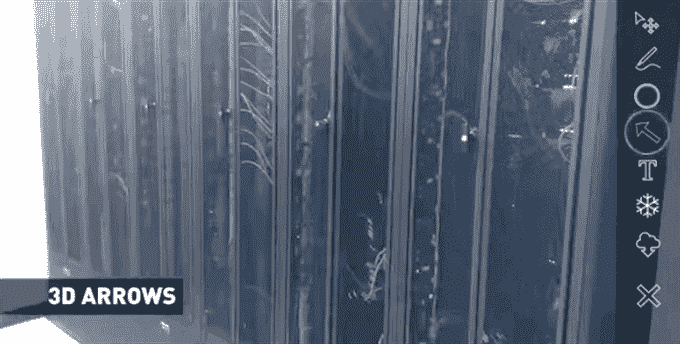

# ScopeAR 通过增强现实技术将专家传送给你

> 原文：<https://web.archive.org/web/https://techcrunch.com/2015/07/30/scopear-beams-an-expert-to-you-through-augmented-reality/>

每个人都有需要专家的时候；一只帮助你的手给你指出正确的方向，这样你就能完成工作。

也许你是一个修理异国汽车的机械师。你知道关于汽车*一般*的一切——但是只有少数人真正知道*这辆*汽车。唉，他们都在地球的另一边。

也许你正在一个石油钻塔上工作，其中一个面板正在抛出错误。屏幕上显示“更换阀门 6B”。你知道怎么更换瓣膜！你…只是不知道那个阀门在哪里。你的公司有这方面的专家，但他们都被叫去其他钻井平台了。

也许你只是在家里试图找出那个闪亮的新 A/V 接收器上无数标签不佳的端口中的哪一个可以支持 4k 分辨率。你所需要的是有人指出正确的，你就万事俱备了。

来自 2015 年夏季班的公司 ScopeAR 希望通过增强现实的魔力帮助专家们去他们需要去的任何地方。

ScopeAR 背后的想法非常简单:打一个视频电话，并添加绘制和注释电话另一端的人正在看的任何东西的能力。当他们移动相机时，您添加的任何内容—箭头、文本、定制的 3D 模型等。—保持锁定在正确的位置。

需要知道哪个阀门是“阀门 6B”？把你的相机对准那一排阀门，专家就可以直接指向它。

ScopeAR 没有试图自己提供数不清的专家，而是专注于与已经拥有自己专家的公司和团队合作。在许多情况下(就像上面的石油钻井平台的例子)，公司会有专业的专家在场，但是专家不可能马上出现在所有地方。当专家的知识可能一个月只需要一次时，他们是否为每个钻机雇用一名专家？他们会雇佣一个专家，让他们无休止地飞来飞去，浪费大量通勤时间吗？或者他们让专家在一个地方放松，并在需要他们的专业知识时通过增强现实将他们传送进来？

当然，这个概念不仅限于石油钻塔。TrendyGadgetCo 可以用它来帮助顾客了解他们的购买情况，就像他们正从顾客的肩膀上看过去一样。需要帮助找出哪个 HDMI 端口是哪个？打开应用程序，给 TrendyGadgetCo 的一位专家打电话，让他们从数不清的地方指出来。他们可以一边指着电源按钮一边说【关机再开机】*。*

这是它实际运行的样子:

[https://web.archive.org/web/20230116173613if_/https://www.youtube.com/embed/EjE__7lGguQ?feature=oembed](https://web.archive.org/web/20230116173613if_/https://www.youtube.com/embed/EjE__7lGguQ?feature=oembed)

视频

有一点视频没有说清楚:在目前的形式下，ScopeAR 需要一个物理标记作为参考点。拨入专家的人得到这个标记——要么自己打印出来，要么事先从他们的公司得到——并把它贴在他们正在看的齿轮上。该公司之前曾尝试使用 Metaio 的 AR 框架进行无标记跟踪，但在 Metaio 被苹果公司[收购及其产品被关闭](https://web.archive.org/web/20230116173613/https://techcrunch.com/2015/05/28/apple-metaio/)后，不得不放弃该框架。

取而代之的是，ScopeAR 目前使用高通的 Vuforia 框架来跟踪标记，并提供定制的解决方案来在呼叫者和专家之间来回传输视频/音频/注释数据。

ScopeAR 目前正在与一些公司进行一对一的合作。如果你的公司与现场技术人员合作，并且可以使用这样的东西，你可以联系他们[，就在这里](https://web.archive.org/web/20230116173613/http://www.scopear.com/)。