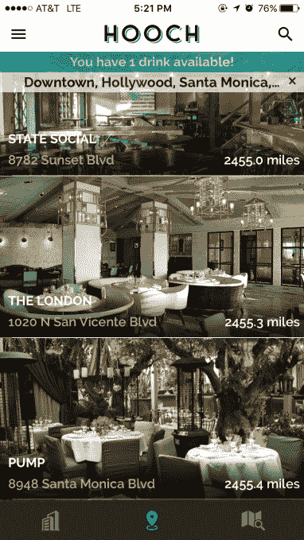

# 通过基于订阅的鸡尾酒应用 TechCrunch，每天喝一杯酒

> 原文：<https://web.archive.org/web/https://techcrunch.com/2016/03/07/score-one-free-drink-a-day-with-hooch-a-subscription-based-cocktail-app/>

# 用 Hooch，一个基于订阅的鸡尾酒应用程序，每天喝一杯

刚刚在洛杉矶推出的 Hooch 是一款基于订阅的应用程序，每月只需 9.99 美元就能为其会员提供一杯鸡尾酒。

是的，我们是认真的。花不到一杯鸡尾酒的钱，你就可以在纽约或洛杉矶的几十家酒吧里每天喝上一杯。

但是这家公司怎么可能赚钱呢？

从本质上说，这项服务是酒吧的促销工具。

与支付数千美元的传统广告不同，Hooch 让酒店为客人提供免费的第一杯酒，希望他们会留下来，并在酒吧消费。

据 Hooch 的首席执行官兼联合创始人戴琳称，这种方法正在奏效。会员平均“每次在 Hooch partner 酒吧获得一轮免费饮料后会额外花费 30-40 美元，在参与的餐厅每次最多花费 140 美元。”

林指出，用户目前平均每月兑换 16 杯饮料，这是非常令人难以置信的参与度。

虽然不断增加新的酒吧和餐厅将是维持这种参与的关键，但既然这个概念已经得到验证，那么签约新的机构应该不会太难。

酒店广告的主要目的是让顾客进门，没有什么比简单地给顾客提供一杯免费饮料更能做到这一点了。此外，虽然 Hooch 目前只专注于饮料，但不难想象未来该平台将迎合整个酒店业，在餐厅提供免费开胃菜或在酒店升级房间。

该公司已经从酒店业的天使投资者以及朋友和家人那里筹集了 100 万美元的种子资金。

胡奇住在纽约洛杉矶，并很快扩展到奥斯汀和迈阿密。可以从 [iOS 应用商店](https://web.archive.org/web/20221203004303/https://itunes.apple.com/us/app/hooch/id966435059?mt=8)和[谷歌 Play 商店](https://web.archive.org/web/20221203004303/https://play.google.com/store/apps/details?id=com.hoochapp.hooch)下载。