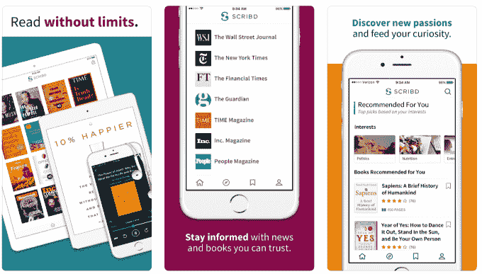

# Scribd 新推出的有声读物和电子书无限量计划可能是狂热读者的梦想

> 原文：<https://web.archive.org/web/https://techcrunch.com/2018/02/08/scribd-unlimited-plan-audiobooks-ebooks/>

# Scribd 新推出的有声读物和电子书无限量计划可能是狂热读者的梦想

厌倦了处理 Audible 的废话或图书馆排长队的狂热有声读物书虫现在有了一种新的方式来获得稳定的好东西。

Scribd 刚刚[宣布](https://web.archive.org/web/20221208143632/https://support.scribd.com/hc/en-us/articles/360000157466-Unlimited-reading-is-here-)它将恢复一个无限制的计划，提供相对自由的访问电子书、有声读物、新闻、杂志、文件和乐谱。不幸的是，这项服务听起来不会是真正的*无限制，在某一点上限制下载和流量，但考虑到下载一本该死的有声读物有多难，对于那些喜欢数字或语音页面的人来说，它可能仍然是一个不错的选择。*

 *无论隐藏的上限是什么，新计划将 Scribd 用户从以前的每月三本电子书和一本有声读物的限制提高了。(任何有声书迷都会告诉你，一个月一本根本不够过日子！)

TechCrunch 已经联系 Scribd，澄清他们无限量计划的限制，当我们收到回复时会更新。根据对 [Fast Company](https://web.archive.org/web/20221208143632/https://www.fastcompany.com/40518091/scribds-quest-to-be-the-netflix-of-reading-is-finally-paying-off) 的采访，在一小部分“超级用户”每月消费数百本图书，破坏了每个人的乐趣后，该服务第一次取消了计划。希望 Scribd 将限制设置得足够低，以保持该产品的活力，但又足够高，以至于不会惩罚正常类型的贪婪读者，他们可能每月阅读大量书籍，但永远不会接近世纪标志。尽管如此，当事实上存在硬限制时，称事情是无限的是一种愚蠢的趋势，即使一家公司对细节避而不谈(看看你，移动运营商)。

Scribd 在其公告中向现有用户保证不会有什么变化:

> 你会注意到你的浏览体验有一个微小的变化:Scribd 精选目录已经被移除，你将不再看到搜索过滤器中的无限切换。不需要每月信用来完全访问 Scribd 上可用的书籍，不再需要单独的 Scribd 精选或无限制的目录！如果你找到了你感兴趣的书或有声读物，就开始读或听吧——我们会处理好其他的事情。

作为一个对有声读物越来越感兴趣的人(并因此读了很多书！)，我下载了 Scribd 试用 30 天免费试用。在我通过拼凑的系统(通过我当地的图书馆和 Audible 的付费服务的 Hoopla 和 Overdrive)在别处阅读的五本流派跳跃的书籍中，Scribd 搜索显示它们都是可用的……都在一个地方，仅此一次。虽然我过去只使用 Scribd 在故事中嵌入 PDF(就像 TechCrunch dot com 上的那些)，但他们的 iPhone 应用程序浏览起来已经比 Audible 或 Hoopla 之类的东西舒服多了。每月 9 美元，我很乐意为一个愉快、可导航的用户界面付费，假设隐藏的上限不会妨碍整个服务——我相信其他人也会有同样的感觉。*