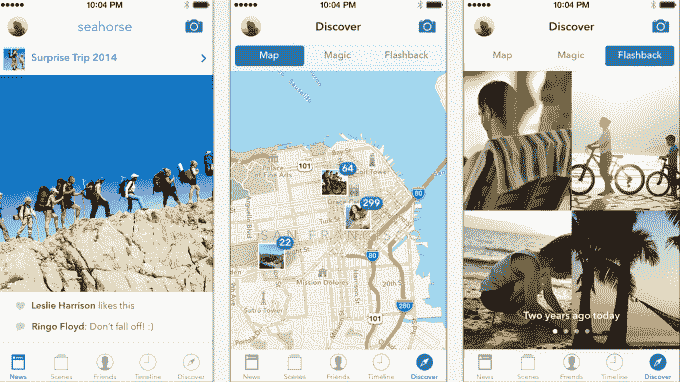

# 海马让你与朋友合作，建立持久的照片和视频相册，私下分享

> 原文：<https://web.archive.org/web/https://techcrunch.com/2014/09/04/seahorse-lets-you-collaborate-with-friends-to-build-lasting-photo-and-video-albums-shared-privately/>

今天发布的一款名为 [Seahorse](https://web.archive.org/web/20230327065028/http://seahorse.co/) 的新移动应用程序可以让你与朋友和家人创建协作照片和视频相册，还可以通过时间、地点或与你在一起的人来过滤你过去的照片。该应用程序是智能手机默认照片库的一个相当强大的替代方案，允许任何人向共享的“场景”添加照片或视频，这些合作相册被称为“场景”。但是海马的与众不同之处在于它在分享这些照片和视频后是如何处理的。

在长达一周的时间里，任何人都可以从“场景”中删除照片——不管是谁添加的。

该公司试图传达的概念是照片的“共同所有权”。也就是说，它试图消除照片拍摄者的重要性，并将永久存档的控制权交给所有参与共享相册的人——那些首先可能是照片或视频主题的人。

这是 Seahorse 的主要卖点，因为它的其他功能有点像我们以前在竞争对手的照片应用程序中看到的东西的大杂烩，包括苹果(即将推出)iOS 8 照片应用程序[的默认体验，例如，它提供按日期、位置和相册名称进行智能搜索的](https://web.archive.org/web/20230327065028/http://www.macworld.com/article/2359708/icloud-meet-photos-whats-changing-for-your-images-in-ios-8.html)，这类似于 Seahorse 按“场景”、年份或国家进行过滤的能力。

与此同时，Seahorse 提供了另一个照片“发现”功能，该功能受到了目前市场上其他应用程序的启发。这一功能被称为“闪回”，可以将前几年的照片从今天带回来，比如类似于[的《时光跳跃》](https://web.archive.org/web/20230327065028/http://timehop.com/)或[的回忆录](https://web.archive.org/web/20230327065028/http://www.yourmemoir.com/)。

事实上，这款应用正在接近《回忆录》想要解决的挑战，但角度不同。它也希望找到一种技术解决方案，来解决无法访问您的朋友拍摄的、但从未与您分享的照片的问题。但回忆录提示你*邀请*朋友分享，海马让你更传统地创建合作相册，你邀请其他人加入，这也让它与其他合作相册创建者[如 Cluster](https://web.archive.org/web/20230327065028/https://techcrunch.com/2014/05/22/mobile-photo-sharing-app-cluster-now-focused-on-private-groups-adds-support-for-video-notes-and-tablets/) 竞争。

联合创始人奥斯卡·赫杰顿森(Oskar Hjertonsson)解释说，总体而言，他对人们的照片分享体验有点着迷，“场景”的目标不是作为收集照片的临时空间，而是建立相册的一种方式。

“许多人只是把他们的照片吸到了一些云上，甚至没有，而且通常没有什么组织可言。我自己，我会*从不*整理照片。但分享很有趣，”他解释道。“因此，如果我们在场景发生时分享*……*，我们就能有效地创建有史以来最令人惊叹的组织。”

## 照片发现和其他功能

此外，Seahorse 还提供了一些有趣的技巧，比如摇晃你的照片以获得“随机”记忆，或者在地图上查看你的照片。它的时间线视图也可以方便地过滤更大的图库。它为任何照片库伴侣提供了一个相当大的功能集，包括支持原始分辨率(仅在 Wi-Fi 上)，相机同步功能，从 Dropbox 和脸书等其他服务中导入照片的导入程序，在“场景”之间复制照片的能力等等。

这项服务也可以在网上获得，桌面应用也在开发中。

## 转换成本

但要让 Seahorse 真正发挥作用，它必须找到一种方法来让用户相信，它是内置照片库的一大进步，事实证明，这对之前的许多初创公司来说是一个严峻的挑战。

此外，合作照片应用还经常面临另一个障碍:在拍照者中，有些人只是更关心照片分享或获取他人照片，并愿意为此做些什么。称之为 1%规则，但是大多数人是不活跃的潜行者，而不是参与者。他们可能会加入一个共享相册并查看内容(也许)，但要让他们真正分享还需要更多的工作。

最后，因为它做了太多的 T4，很难向新用户解释为什么他们应该换成海马。一些人可能喜欢它可以从他们所有的服务中导入照片，而另一些人会喜欢协作相册，还有一些人仍然会被它的搜索和过滤功能所吸引——你永远不确定哪一点会卖掉它们。

## 关于公司

这家总部位于旧金山的初创公司由 Hjertonsson 和 Daniel Undurraga 共同创立，他们之前都推出了社交市场 Needish，后来又推出了拉丁美洲的每日交易网站 ClanDescuento，该网站已被 Groupon 收购。在今天“正式”推出 1.0 之前，Seahorse 已经在 10，000 名用户中进行了公开的试点测试。Hjertonsson 说，这些用户每月上传大约 100 万张照片。

这款应用可以在 iTunes 和 T2 的 Google Play 上免费下载，并且有一定的免费存储空间，你可以通过邀请朋友来增加存储空间。通过应用内购买，升级到 100 GB 存储空间的高级帐户目前为每年 9.99 美元。