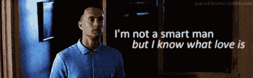

# 女士们先生们，来自 Tinder 的肖恩·拉德

> 原文：<https://web.archive.org/web/https://techcrunch.com/2015/11/18/sean-rad-of-tinder-ladies-and-gentleman/>

今天，世界从《伦敦旗帜晚报》的各种简介中醒来。这个简介是关于 Tinder 首席执行官肖恩·拉德的。这很特别。从哪里开始？

首先，让我们把严肃的事情处理掉。Rad 的[母公司 Match 近日申请上市](https://web.archive.org/web/20230322160427/https://techcrunch.com/2015/10/16/tinder-owner-match-group-files-to-go-public/)。所以公司处于平静期，对吧？当然可以。除非你很酷。

现在，让我们开始…其他的东西。在没有~~撰写的~~评论的情况下，以下是拉德的一系列生活语录:

在都柏林 U2 网络峰会的招待会上:

**“…比 Instagram 的还大”，满满的“尖叫”粉丝。就像一场音乐会。我想，科技比以前更重要了。就像新的摇滚。”**

关于寻找~~爱情~~？在 Tinder 上，他说他已经“上瘾”了:

“…每隔一周我都会爱上一个新的女孩。我很专注。对公司来说，这是一个非常关键的时刻，所以很不幸，我没有太多的时间去做这些事情。”

被模特跟踪:

一个“超级名模，一个非常非常有名的人”向他“乞求”性，“而我一直说，不”。他说，她“奚落”他，“说我假正经”。

关于该模型的更多信息:

她是我见过的最漂亮的女人之一，但这并不意味着我想扒下她的衣服和她做爱。吸引力是微妙的。我一直被那些……嗯，我的朋友们可能认为很丑的女人所吸引。我不在乎某人是不是模特。真的。对于一个男人来说，这听起来很老套，几乎完全不可思议，但这是真的。我需要智力挑战。”

然后…

显然，有一个术语是指那些被知识分子的东西吸引的人。你知道，只是聊天。怎么说来着？我想说‘鸡奸’？”

*————没有可用图像——*

关于[名利场文章](https://web.archive.org/web/20230322160427/https://techcrunch.com/2015/08/12/how-not-to-pr-by-tinder/)导致公司对记者个人进行猛烈抨击，并对她进行“背景调查”:

“…作为一个个体，她身上有些东西会让你有不同的想法。”

如果你喜欢，你可以在这里阅读其余的。为在火绒上找到爱干杯。

以及 IPO 时的一次大“爆”。