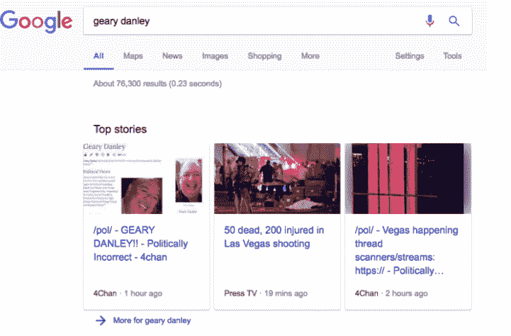

# 拉斯维加斯枪击案发生后，搜索和社交媒体充斥着点击诱饵和宣传 

> 原文：<https://web.archive.org/web/https://techcrunch.com/2017/10/02/search-and-social-media-was-filled-with-clickbait-and-propaganda-in-the-wake-of-vegas-shooting/>

# 拉斯维加斯枪击案发生后，搜索和社交媒体上充斥着点击诱饵和宣传

在美国历史上最严重的大规模枪击事件发生后，成千上万的人转向社交媒体了解今天早上早些时候展开的调查的信息，他们会发现大多数主要网站上的许多热门帖子都是热门垃圾。

让一种算法从互联网评论的下水道中筛选出链接，然后分发给数百万人，这是一场失败的游戏。这是脸书和其他国家继续推卸责任的又一个迹象。

谷歌和社交媒体网站表示，他们正在努力提高更高质量新闻来源的命中率，但今天拉斯维加斯枪击事件后的传播表明，他们还有多少工作要做。

整个上午，脸书的“安全检查”页面包括了来自极右翼博主的关于枪击事件的更新，该博主[指责枪手是一个“极左翼的疯子”](https://web.archive.org/web/20221006080944/https://thinkprogress.org/gateway-pundit-geary-danley-5280ad08276f/)随后，网站上的第一篇帖子转而展示了一个来自新闻聚合服务 MyTVToday 的 clickbait 视频，最后选择了来自地方和国家新闻媒体的报道。

脸书并不是唯一一个在其字幕页面上循环猜测和公然撒谎的人。在网站 [4chan](https://web.archive.org/web/20221006080944/https://twitter.com/daiwaka/status/914890838554984448) 上流传的一个谣言将枪手误认成了一个名叫 Geary Danley 的人，这个人出现在谷歌的 top stories widget 上(正如 [Buzzfeed](https://web.archive.org/web/20221006080944/https://www.buzzfeed.com/ryanhatesthis/here-are-all-the-hoaxes-being-spread-about-the-las-vegas?utm_term=.eqJoDaLE9#.auxN4xYeM) 和[彭博](https://web.archive.org/web/20221006080944/https://www.bloomberg.com/news/articles/2017-10-02/fake-news-fills-information-vacuum-in-wake-of-las-vegas-shooting)所报道的)。

谷歌向彭博和《纽约时报》发布了以下声明(我们也寻求置评):

> “不幸的是，今天早上我们在少量查询的搜索结果中短暂地出现了一个不准确的 4chan 网站。几个小时后，4chan 的故事在算法上被相关结果所取代。这不应该出现在任何查询中，我们将继续进行算法改进，以防止这种情况在未来发生。”

Twitter 和脸书等社交媒体网站用来决定显示哪些故事的算法已经成为头条新闻，因为人们越来越关注它们发布的信息。

仅出现在 Twitter 上的 Buzzfeed 列出的[恶作剧](https://web.archive.org/web/20221006080944/https://www.buzzfeed.com/ryanhatesthis/here-are-all-the-hoaxes-being-spread-about-the-las-vegas?utm_term=.eqJoDaLE9#.auxN4xYeM)就足以让@Jack 相信，需要对在该服务自吹自擂的新闻流中故意纵火的巨魔采取一些措施。

一个合理的问题是，像 4chan 这样的来源怎么会被认为是获取突发新闻信息的可行渠道。事实上，一些记者已经在问了。

谷歌、推特和脸书因其对俄罗斯黑客丑闻的回应而受到密切关注，目前国会正在调查此事。他们在处理一个震惊全国的故事方面的最新失误，造成了如此多的伤亡，还有如此多的未知，这只是强调了他们对软件的依赖有多么成问题——以及它可能带来的现实世界的后果。