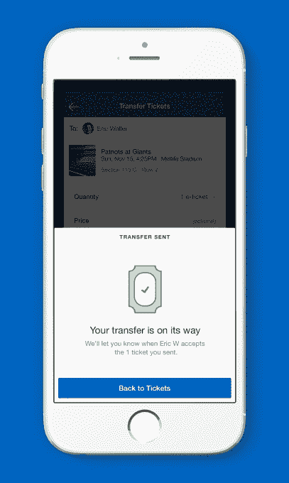

# SeatGeek 推出了一个任何人都可以出售和转让门票的市场 

> 原文：<https://web.archive.org/web/https://techcrunch.com/2015/11/19/seatgeek-launches-a-marketplace-where-anyone-can-sell-and-transfer-tickets/>

# SeatGeek 推出了一个任何人都可以出售和转让门票的市场

SeatGeek 已经是一个获得现场赛事门票的可靠途径，但现在你也可以用它来出售门票。

从某种意义上来说，SeatGeek 上的门票已经被转售，但这种模式依赖于将其他网站上出售的门票进行汇总。随着今天 SeatGeek 市场的推出，任何人都可以通过 SeatGeek 自己获得门票。

要卖出一张票，你需要做的只是将你的 PDF 上传到 SeatGeek 网站或应用程序，然后它将使用 OCR 技术提取相关信息。它甚至会推荐一个销售价格。一旦有人完成购买，转账就在 SeatGeek 内部进行，他们可以用手机赎回门票[。](https://web.archive.org/web/20221205114116/https://beta.techcrunch.com/2015/10/22/seatgeek-embraces-paperless-tickets/)

“我们花了很多时间来自动化这个过程中所有棘手的部分，”Jack Groetzinger 说(上图是他和他的联合创始人 Russ D'Souza)。“你不必担心计算出最优价格是多少。默认情况下，我们会根据我们的工作设定一个建议价格，以最大限度地提高您的收费。”

从财务角度来看，SeatGeek 向卖方收取费用，但不向买方收取。所以会有一点透明度，因为当你设定价格时，那是买方实际支付的。当您准备好套现时，您可以通过 Venmo 进行。

SeatGeek 增加了对没有价格标签的机票转让的支持。如果您想给朋友一张票，或者您有朋友的票，不想只是站在那里等他们，您可以直接发到他们的手机上。

整个过程只需要轻轻拍几下。我没有使用 SeatGeek 出售或分享，但当 Groetzinger 给我一张票时，赎回它肯定很简单。(遗憾的是，音乐会已经过去了。)