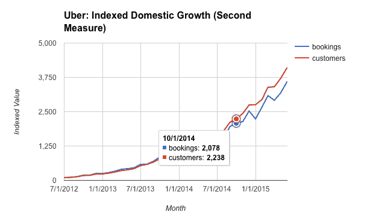

# 推出第二项措施，提供对上市/私营公司的强大实时数据分析 

> 原文：<https://web.archive.org/web/https://techcrunch.com/2015/08/10/second-measure-launches-offering-powerful-live-data-analysis-of-publicprivate-companies/>

一个事实证明了 [Second Measure](https://web.archive.org/web/20221207211751/https://secondmeasure.com/) (YC S15)和他们的数据分析产品的实力，即在支持该公司后，Y Combinator 留下了深刻的印象，他们自己成为了该产品的付费用户，现在正在使用它来帮助通知自己的未来投资。

Second Measure 通过检查数十亿笔信用卡交易(占美国消费者支出的 1%以上)并通过其产品向投资者和分析师提供详细的见解，提供了如此有效的分析。

“我们可以看到上市公司和私营公司的实时表现，”Second Measure 的联合创始人迈克·巴比诺(Mike Babineau)说。“例如，我们可以向投资者展示网飞这个月有多少用户，或者优步相对于 Lyft 的表现如何。”

Second Measure 有两款产品:一款是面向分析师的网络应用，另一款是面向研究人员的数据馈送。该公司目前跟踪约 400 家公司，但希望很快扩大到“数千家”

该公司从“各种战略合作伙伴”(他们拒绝透露更多细节)那里获得的数据看起来非常丰富，可以进行深入的比较分析。

*在隐私方面，联合创始人 Lillian Chou 指出，当 Second Measure 收到信用卡数据时，所有的信用卡数据都会被删除。*

Second Measure 的优步拼车数据样本。

Babineau 和 Chou 向我展示了该产品的演示，比较了几家拼车公司，该网络应用程序提供的分析似乎改变了游戏规则(查看该公司[博客帖子](https://web.archive.org/web/20221207211751/http://blog.secondmeasure.com/2015/07/28/people-ride-uber-more-than-you-think/)上的一些优步数据)。

通过第二种方法，投资者可以挖掘运营指标，如收入和客户增长、保留和群组分析，同时还可以将公司与竞争对手进行对比，以跟踪整体市场渗透率。

据 Babineau 称，该公司将其产品“主要面向风险投资和对冲基金”，很容易理解为什么该产品会对他们有吸引力。

目前，风险资本家主要在搜索 Second Measure 的产品，以识别快速增长的公司，对冲基金正在用它来“通知他们的财务模型”，并预测上市公司的收益发布。

Babineau 和 Chou 认为，许多其他投资者只是没有利用现有的复杂数据库来有效地为他们的决策提供信息，主要是因为访问权限的限制。

“所有这些新的有趣的大规模数据集都非常有价值，”Babineau 说。“但这些投资者无法使用它们，因为他们没有数据或工程团队，这就是 Second Measure 真正试图弥合差距的地方。”