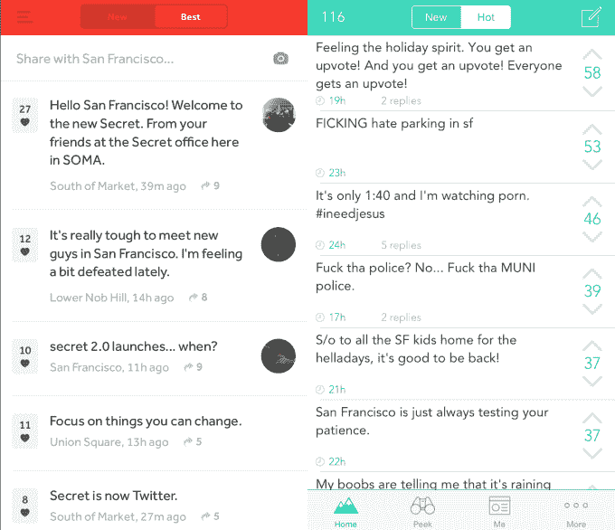

# Secret 联合创始人 Chrys Bader-Wechseler 下台，因为这不再是关于设计了

> 原文：<https://web.archive.org/web/https://techcrunch.com/2015/01/29/secret-co-founder-chrys-bader-wechseler-steps-down-because-its-not-about-design-anymore/>

# Secret 的联合创始人克里斯·巴德-韦奇塞勒辞职，因为这不再是设计的问题了

在与谷歌同事大卫·拜托一起创建匿名应用程序 [Secret](https://web.archive.org/web/20230323141129/https://www.secret.ly/) 一年后，克里斯·巴德-韦克斯勒[友好地离开了公司](https://web.archive.org/web/20230323141129/http://medium.com/@davidbyttow/new-beginnings-16d7c7b23629)。他引用说，自从最近重新设计以来，Secret 现在不再是关于设计和策展的了，它放弃了带有覆盖文本的巧妙的照片方块，转而采用了看起来就像竞争对手 Yik Yak 的无菌文本提要[。](https://web.archive.org/web/20230323141129/https://techcrunch.com/2014/12/18/the-anonymous-app-singularity/)

下面你可以看到左边是最近的秘密设计，右边是 Yik Yak。

这里你可以看到它过去的样子。用户可以选择不同纹理的照片或颜色作为文本秘密的背景。这使得 Secret 在视觉上更引人注目，但更难快速浏览，因此进行了重新设计。

Bader-Wechseler 告诉我“我非常尊重 David，我们都认为这是该产品的下一章。”

在一篇博客文章中，Bader-Wechseler 说:

> “很明显，Secret 的下一个篇章开始的方式将不再是我喜欢的那种创作和设计，所以是时候让我下台了，让团队做他们最擅长的事情，专注于我最擅长的事情。”

没有 Chrys，Secret 将继续前进，尽管他将保留他在 600 万美元中的份额，他和 Bytow 在他们最后一轮筹集资金时离开了桌子。

根据 Byttow 的数据，这款应用可能没有竞争对手 Yik Yak 大，但它已经注册了 1500 万用户。它的未来可能在于成为现场事件聊天的后台渠道。Secret 最近在 CES 和圣丹斯电影节上为人们设置了特殊的地理围栏订阅。两者都很活跃，充满了八卦、评论和聚会后的地点。

虽然 Secret 的新设计一点也不鼓舞人心，但它确实让发布和阅读变得更快了。与其让人们觉得他们不得不巧妙地创作一个小杰作来放置他们的文本，他们可以向世界大声喊出来。在手机上，慢就是死亡，所以这种转变可能是正确的。只是不适合克里斯。