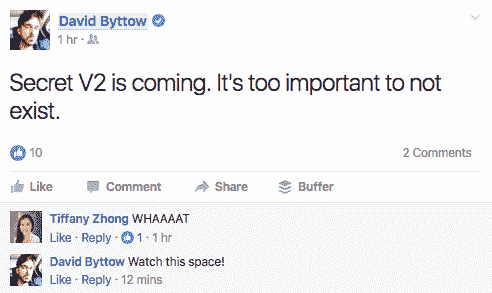

# 秘密回来了

> 原文：<https://web.archive.org/web/https://techcrunch.com/2016/11/12/secret-is-coming-back/>

由 David Byttow 和 Chrys Bader-Wechseler 开发的匿名分享应用 Secret 看起来正在复活。

该应用是 Whisper 和 YikYak 等匿名应用浪潮的一部分，但在面临大量关于隐私和网络欺凌的批评后，[于 2015 年 4 月](https://web.archive.org/web/20230323141144/https://techcrunch.com/2015/04/29/psst/)关闭。

Secret 允许任何人在匿名的基础上发布像谣言或八卦这样的文本片段。这些短信中有许多包含了只有特定个人知道的详细信息，尽管一个人的名字不会出现在他们的帖子旁边，但他们的位置等其他细节可能会显示出来，从而更容易推断出是谁泄露了信息。

但当包括巴德-韦克斯勒在内的几名关键团队成员突然离开公司时，这款应用背后的初创公司真正瓦解了。尽管 Secret 已经筹集了 3500 万美元，但它已经裁员一半，接近 TechCrunch 的消息人士证实，在完全停止之前，它基本上处于维护模式。

然而，Byttow 给了一些希望，很快就会有第二个版本。这位前联合创始人在周六晚上晚些时候在脸书的个人资料上发布了“秘密 V2 来了。不存在太重要了。”

Byttow 在那篇神秘的帖子后立即与我们进行了交谈，并告诉我们最近的总统选举使他有勇气将该应用程序带回来。

“当前社交媒体产品的缺点必须得到解决，这是我目前知道的方法，”Byttow 告诉 TechCrunch。

社交媒体在这次选举中发挥了很大的作用——当选总统唐纳德·特朗普[认为](https://web.archive.org/web/20230323141144/https://www.yahoo.com/news/trump-credits-social-media-election-win-235833995.html)是社交媒体将他推上了胜利的巅峰——特别是脸书，他被指控在整个选举周期中向不知情的公民传播假新闻和错误信息，从而[影响了选举的结果](https://web.archive.org/web/20230323141144/http://www.npr.org/sections/alltechconsidered/2016/11/11/501743684/zuckerberg-denies-fake-news-on-facebook-had-impact-on-the-election)。

一些人还说，社交媒体应该为呈现有偏见的新闻负责，从而进一步分裂我们的国家，扩大保守和自由意识形态之间的峡谷，这是 Byttow 希望在新的秘密中解决的问题。

“人们没有一个好的空间来做最真实的自己，尤其是对他们认识的人，”Byttow 说。“恐惧太多，自我意识太少。我们需要更多的自我意识，从硅谷开始。我们处于泡沫之中。去他妈的泡沫。真理想要自由。只有到那时，我们才能开始理解，只有到那时，我们才能治愈创伤，共同努力。”

虽然 Byttow 说他正在“小心翼翼地前进”,并希望第二次建立正确的东西——从与许多人交谈开始，以获得正确的东西。他还补充说，如果他真的发布新的改进版本，他不会为了钱而这样做。

他说，这次他将单干，而不是接受风险投资，该应用程序赚的任何钱都将主要捐给他相信的慈善机构，如美国公民自由联盟和计划生育组织，这在特朗普总统任期内受到了威胁。

“如果要存在，它必须能够自我维持，而且必须没有任何利益冲突，”他说。

虽然 Byttow 不想向我们详细说明该应用程序如何在没有投资的情况下产生收入或聚集起来，但人们可以假设他将在其他努力的基础上启动业务。Byttow [目前正在运营一家名为 Bold 的企业内容初创公司](https://web.archive.org/web/20230323141144/https://techcrunch.com/2016/06/07/bold/)。

但他表示，他的首要任务是并将继续保持大胆，新的秘密不会是他随手可得的工作，而是由他监督下的另一个团队构建。

“有一件事我可以肯定:这将是很好的，”Byttow 补充说。

当我们听到 Secret 回归的更具体的时间表时，我们一定会让你知道。与此同时，我们只能在社交媒体上公开发布我们可悲的自我。