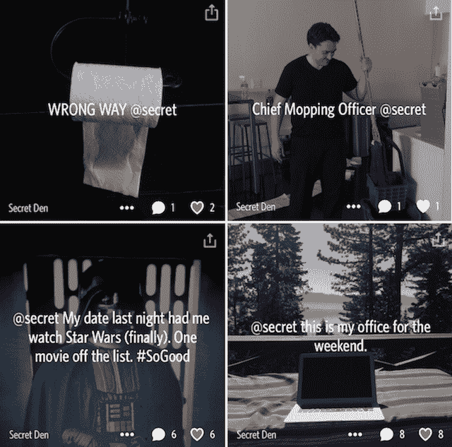

# Secret 正在将其匿名网络应用带到学校和工作场所，并新增了“秘密巢穴”功能 

> 原文：<https://web.archive.org/web/https://techcrunch.com/2014/06/09/secret-is-taking-its-anonymous-networking-app-to-schools-workplaces-with-new-secret-dens-feature/>

匿名社交网络应用 Secret 是一款流行的硅谷八卦水冷却器，现在，更要感谢[最近的扩张](https://web.archive.org/web/20221209194913/https://beta.techcrunch.com/2014/04/28/secret-taps-into-android-international-markets-uk-ireland-australia-new-zealand-coming-first/)，刚刚[宣布了](https://web.archive.org/web/20221209194913/https://medium.com/secret-den/introducing-secret-dens-633647edaf4)一个名为“秘密巢穴”的新功能，专注于工作场所或学校的匿名分享。该公司通过博客解释说，这个想法是“分享你正在想的任何事情——保持在你工作场所的墙壁里。”换句话说，这些内部秘密永远不会更广泛地传播到更广泛的秘密网络。

该功能仍处于私人测试阶段，并已在 Secret 的总部进行了测试，在过去的一个月里，这个现在由 16 人组成的团队一直在分享内部笑话、更新等。他们说，现在，试点项目开始向其他几家公司推广，但最终目标是在未来让更多的公司、大学和组织可以使用“秘密窝点”。

此举正值其他匿名网络应用程序在 Secret 本身瞄准的相同人群中起飞之际，其中最引人注目的是 Whisper 和 YikYak，后者面临着激增的增长，但由于其在学校的兴起，也面临着大规模的网络欺凌。

对于 Secret 来说，这是一个有趣的举动，因为它的两个主要竞争对手已经显示出优先考虑适度和报告功能，以打击欺凌行为以及可能会引发一些用户自残的潜在“触发”信息。例如，在 Whisper 中，该社区大量审核帖子，并将一些更痛苦的用户指向其相关的非营利部门 [YourVoice](https://web.archive.org/web/20221209194913/http://www.your-voice.org/) ，例如，该部门向那些可能处于自杀边缘的人伸出援手。

与此同时，虽然 YikYak 可能天真地没有考虑到针对年轻人群的匿名应用程序的潜在影响，但在网络欺凌问题成为全国新闻后，[迅速介入](https://web.archive.org/web/20221209194913/https://beta.techcrunch.com/2014/03/13/amid-vicious-bullying-threats-of-violence-anonymous-social-app-yik-yak-shuts-off-access-to-u-s-middle-high-school-students/)，关闭了它的应用程序，甚至禁止它在校园内工作。它通过实施一系列地理围栏来实现这一目标，这些围栏现在覆盖了美国大多数公立学校

另一方面，Secret 在早期一直在与欺凌行为作斗争，允许科技行业的公众人物(不一定是全球范围内的“知名”人士)被无情地嘲笑几个小时或几天，然后这些冒犯性的评论才会被删除，如果他们真的被删除的话。

除非 Secret 在最近几天对其反欺凌和报告功能进行了重大改进，否则在学校区域引入这一功能可能还为时过早，即使它们仅限于大学级别。事实上，你甚至可以说年轻用户根本不应该成为这类应用的目标市场。

如果在工作场所引入秘密共享，如果帖子变得负面或指名道姓地骚扰个人，未来也会有许多参与公司遭到人力资源部门的投诉。

在今天帖子底部关于私人试点项目的简短问答中，Secret 没有说明它打算如何处理秘密窝点内的这些问题。