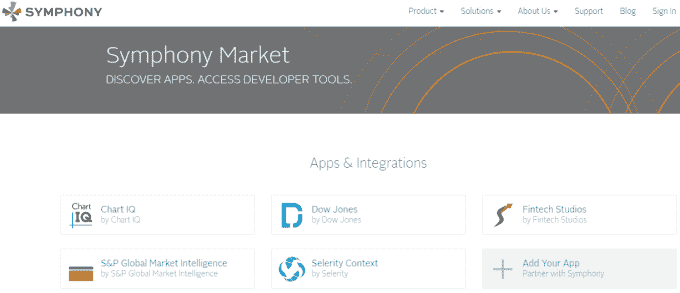

# 安全消息初创公司 Symphony 希望扩大其管弦乐队中的行业

> 原文：<https://web.archive.org/web/https://techcrunch.com/2017/03/05/secure-messaging-startup-symphony-looks-to-expand-the-industries-playing-in-its-orchestra/>

安全通信技术公司 Symphony 正在扩大其客户群。这家位于帕洛阿尔托的初创公司诞生于华尔街，是彭博信息服务的替代品，现在它的目标客户从律师事务所到政府。

Symphony 于 2016 年底以超过 10 亿美元的估值融资，其战略是基于价格、适应性和规模“增加座位”(或个人用户)。该公司正在为客户提供更多的平台定制— [为定制的应用程序开放 API](https://web.archive.org/web/20230321141522/https://symphony.com/apps)，并提供整合分析服务的工具。

在价格上，Symphony 每月 15 美元的产品费相对较低。这使得它在非金融服务公司的预算范围内。对于华尔街的交易人群来说，Symphony 也是比彭博的聊天工具更便宜的选择，后者来自彭博的终端分析平台，每月收费 1000 美元。

“我们从金融服务开始，但还有其他市场，”Symphony 首席执行官大卫·古尔说。“想想制造业、国防、保险、能源，这些都是以[企业对企业]为中心的行业，保密性、数据所有权和信息安全性的相对价值非常高。”

**彭博影响力，高盛根基**

Symphony 被吹捧为“彭博杀手”，由华尔街公司的一个小集团在 2014 年推出，据报道，彭博新闻记者窥探了彭博社终端客户的消息。

事实并非如此。一项独立调查显示，彭博记者查看了一些终端客户端的员工登录频率，而不是信息内容。高盛发言人解释说，Symphony 的前身——高盛内部聊天平台 live current——早在 2012 年就已经投入使用。

高盛开发 LiveCurrent 很大程度上是因为非安全短信和社交媒体服务的兴起。高盛在彭博的 2 万多美元终端订阅数量有限，只为安全聊天功能扩展这些订阅是不可行的。高盛发言人表示:“我们需要一种实用的方式，让公司的 3 万名员工实时分享新闻和信息，而彭博的终端对我们来说太贵了。”。

该公司认识到其消息应用作为行业平台的价值。2014 年，高盛将 LiveCurrent 连接到由 14 家金融公司组成的财团(包括摩根大通、美国银行和贝莱德)，以 6600 万美元收购了现有的即时通讯初创公司 Perzo，并将其整合在一起，推出了 Symphony 。

**夺取席位**

David Gurle 估计 Symphony 的安全消息产品的潜在市场为 1 亿个个人席位，其中 800-1000 万个在金融服务领域，2000 万个在保险、教育、政府和医疗保健领域。

Gurle 说，夺取这些席位的策略是双重的。在金融服务公司内部，Symphony 希望利用产品的适应性来“与其他系统集成”并“作为协作工具扩展到组织的其他部分”在金融领域之外，Gurle 指出了该产品“对其他组织的价值主张”以及计划“今年推出一支销售队伍来追逐他们。”

当然，Symphony 及其竞争对手成功的基础是确保安全通信的能力，这个世界在过去一年里经历了史诗般的数字入侵。

Gartner 研究主管 Adam Preset 表示，任何重大失败都会带来很高的声誉风险。“很明显，如果你不做这项工作，你的商业模式就会有危险，”他说。

Symphony 认为产品隐私和可用性是关键。“我们必须开发一个既方便又具有无与伦比的安全措施的系统，”Gurle 说，他指的是该产品的端到端加密和“[双因素认证](https://web.archive.org/web/20230321141522/https://www.techopedia.com/definition/13699/twofactor-authentication)”

**拓展游戏领域**

随着 Symphony 在华尔街和其他地方寻求更大的客户群，它发现自己处于一个竞争激烈且不断扩大的市场中。在金融服务领域，彭博的终端仍然占据主导地位。据一位彭博代表在后台说，该产品的入门价格是每年 24000 美元，在全球拥有 325000 名用户。彭博目前不提供以较低价格将其消息服务从终端中分离出来的选项。

据公司发言人称，汤森路透的 [Eikon](https://web.archive.org/web/20230321141522/http://financial.thomsonreuters.com/en/products/tools-applications/trading-investment-tools/eikon-trading-software.html) 分析产品——彭博终端的竞争对手——在整个平台上或单独免费提供其 [Eikon Messenger](https://web.archive.org/web/20230321141522/http://thomsonreuters.com/en/products-services/financial/equities-markets/eikon-messenger.html) 服务。Eikon Messenger 用户在 2016 年底达到 30 万，[雅虎 Messenger 停产后激增](https://web.archive.org/web/20230321141522/http://thomsonreuters.com/en/press-releases/2016/august/thomson-reuters-eikon-messenger-numbers-surge.html)。

汤森路透不愿证实有多少人使用免费聊天服务，而不是付费的 Eikon 平台。该公司没有提供公开的定价信息，但一个全负荷的 Eikon 设置据说每年花费大约 2 万美元。

在过去的几年里，彭博和汤森路透都已经采取措施开放 API，并允许对他们的分析产品平台进行更大程度的定制。

在扩张的过程中，Symphony 面临着许多安全通信提供商的竞争。Gartner 的预设突出了两个类别。他说:“有些服务可以确保通信、即时消息、电子邮件的安全，并用于审计和合规目的，还可以与第三方系统集成。”“然后还有其他人纯粹专注于一个安全的移动售货应用。”

与 Symphony 和彭博的 IP 类似，Preset 命名为 [Global Relay](https://web.archive.org/web/20230321141522/https://www.globalrelay.com/) 和 [Ice Chat](https://web.archive.org/web/20230321141522/https://www.theice.com/technology/instant-message) 作为机密通信服务，具有更广泛的 B2B 应用和功能。他强调 Wickr 和 [Signal](https://web.archive.org/web/20230321141522/https://www.crunchbase.com/product/signal-desktop) 是更多地交叉到一般机构和个人使用的应用。

“大约有 60 家不同的供应商在解决不同垂直领域的安全消息传递问题。竞争非常激烈，”Preset 说。

在金融服务聊天和分析领域——鉴于彭博和汤森路透产品背后的资源——Symphony 更有可能带来更大的适应性和下行价格压力，而不是杀死任何一个领导者。在更广泛的安全通信市场，时间将会证明 Symphony 是否能比众多竞争对手更快地满足不断增长的需求。