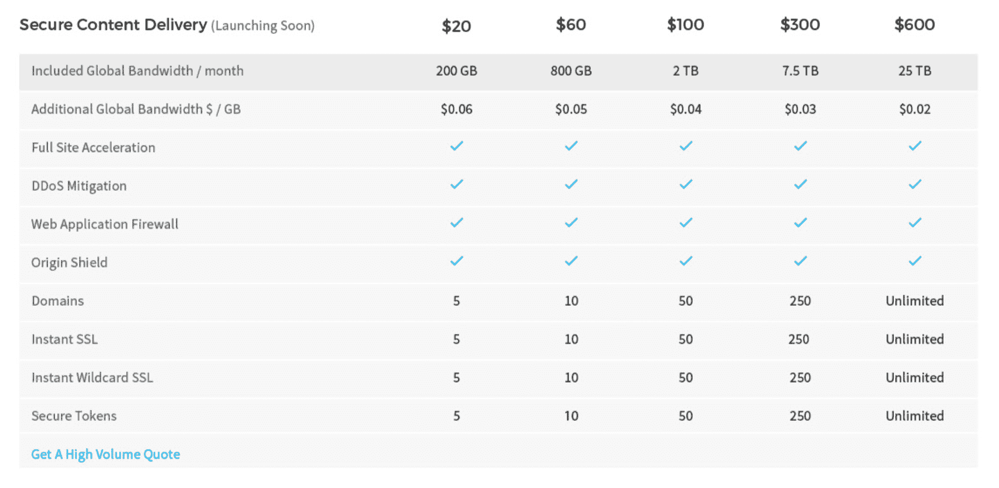
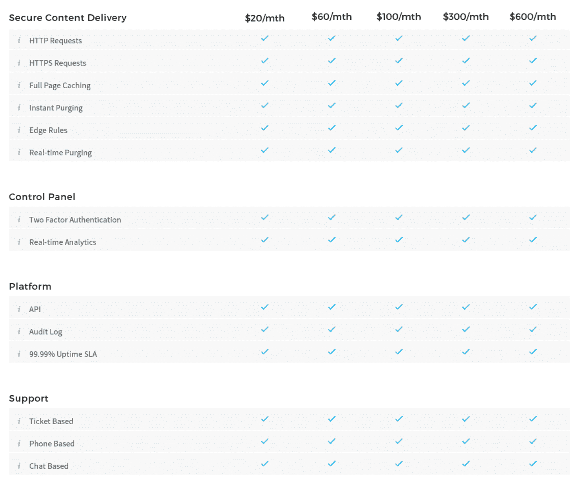

# 安全即服务初创公司 StackPath 获得 1.8 亿美元，4 次收购，包括 MaxCDN 

> 原文：<https://web.archive.org/web/https://techcrunch.com/2016/07/25/security-as-a-service-startup-stackpath-nabs-180m-4-acquisitions-including-maxcdn/>

根据 IDC 的数据，IT 服务向云的大规模迁移，加上互联设备的巨大增长，已经形成了一场完美的安全漏洞风暴，仅去年一年就发现了约 4 亿次恶意软件攻击。现在，一个被称为 [StackPath](https://web.archive.org/web/20221208224342/http://stackpath.com/) 的新希望相信它可能拥有一劳永逸地打击恶意黑客的关键(和规模)。

如今，该公司凭借高达 1.8 亿美元的资金和四项重大收购(MaxCDN、Fireblade、斗篷和 Staminus)脱颖而出，推出了一个安全即服务平台，并充实了其客户网络。仅 MaxCDN 一项就为这家新创业公司带来了 16000 名客户，而斗篷则带来了 15000 名客户。

这笔资金由大型私募股权公司 [ABRY Partners](https://web.archive.org/web/20221208224342/http://www.abry.com/Investments.aspx) 牵头 1.5 亿美元，另外还有来自该公司未透露姓名的“内部人士”的 3000 万美元。目前还不清楚这些收购是来自这笔资金，还是与这笔资金无关。StackPath 的财务条款和估值尚未披露，但我们正在努力寻找答案。

StackPath 不是普通的安全初创公司。首先，它是由 SoftLayer 的创始人兼首席执行官 Lance Crosby 创立的，SoftLayer 于 2013 年被 IBM 以 20 亿美元收购[，构成了其新一波云计算业务的基础。其次，是公司的大前提。该公司指望建立一个大规模的安全平台，并以灵活的 SaaS 式产品做大，作为解决安全问题的关键部分。](https://web.archive.org/web/20221208224342/https://www.ibm.com/midmarket/us/en/article_cloud6_1310.html)

在安全领域已经有几十家初创公司正在采取全新的方法来解决这个问题，例如，使用围绕人工智能的新[技术](https://web.archive.org/web/20221208224342/https://beta.techcrunch.com/2016/06/09/cylance-fighting-malicious-hackers-with-ai-hits-1b-valuation-after-raising-100m/)，或者受[军事编队](https://web.archive.org/web/20221208224342/https://beta.techcrunch.com/2014/11/13/microsoft-buys-israeli-hybrid-cloud-security-startup-aorato-in-200m-deal/)的启发，来帮助构思和塑造产品。

StackPath 认为，在企业越来越多地购买安全软件和其他 IT 服务，而不是为可能还包括昂贵硬件(特别是安全服务)的大合同产品支付大量现金的环境下，提供各种服务是有机会的。

“互联网是全世界做生意的地方。StackPath 首席执行官兰斯·克罗斯比(Lance Crosby)在一份声明中说:“这可能是当今支持企业的最重要的公用事业，但我们继续让老化的基础设施负担过重，并努力确保它的安全。

“StackPath 平台是对由太多单独的、基于设备的附加安全解决方案造成的分散问题的集成式响应。是时候为企业提供内置安全而非附加安全的互联网服务了，这样他们才能成为最珍贵资产的可靠守护者。我们感谢 Abry Partners 的支持，我们将继续我们的使命，构建一条通往安全互联网的道路。”

StackPath 的其他关键员工包括 Andrew Higginbotham，首席运营官和总裁，他曾是 CenturyLink 的云和技术 SVP；首席财务官金·希伊(Kim Sheehy)来自 CyrusOne (CONE)。

当然，StackPath 将会涉足机器学习等领域。服务将以 API 的形式提供，在每种情况下，StackPath 的平台都将根据通过每个服务收集的数据来“了解”更多的威胁。该公司指出:“它有效地授权主机网络上的每个服务识别并向智能数据存储库传达针对它的实时威胁。”

该公司更大的愿景是创建一个平台，为用户提供各种不同的安全服务，但它表示，它将首先从安全内容交付开始(可能使用 MaxCDN 的技术)。

该产品将于 8 月份推出，将根据带宽大小、安全令牌数量等方面的不同，按每个用户每月 20 美元的起价到每个用户每月 600 美元的价格分层定价，并将包括以下几项功能:

被收购的四家公司将带来一系列服务和客户，其中一些将比其他公司更快显现出来，这取决于新功能推出的时间:

[MaxCDN](https://web.archive.org/web/20221208224342/https://www.maxcdn.com/) 被描述为基于 Varnish 和 Nginx 构建的“下一代内容交付网络”，使用缓存技术来加速网站和应用。它已经是一个非常成熟的企业:它拥有 19 家全球 pop 和 16，000 多名客户。StackPath 表示，它已经将这一技术堆栈迁移到其内置安全功能(如 WAF 和 DDOS)的新平台上。

[Fireblade](https://web.archive.org/web/20221208224342/http://www.fireblade.com/) 是一家 web 应用防火墙提供商，最初成立于以色列，使用“一种获得专利的行为和数据驱动方法来降低风险。”它实时处理流量数据，“立即推出新的结论和规则，以应对新出现的威胁和僵尸网络攻击。”该公司表示，Fireblade 已经集成到 StackPath 的平台中。

[Staminus](https://web.archive.org/web/20221208224342/https://www.staminus.net/) 是一个反 DDoS 条款，已经在市场上享有声誉，还有专利。虽然今天其技术是基于设备和全球清洗中心网络，但 StackPath 表示，其 DDoS 缓解能力“已经完全集成到 StackPath 的 PoP 和网络架构中，以保护 StackPath 的网络和客户免受最大和最复杂的 DDoS 攻击。”

最后，[斗篷](https://web.archive.org/web/20221208224342/http://getcloak.com/)——实际上[早在 4 月](https://web.archive.org/web/20221208224342/https://blog.getcloak.com/2016/04/28/cloak-joins-stackpath/)就悄悄地宣布了它的收购——是一个领先的消费者 VPN 平台，拥有原生 iOS 和 Mac 应用程序，允许人们在不可信的网络上通过加密隧道安全地使用互联网。(该公司表示，Android 和 Windows 即将推出。)这在当前许多人自带设备并使用它们来工作的工作环境中尤其有用。该公司非常成熟，迄今已有 100 万次下载，15000 名付费用户。该公司将帮助 StackPath 瞄准中小型企业以及大型企业。