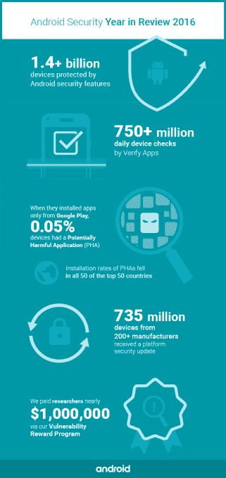

# Android 计划今年提高安全更新速度

> 原文：<https://web.archive.org/web/https://techcrunch.com/2017/03/22/security-updates-are-still-slow-for-android-users/>

过去一年，谷歌一直在与第三方制造商和手机运营商合作，改善其 Android 更新系统，该系统经常被批评为不够快，无法保护用户免受已知漏洞的影响。尽管谷歌表示已经在这一领域取得了一些进展——2016 年，Android 向 200 多家制造商的 7.35 亿台设备发布了安全更新——但大约一半的 Android 用户仍然没有获得重要的安全补丁。

“保护所有安卓用户仍有大量工作要做:2016 年底，约一半在用设备在过去一年没有获得平台安全更新，”安卓安全主管阿德里安·路德维格和梅林达·米勒在一篇年度回顾文章中写道。在此期间，Android 每月都会发布安全更新。

当手机制造商发现他们产品中的漏洞时——无论是通过安全研究人员的外部报告还是通过内部审计——它都会引发一场在问题被广泛利用之前修补问题的竞赛。但在包括数百家运营商和制造商的 Android 生态系统中，向每个用户推送这些更新是一个复杂的过程。

虽然谷歌制造的 Pixel 和 Nexus 手机和平板电脑会收到[自动更新](https://web.archive.org/web/20230405191548/https://android.googleblog.com/2015/08/an-update-to-nexus-devices.html)，但数百家在其设备上运行 Android 的制造商不会立即向客户推送安全更新。这种做法可能会让客户等待数月才能获得更新，同时他们的设备也容易受到攻击。

Ludwig 告诉 TechCrunch，通过与运营商和制造商合作，谷歌已经能够将安全更新的等待时间从六到九周缩短到几天。“在北美，只有超过 78%的旗舰设备在 2016 年底进行了安全更新，”他解释道。“就它所代表的进步而言，这是一个很好的数字。我们认为我们可以做得更好。”

与运营商和制造商分享谷歌的更新速度数据，对于说服他们发布更快的安全更新至关重要。“这不是让他们相信这很重要——他们已经相信了——这是提供特定状态的可见性，而这往往是他们所没有的，”路德维希说。“因为生态系统有太多的参与者，每个人都知道更新率很低，但他们认为这是由其他人引起的。提供信息让他们能够采取行动。”

运营商开始以不同于功能更新的方式看待安全更新，并更快地将它们送到消费者手中，同时制造商也在调整他们向设备发布更新的方式。谷歌也为这一进程做出了贡献，它缩小了更新的大小，以确保更快的下载速度，并取消了用户批准每次更新的要求。

除了更新之外，Android 在消除所谓的“潜在有害应用程序”方面取得了更大的进展，这些应用程序会将特洛伊木马、网络钓鱼诈骗和恶意下载程序偷偷下载到客户的手机上。根据年终报告，谷歌自动扫描 Play store 中的应用程序以查找有害内容，执行“2016 年 7.5 亿次日常检查，高于前一年的 4.5 亿次”。

每日扫描次数的增加导致从 Play 下载的有害应用的比例大幅下降:

> 来自 Google Play 的 PHA 安装量在几乎所有类别中都有所下降:
> 
> ●现在 0.016%的安装量，安装的木马比 2015 年下降了 51.5%。
> 
> ●现在 0.003%的安装量，恶意下载者比 2015 年下降了 54.6%。
> 
> ●现在 0.003%的安装量，与 2015 年相比，后门下降了 30.5%。
> 
> ●现在 0.0018%的安装，钓鱼应用比 2015 年下降了 73.4%。

尽管取得了这一进展，路德维希和米勒表示，2016 年潜在有害应用的总体安装量有所上升。“虽然在 2016 年底，所有 Android 设备中只有 0.71%安装了潜在有害应用程序(PHA)，但这比 2015 年初的约 0.5%略有增加，”他们写道，并补充说，他们希望今年使用 2016 年开发的新工具来减少这一数字。

Android 还在其最新的操作系统 Nougat 中进行了加密改进，并改进了音频和视频文件的沙箱。