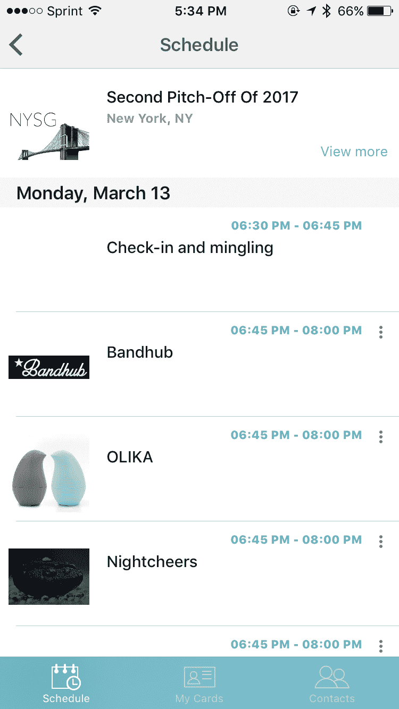

# 今晚在纽约微聚会 TechCrunch 见

> 原文：<https://web.archive.org/web/https://techcrunch.com/2017/03/13/see-you-tonight-at-the-new-york-micro-meetup/>

# 今晚在纽约微聚会上见

为了准备 5 月份的纽约大混乱，我将在纽约为你们所有人举办几次投球研讨会。我们将于 3 月 13 日晚上 7 点在位于西 38 街 22 号的 [Knotel](https://web.archive.org/web/20221205124259/https://knotel.com/) 空间 4 楼聆听并评论 8 个提议。这是一场非正式的比赛，但是两个最好的队将获得两张 [Disrupt](https://web.archive.org/web/20221205124259/https://beta.techcrunch.com/tag/Disrupt) New York 的门票以及数百万人永恒的崇拜(实际上更像是 80 个人，因为房间并不大。)请 BYOB。没有太多的预算，但是很有趣。

民间投球手有 [BandHub](https://web.archive.org/web/20221205124259/https://bandhub.com/) 、 [OLIKA](https://web.archive.org/web/20221205124259/http://www.olikalife.com/) 、 [Nightcheers](https://web.archive.org/web/20221205124259/http://nightcheers.com/) 、 [Workshop](https://web.archive.org/web/20221205124259/http://meetworkshop.com/) 、 [Flytechnista](https://web.archive.org/web/20221205124259/http://flytechnista.org/) 、 [Adventurely](https://web.archive.org/web/20221205124259/http://getadventurely.com/) 、 [StyleKist](https://web.archive.org/web/20221205124259/http://stylekist.com/) 和[re fill](https://web.archive.org/web/20221205124259/http://reefill.com/)。

[RSVP 此处](https://web.archive.org/web/20221205124259/https://www.meetup.com/New-York-Startup-Guild/events/238150014/)。我把数量限制在 8 个，这样我们就有时间来讨论音高了。回头见。

我们将在会议期间投票选出最佳创业公司。要投票，请下载 [Rapid Square](https://web.archive.org/web/20221205124259/http://rapidsq.com/) 或在 App store 或 Google play 上搜索“Rapid Square 卡”。

