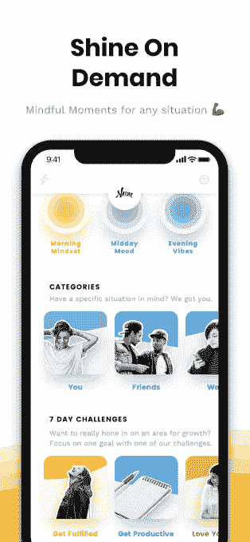

# 自我保健创业公司 Shine 融资 500 万美元 A 轮 

> 原文：<https://web.archive.org/web/https://techcrunch.com/2018/04/03/self-care-startup-shine-raises-5-million-series-a/>

公司今天宣布，在如今充斥着自我护理应用程序和服务的市场[中较早进入的](https://web.archive.org/web/20230213184950/https://techcrunch.com/2018/04/02/self-care-apps-are-booming/)Shine，已经获得了 500 万美元的首轮融资，同时达到了活跃用户达到 200 万的里程碑。这轮投资由康卡斯特风险投资公司的现有投资者牵头，betaworks、Felix Capital、纽约时报、Eniac Ventures、女性创始人基金
和 BBG 风险投资公司也参与其中。

大约两年前，Shine [推出了其免费服务](https://web.archive.org/web/20230213184950/https://techcrunch.com/2016/06/23/shine-facebook-and-sms/?_ga=2.52777387.2012850336.1522674640-1447864512.1494524635)，这是一个针对年轻用户的消息机器人，每天通过短信或脸书的信使提供生活建议和积极的鼓励。

当时，自助可以被放入一个应用程序或类似机器人的格式，这仍然是一个相对新颖的概念。但是今天，数字健康已经变得越来越普遍，从冥想到自助，从谈话疗法到谈话疗法，数字健康应用已经变得越来越普遍。

“我们感到自豪的是，我们是让福祉成为一个行业的催化剂的一部分，这是一个非常重要的问题。联合创始人娜奥米·希拉巴亚希(Naomi Hirabayashi)说:“我们真的感觉到了世界的发展方向，我们走在了它的前面。”娜奥米·希拉巴亚希和她在 DoSomething.org 的前同事玛拉·莉迪(Marah Lidey)一起创建了 Shine。创始人们想给其他人提供一些类似于他们作为亲密朋友彼此之间的个人支持系统的东西。

“马拉赫和我都是有色人种女性，我们从企业家的角度出发，在非常非传统的背景下创建了这家公司——我们没有上过商学院，”Hirabayashi 解释道。“我们看到市场中缺少一些东西，因为福利公司没有真正接触到我们——他们没有和我们说话。我们没有看到像我们一样的人。她说:“我们觉得他们分享内容的方式听起来不像我们谈论生活中不同的幸福问题的方式。

该公司的免费信息产品 Shine Text 是他们对现有产品不满的结果。它每天在自信、生产力、心理健康、幸福等领域处理一个及时的主题。它不仅仅是某种肯定生活的文本——Shine 使用研究支持的材料就手头的主题与你交谈，以帮助你更好地理解信息。它的呈现方式也让 Shine 感觉更像是一个朋友在和你聊天。

这项服务已经在 189 个国家发展到 200 万用户，尽管没有其他语言的本地化。88%的用户年龄在 35 岁以下，70%是女性。

Shine [过去曾试图通过订阅生活指导服务](https://web.archive.org/web/20230213184950/https://techcrunch.com/2016/10/12/shine-is-rolling-out-on-demand-life-coaching-via-text-message/)来创收，但用户希望与真人交谈，订阅费用相当高，每周 15.99 美元。该产品从未出现在测试中，创始人现在称之为“实验”

[gallery ids="1615987，1615986，1615985，1615984，1615983"]

该公司在去年 12 月又给了订阅一次机会，在 iOS 上推出了免费增值(付费升级免费)[应用。这款新应用提供冥想、肯定和一种叫做“闪亮故事”的东西。](https://web.archive.org/web/20230213184950/https://itunes.apple.com/us/app/id1293721589?mt=8)

冥想是由有影响力的人发出的简短音频，帮助你应对各种挑战。有快速的冥想来重新集中精力和放松，那些你可以专注于处理特定情况的冥想——比如有毒的友谊或网上约会——以及处理特定问题的七天挑战，比如倦怠或生产力。

肯定是快速的鼓舞士气的谈话，精彩的故事稍微长一点——大约五分钟，也是由有影响力的人说的。

Hirabayashi 说:“最重要的是，我们希望在用户所在的地方与他们见面，我们知道人们都在忙碌着。“你可以期待未来会有更多关于我们如何结合音频消费的真正令人兴奋的时代和对激励人心、让你感觉更好的音频内容的渴望。”

当被问及该公司是否正在考虑一个语音优先的应用程序，比如 Alexa skill，或者更传统的播客时，Lidey 说他们还不确定，但没有计划无限期地将 Shine 的故事限制在一个平台上。但他们近期没有兴趣做的一件事是在 Shine 的音频内容中引入广告。

iOS 版的 [Shine 应用](https://web.archive.org/web/20230213184950/https://itunes.apple.com/us/app/id1293721589?mt=8)是免费下载的，免费用户可以选择其中的一些音频。用户可以以每月 4.99 美元的价格解锁整个图书馆，这相当于每年 59.99 美元的订阅费，如果按月付费，则每月 7.99 美元。

创始人拒绝透露他们从免费会员转为付费会员的具体情况，但表示这“符合行业标准”

随着 A 系列产品的推出，Shine 计划今年将其 8 人团队增加一倍，在 Android 上推出应用程序，继续发展业务，包括可能推出新产品。

现在的问题是，千禧一代是否真的*如此*关心自己，以至于他们会付钱。有一些迹象可能是真的——上个季度，排名前十的自我保健应用程序获得了 1500 万美元的收入，其中冥想应用程序领先。

“我们现在主导着千禧一代女性的日常自我护理，我们希望继续这样做，”Lidey 说。