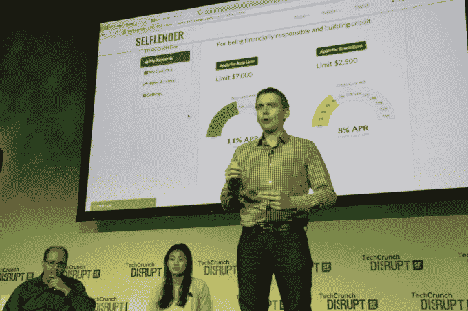
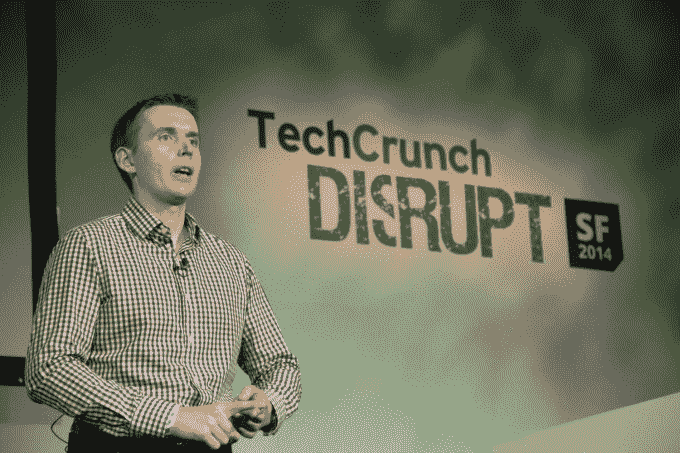

# Self Lender 希望帮助人们建立和修复他们的信用 

> 原文：<https://web.archive.org/web/https://techcrunch.com/2014/09/09/self-lender-wants-to-help-people-build-and-repair-their-credit/>

美国的信用系统不是很好。人们很难在其中建立和恢复自己的地位。今天，在 Disrupt Startup 战场上， [Self Lender](https://web.archive.org/web/20221007003412/http://selflender.com/) 推出了消费者金融服务，以帮助信用历史有限的人建立信用，并帮助信用档案较弱的人提高他们的分数。

Self Lender 通过让人们借一小笔托管的钱来解决这个问题。债务将在三个月、六个月、九个月或十二个月内偿还。一个简单的支付计划让用户以一种定期的方式付清欠款，公司在支付期结束时返还用户“付清”的几乎所有的钱。

通过这种方式，用户实际上可以使用 Self Lender 进行储蓄。该公司建议，用户可以建立自己的信用，并轻松增加资金来支付汽车的首付款，鉴于他们的信用状况有所改善，他们将有资格获得贷款。

该公司每月收取 3 美元的费用。用户可以在他们选择的付款期内每月偿还 25 至 250 美元，如果你借得更多，使用 Self Lender 会更经济。支付历史对个人信用评分的影响程度各不相同。

我与创始团队讨论了该产品，以及使用 Self Lender 对您的信用评分产生积极影响需要多长时间。公司说是六个月，但是，正如你所料，时间越长越好。

自助贷款支持自动支付。因此，对于普通用户来说，他们可以注册这项服务，设置他们的付款，然后忘记所有的事情，直到 Self Lender 将他们几乎所有的钱都寄回来，并增加额外的甜头，将现金回报与提高的信用评分联系起来。

让普通人考虑他们的信用可能很难，这可能使 Self Lender 难以在短期内扩大其用户群。但随着时间的推移，该公司将扩大用户群，它知道这些用户希望变得精明。这些信息对提供传统贷款的公司来说更有吸引力；如果你借钱给别人，难道你不想把钱借给比一般人更值得信任的人吗？

看看 Self Lender 能多快获得用户将会很有趣。想建设，又不想滥用信用的人的市场有这么大吗？

**Q & A**

*你是如何获取客户的？*

这位首席执行官有建立客户群的经验，也计划与其他团体合作，寻找目前银行服务不足的人。

你对你的目标客户做过市场调查吗？

到目前为止，我已经有了一些测试版客户，而且反响非常好。脸书被用来获得他们的第一批用户。由于许多人在 2008 年的金融衰退中遭受重创，对该产品也有需求。

*当谈到他们即将到来的信贷需求时，人们对未来的展望有多远？*

有 7000 万到 9000 万人由于缺乏支付历史而拥有次级信贷。那些人被激励去使用这个产品。

*你有一张幻灯片，上面说你 35%的信用评分是按时支付的，剩下的是多少？这足以影响你的信用评分吗？*

自我贷款建立了每一块馅饼。但是人们也需要建立支付历史。Self Lender 也认为他们的产品足够简单，每个人都可以使用。

*你是否造成了误报？如果他们不履行义务会怎么样？*

Self Lender 没有声称它的信息是可预测的，其他外部团体说它是可预测的。

*你有没有考虑过通过信用社分销？*

是的。

在存在大量掠夺性贷款的脸书，你如何利用广告建立信任？

与银行合作，下个月会有更多的消息宣布。

随着时间的推移，600 美元是否会有一点浮动？

是的，但是它很小，并且它使价值主张变得复杂。