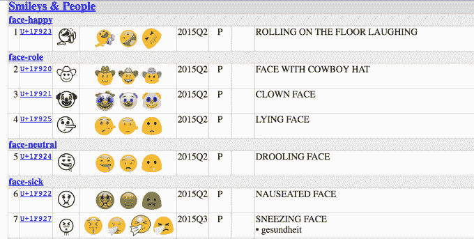
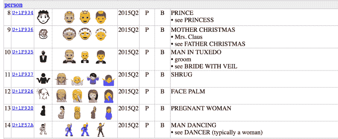
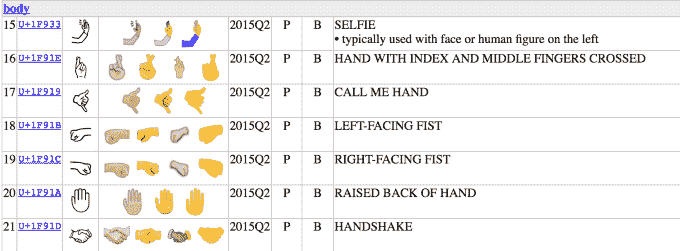
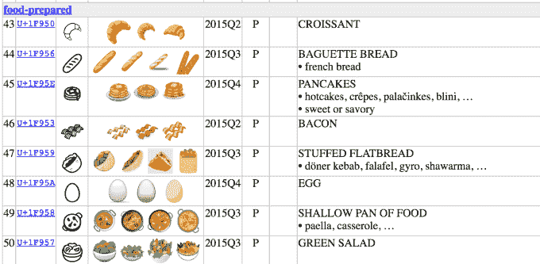
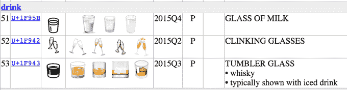
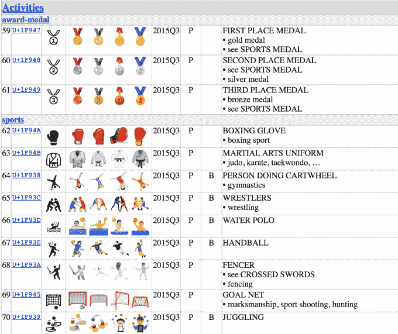

# 自拍、耸肩、ROFL、脸掌、威士忌、小丑等新表情符号将于 6 月上市 

> 原文：<https://web.archive.org/web/https://techcrunch.com/2016/06/02/selfie-shrug-rofl-face-palm-whiskey-clowns-and-more-among-new-emoji-arriving-in-june/>

新表情符号即将推出！在新表情符号敲击键盘之前批准它们的组织刚刚[宣布了](https://web.archive.org/web/20230126123337/http://www.unicode.org/emoji/charts/emoji-candidates.html#u9.0_candidates) 72 个新表情符号，它们将在本月晚些时候被添加到 Unicode 标准(Unicode 9.0)中。这个选择包括几个有趣的新增内容，包括那些反映网络俚语的内容——例如，笑着在地板上打滚——源于首字母缩略词[ROFL](https://web.archive.org/web/20230126123337/http://www.urbandictionary.com/define.php?term=ROFL)——是即将推出的表情符号之一，显示了一个张着大嘴闭着眼睛的倾斜笑脸。另一个肯定很受欢迎的新增功能是耸肩，今天人们倾向于用 _(ツ)_/这样的符号打出 T5。

再加上有一张小丑脸，一张长着长鼻子的匹诺曹似的躺着的脸，一个牛仔，还有几张“恶心”的脸像绿色的恶心脸，打喷嚏的脸，流口水的脸(看起来比流口水还恶心。).

在新增的人物中，值得注意的新来者将包括一个带着孩子的女人，一个看起来像周六夜狂热的约翰·特拉沃尔塔的跳舞男人，一个穿着晚礼服，戴着脸掌的男人，以及前面提到的耸肩。

对于手势，我们终于*得到了交叉手指表情符号，以及握手、握拳、举着手机的“自拍”表情符号，等等。*

 *

还有许多新的动物和食物，包括及时添加的大猩猩，加上鹿，狐狸，蜥蜴，鲨鱼，蝴蝶等，加上美味的培根和法棍面包，煎饼和沙拉(如果你很乖)，仅举几例。

哦，对了:现在终于有了一个威士忌酒杯，用于那些啤酒杯或马提尼根本不能反映你选择的饮料的日子。(又名:每天。)

也有更多的运动和旅行选择，像轻便摩托车和踏板车，空手道，击剑，拳击，手球，摔跤，杂耍，体操，甚至水球…因为…嗯，我肯定有人玩水球，厌倦了打字了。哦，嘿，夏季奥运会就要来了！

新的金牌、银牌和铜牌对此也很方便。

这只是部分精彩列表，但是你可以在 Unicode.org 网站上浏览新表情符号[的完整列表。](https://web.archive.org/web/20230126123337/http://www.unicode.org/emoji/charts/emoji-candidates.html#u9.0_candidates)

你在新标准中看不到的一件事？更多样化的表情符号。 [Unicode 已经推出了一个更新，包括一个肤色修饰符](https://web.archive.org/web/20230126123337/http://www.npr.org/sections/thetwo-way/2014/11/04/361489535/2015-emoji-update-will-include-more-diverse-skin-tones)，但它仍然在工作和体育角色中有很多男性角色——至少可以从男人或女人中选择一个。

其他公司也在努力使他们的表情符号多样化。本周，脸书推出了新的表情符号,以更好地反映肤色和性别，同时推出了更多女性表情符号——包括警察、跑步者、冲浪者、行人和游泳者。与此同时，[的谷歌员工向 Unicode Consortium](https://web.archive.org/web/20230126123337/https://www.buzzfeed.com/charliewarzel/google-is-proposing-a-new-set-of-emoji-to-better-represent-w?utm_term=.hvwZ72ZXD#.jeOwxjw3d) 提交了一份提案，要求他们添加 13 个新的表情符号，突出“女性职业的多样性”，展示女性在医生、科学家、科技行业等领域的工作。

然而，在你对所有这些新字符抱太大希望之前:尽管 Unicode Consortium 将在 2016 年 6 月 21 日批准这些新的 Unicode 9.0 表情符号，但这并不意味着它们将在那时出现在你的手机上的表情符号键盘中。

此后，苹果、谷歌和微软等智能手机制造商可以在自己的软件中添加新的表情符号。然后他们必须通过软件更新向公众发布。

*主图:来自[表情百科](https://web.archive.org/web/20230126123337/http://blog.emojipedia.org/new-unicode-9-emojis/)的实体模型；Unicode.org 剩余**