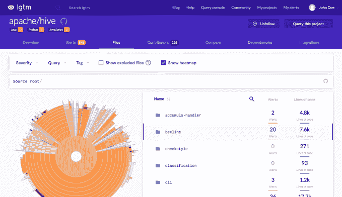

# 使代码可搜索的初创公司 Semmle 获得 2100 万美元的 B 轮融资 

> 原文：<https://web.archive.org/web/https://techcrunch.com/2018/08/21/semmle-startup-that-makes-code-searchable-hauls-in-21m-series-b/>

# 使代码可搜索的初创公司 Semmle 获得了 2100 万美元的 B 轮融资

最初从牛津大学的研究中分离出来的初创公司 Semmle 今天宣布获得由 Accel Partners 领投的 2100 万美元 B 轮投资。这标志着[第二次获得 Accel](https://web.archive.org/web/20230117060052/https://techcrunch.com/2014/09/16/semmle-series-a/) 对该公司的投资。

工作台也参加了这一轮。今天的投资总额达到 3100 万美元。

Semmle 通过采用一种独特的方法来寻找代码中的漏洞，保证了这种兴趣。“我们技术背后的关键思想是将代码视为数据，将分析问题视为对数据库的简单查询。Semmle 联合创始人兼平台工程副总裁 Pavel Avgustinov 告诉 TechCrunch 说:“这可以让你非常容易地对领域专业知识、安全专业知识或任何其他类型的专业知识进行编码，从而可以轻松地自动应用于大量代码。

截图:塞姆勒

一旦您创建了正确的查询，您就可以针对您的代码连续运行它，以防止在后续构建中在代码库中出现相同的错误。这里的关键是建立查询，公司有几种方法来处理这个问题。

他们可以与客户合作，帮助他们创建查询，尽管从长远来看，这不是一种可持续的工作方式。相反，他们分享问题，并鼓励客户与社区分享。

“我们发现，与我们合作的伟大科技公司拥有世界上最好的安全团队，他们以开源的方式与其他用户分享他们在 Semmle 平台上创造的东西。公司首席执行官兼联合创始人 Oege de Moor 解释说:“GitHub 有一个知识库，我们在那里发布查询，但微软和谷歌正在做[同样的事情](https://web.archive.org/web/20230117060052/https://lgtm.com/)。

事实上，Semmle 解决方案是免费提供给开源程序员使用的，该公司目前分析了近 80，000 个开源项目的每个提交。开源开发者可以针对他们的代码运行共享查询，或者创建他们自己的查询。

微软、谷歌、瑞士瑞信银行、美国宇航局和纳斯达克等客户也有付费版本。到目前为止，他们主要依赖这些战略合作伙伴。有了今天的投资，他们计划建立他们的销售和营销部门，将他们的客户群扩展到更广泛的企业市场。

该公司于 2006 年从牛津大学的研究中分离出来。他们现在位于旧金山，有 60 名员工，这个数字应该会随着这项投资而增加。他们在 2014 年获得了 800 万美元的首轮融资，在 2011 年获得了 200 万美元的种子融资。