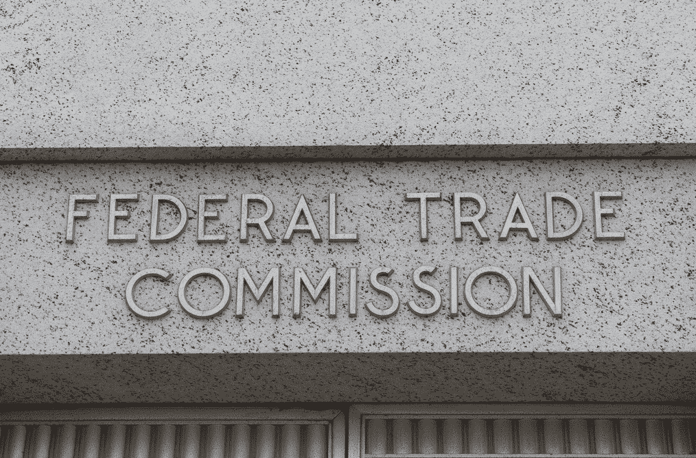

# 参议员哈里斯告诉联邦机构认真对待面部识别风险

> 原文：<https://web.archive.org/web/https://techcrunch.com/2018/09/18/sen-harris-tells-federal-agencies-to-get-serious-about-facial-recognition-risks/>

面部识别技术带来了无数的机会和风险，但似乎政府在将其用于执法和文书目的时只会考虑前者。参议员卡玛拉·哈里斯(D-CA)已经写信给美国联邦贸易委员会联邦调查局和平等就业机会委员会，告诉他们需要参与这个项目，并面对这个有争议的技术带来的非常真实的偏见和风险。

在提供给 TechCrunch 的三封信中(嵌入在本文底部)，哈里斯和其他几位著名的立法者指出了最近的研究，这些研究表明面部识别如何产生或加强偏见，或者以其他方式失败。这必须在联邦机构的规则、指南和应用中加以考虑和适应。

其他议员和当局已经致函各公司和首席执行长，或举行听证会，但哈里斯的代表解释说，也有必要在政府内部推进这一问题。

哈里斯参议员在最近的一次听证会上。

对像联邦贸易委员会和 EEOC 这样“负责执行公平”的机构的关注是“向公司发出的一个信号，即巡逻警察正在关注，也是一个间接信号，表明他们也需要关注。我们感兴趣的是公平的结果，而不是某个特定公司的做法。”

如果在制定规则和法律时，或者在技术的应用和部署中，不考虑这项研究和人工智能系统控制不良的可能性，可能会造成严重的伤害。不仅仅是正面的伤害，如错误识别犯罪嫌疑人，还有负面的伤害，如以算法形式钙化数据和商业实践中的偏差，剥夺受就业或服务偏差影响的人的权利。

“虽然有些人表示希望面部分析可以帮助减少人类的偏见，但越来越多的证据表明，它实际上可能会放大这些偏见，”这封给 EEOC 的信写道。

在这里，参议员哈里斯，以及参议员帕蒂·默里(华盛顿州民主党)和伊丽莎白·沃伦(马萨诸塞州民主党)，表达了对就业过程日益自动化的担忧。招聘是一个复杂的过程，每个阶段都会引入基于人工智能的工具，因此这不是一个理论问题。信中写道:

> 例如，假设一名非裔美国女性在一家公司找工作，该公司利用面部分析来评估候选人的言谈举止与公司高管的相似程度。
> 
> 首先，这项技术对她言谈举止的解释可能不如白人男性候选人准确。
> 
> 第二，如果公司的高层管理人员是同质的，例如白人和男性，那么所寻求的特征可能与工作表现无关，而是属于这个群体的人工制品。她可能和白人男性候选人一样胜任这份工作，但面部分析可能不会给她很高的评价，因为她的暗示与众不同。
> 
> 第三，如果有偏见的晋升的特定历史导致高层管理人员的同质性，那么面部识别分析技术可以编码这种偏见，然后将其隐藏在客观的科学外表下。

如果这听起来像是面部识别的一种幻想，那么你可能还没有给予足够的关注。此外，即使它仍然是罕见的，在这些事情成为普遍问题之前考虑它们是有意义的，对吗？这个想法是为了识别技术中固有的问题。

“我们要求 EEOC 为雇主制定公平使用面部分析技术的指导方针，以及这项技术如何违反反歧视法，”参议员们问道。

一系列问题也随之而来(每封信中都有):有没有类似的投诉，或者在现行法律下这项技术有没有明显的问题？如果面部技术成为主流，应该如何测试，EEOC 将如何验证该测试？哈里斯和其他人要求在 9 月 28 日前给出委员会计划如何调查此事的时间表。

名单上的下一个是联邦贸易委员会。该机构的任务是识别和惩罚商业和广告中的不公平和欺诈行为；哈里斯声称，如果面部识别技术的供应商未能测试或说明其系统中的严重偏差，他们可能会被认为违反了联邦贸易委员会的规定。

信中写道:“开发者很少测试并披露他们技术中的偏见。”。“如果不了解技术中的偏见或使用技术带来的法律和道德风险，善意的用户可能会无意中不公平地参与歧视。此外，根据《联邦贸易委员会法》，未能向购买者披露这些偏见可能具有欺骗性。”

另一个例子是:

> 例如，考虑这样一种情况，零售店中的一名非裔美国女性被有偏见的面部识别技术错误地识别为商店扒手，并基于该信息被错误地逮捕。这种错误的逮捕会造成创伤，并严重损害她未来的住房、就业、信用和其他机会。
> 
> 或者，考虑一个场景，一个肤色黝黑的年轻人无法从自己的银行账户中取钱，因为他所在银行的 ATM 使用面部识别技术，无法识别他是他们的客户。

再说一次，这与幻想相去甚远。几周前在 Disrupt 的舞台上，UCOT 的 Chris Atageka 和微软研究院的 Timnit Gebru 讨论了有色人种在与人工智能设备和过程交互时面临的几个非常现实的问题。

事实上，联邦贸易委员会早在 2012 年就有一个关于这个话题的研讨会。但是，听起来令人惊讶的是，这个研讨会没有考虑基于种族、性别、年龄或其他指标的潜在偏见。该机构在早期解决这一问题当然值得称赞，但显然行业和主题已经取得了进展，赶上来符合该机构及其服务对象的利益。

这封信以类似 EEOC 的问题和截止日期结尾:有人投诉吗？他们将如何评估潜在的偏见？他们会发布“一套合法、公平、透明地使用面部分析的最佳实践吗？”这封信由参议员理查德·布卢门撒尔(民主党)、科里·布克(新泽西州)和罗恩·怀登(俄勒冈州)联署。

最后是联邦调查局，哈里斯在这方面有优势:政府问责局发布了一份关于面部识别技术的报告，其中有具体的建议供该局实施。哈里斯想知道的是，他们对此做了什么，如果有的话？

信中写道:“尽管高马德在两年前就向联邦调查局提出了建议，但没有证据表明该机构已经按照这些建议采取了行动。”。

美国政府问责局提出了三项主要建议。简要总结:对下一代身份识别-州际照片系统(NGI-IPS)进行一些认真的测试，以确保它做了他们认为它做的事情，然后进行年度测试，以确保它满足需求并按预期运行，并审核外部面部识别程序的准确性。

“我们也渴望确保联邦调查局对最新的研究做出回应，特别是那些证实面部识别技术在分析女性和非洲裔美国人的面部时表现不佳的研究，”这封信继续说道。

这里的问题清单很大程度上符合美国政府问责局的建议，只是要求联邦调查局表明是否以及如何遵守了这些建议。它测试过 NGI-IPS 在现实条件下的准确性吗？它是否经过了跨种族、肤色、性别和年龄的性能测试？如果没有，为什么没有，什么时候会有？与此同时，它如何证明一个没有经过充分测试的系统的使用是正确的呢？事实上，这个系统在最常被攻击的目标上表现最差。

联邦调查局的这封信的回复截止日期是 10 月 1 日，由布克和国会黑人小组主席塞德里克·里士满共同签署。

这些信件只是一个政府计划的一部分，这个计划当然应该是检查和了解新技术，以及它如何与现有的系统和机构相结合。联邦政府行动缓慢，即使在最好的情况下，如果它要避免或帮助减轻技术带来的真正伤害，否则将不受监管，它必须尽早开始，并经常更新。

* * *

你可以在下面找到这些信的全文。

**EEOC** :

[森哈里斯-EEOC 面部识别系统…](https://web.archive.org/web/20221201150546/https://www.scribd.com/embeds/388920670/content#from_embed "View SenHarris - EEOC Facial Recognition[2] on Scribd") 由 Scribd 提供

**FTC** :

[sen Harris–FTC 面部识别…](https://web.archive.org/web/20221201150546/https://www.scribd.com/embeds/388920672/content#from_embed "View SenHarris - FTC Facial Recognition[2] on Scribd") 由 Scribd 上的

美国联邦调查局:

[sen Harris–FBI 面部识别…](https://web.archive.org/web/20221201150546/https://www.scribd.com/embeds/388920671/content#from_embed "View SenHarris - FBI Facial Recognition[1] on Scribd") 作者:on Scribd