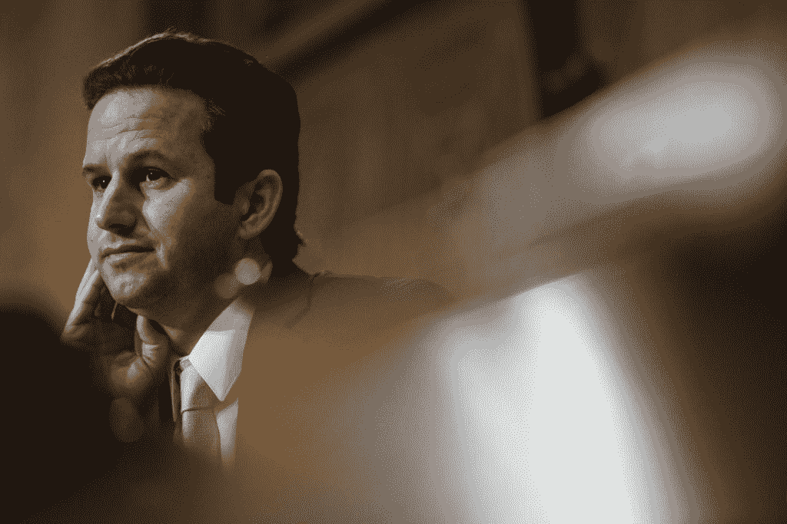
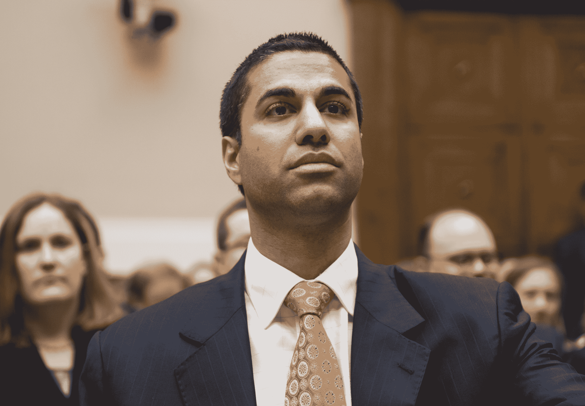

# 参议员沙茨在 FCC 上说:“他们不知道人们会有多愤怒”

> 原文：<https://web.archive.org/web/https://techcrunch.com/2017/04/26/sen-schatz-on-fcc-they-have-no-idea-how-outraged-people-are-about-to-be/>

今天，联邦通信委员会主席 Ajit Pai 对 2015 年建立的网络中立规则正式宣战，引起了轩然大波。人们的反应不一——取决于这个人是否代表电信行业。在混战中，我有机会与参议员沙茨(D-Hawaii)谈论这一声明。

沙茨是参议院通信技术、创新和互联网商务小组委员会的资深民主党人。在众多其他事情中，这个小组委员会监督联邦通信委员会，所以这是参议员的舵手室。

(一些术语注释: *NPRM* 是一份规则制定提案通知，一份解释主要法规的草案文件，在 FCC 投票前几个月提供并征求意见。 *CRA* 是国会审议法案，根据该法案，国会在极短的时间内撤销了宽带隐私条例。标题 II 是《通信法案》的一部分，FCC 至少在一定程度上以此作为其管理宽带的依据。)

我向参议员沙茨询问了第二章经常出现的丑化现象；Pai 和其他人将其描述为“大萧条时代的监管”，专门用于处理“马贝尔垄断”，不适合 FCC 的目的。

“在我的家乡或其他任何地方，都没有人对《电信法》第二章的使用感到不安，”他说。“这可能会让华尔街或 K 街的人感到紧张，但我们这些希望互联网自由开放的人对他们撤销这些基本保护感到愤怒。这里必须强调的是，他们的所作所为没有支持者。唯一希望这样做的实体是电信公司。就是这样。”

我注意到，Pai 主席为 2015 年开放互联网秩序赋予了大量的党派和政治动机——这一讲话远远不是程序性争议。他甚至试图诋毁一位显然是社会主义者的批评家。

“我被党派的论调震惊了，”沙茨说。“这很麻烦。他是一个准司法机构的主席，我认为这没有必要。我的直觉是，他们不知道人们会有多愤怒，也不知道即将到来的公众评论的数量、速度和热情。如果这是一个创纪录的数字，如果他们以 50 比 1 的比例反对委员会的提议，我一点也不会感到惊讶。”

 “用 CRA 周围的隐私他们唤醒了一个沉睡的巨人，”他继续说道。“围绕技术和保护自己，你有一个重新激活的选民。CRA 的时间框架是 30 小时，而 NPRM 则需要几个月。我认为他们会不知所措。”

特别是，Pai 将 FCC 之前的做法描述为在 2014 年中期选举中惨败的引人注目的反应性举措。当我问到这个问题时，参议员似乎对这个策略感到困惑。

“他们提出这种奇怪的论点，认为联邦通信委员会所做的是受欢迎的，而他们将要做的是不受欢迎的，”他说。他也不反对。“他说得对。很多人来和我谈论开放的互联网——超越党派政治和分析。在 20 年的政治生涯中，15 年的民选公职生涯中，从来没有一个不受电信公司补偿的人*走过来说，“嘿，我讨厌第二条。”"*

 *

Pai 主席列举了几个显然与开放的互联网秩序有关的负面影响，特别是宽带公司在基础设施上的资本支出下降。参议员沙茨并不相信。

“事实证明这不是真的，”他说。“现在有充分的研究表明，自订单以来，宽带研究投资有增无减，盈利能力也有所提高。数据出来了，电信公司做得很好。”

(必须指出的是，支持双方观点的数字都有所提高，但几家公司公开表示，他们的业务基本上没有受到订单的影响，出现的下降似乎与订单没有直接关系。)

这位参议员警告说，不要把消费者做出正确选择的权利留给公司自己。

他警告说，“他们会承诺不做任何邪恶的事情，但法律没有禁止他们将数据分类，并像有线电视一样打包卖给你。”“如果在人们实际接触提供商方面存在垄断和双头垄断，市场不会解决这个问题。他们会保证不这么做，但我还是要说，我们为什么不把它写进一条规则里呢？”

我问参议员是否认为网络中立的问题已经变得太家喻户晓，一种人们理解和期望的保护，以至于人们容忍它被干扰。我问道，废除它会不会如此不受欢迎，以至于失去政治上的支持？

“让我们看看，”他只说了这么一句。

目前，主席的计划只是粗略地勾勒出来，但 NPRM 将于明天公开提供，届时将会开始更多(和更技术性的)评论。无论 Pai 与这场辩论的另一方有什么不同，他都正确地重视这一重大问题的正当程序。

“这个决定应该通过一个公开透明的过程来做出，在这个过程中，每个美国人都可以分享他们的观点，”他今天说。这正是他应该期待的。*