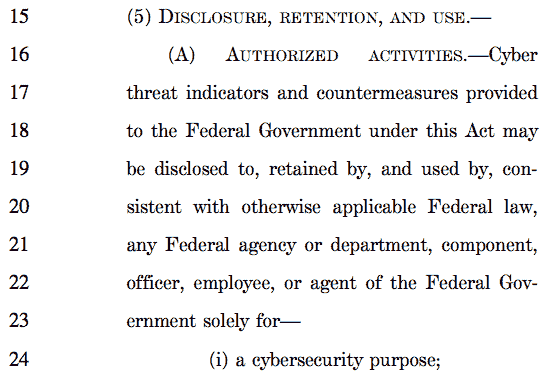
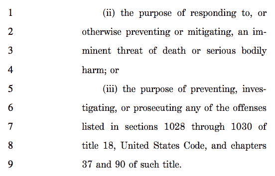

# 参议院委员会提出有争议的网络安全法案

> 原文：<https://web.archive.org/web/https://techcrunch.com/2014/07/08/senate-committee-advances-controversial-cybersecurity-bill/>

参议院情报委员会今天批准了一项网络安全法案，该法案将鼓励公司之间以及与联邦政府之间共享威胁信息。参议院小组以 12 票对 3 票通过了该法案。今年应该会进行全面投票。

《网络安全信息共享法案》( CISA)自 6 月出台以来，受到了隐私保护组织的严厉批评。投诉源于该法案的宽泛定义，这些定义可能会被滥用，缺乏国土安全部的监督，以及保护美国公民隐私的不成熟(充其量是最小化)技术。他们还质疑不仅与国家安全局(NSA)共享信息，而且与拥有广泛权限将共享信息用于非网络安全目的的各级政府共享信息。

鉴于前政府承包商爱德华·斯诺登的爆料，上述担忧变得更加复杂。该爆料显示，行政部门[愿意利用漏洞和更多的违法行为](https://web.archive.org/web/20221206195102/https://beta.techcrunch.com/2014/06/30/fbi-cia-join-nsa-in-backdoor-searches-on-americans/)来更好地收集美国公民的数据和通信。

“自爱德华·斯诺登揭露存在大规模监控项目以来的一年里，这些项目是秘密授权的，依据的是机密和有缺陷的法律推理，美国人压倒性地要求进行有意义的隐私改革，并撤销自《爱国者法案》通过以来建立的监控状态，”隐私团体[在一封信](https://web.archive.org/web/20221206195102/https://www.aclu.org/sites/default/files/assets/6-26-14_--_cisa_sign-on_letter_final.pdf)中写道。"该法案将起到完全相反的作用。"

该法案将消除现有的法律障碍，让私营部门可以自由地向其他公司和政府移交与网络威胁相关的数据，以提高安全性。然而，正如美国公民自由联盟和其他人所指出的，该法案在减少为此目的收集的信息方面做得甚至不够。

因此，根据该法案对网络威胁及其应对措施的宽泛定义，现有的激励措施可以用来收集并非专门用于网络安全目的的数据。这些数据可以在政府内部广泛共享，因为该法案将对其使用提供很少的控制。

该法案还将赋予政府机构广泛的披露、保留和使用私人公司提供的网络威胁信息的权利。该法案将允许这些数据被用于起诉广泛的犯罪，包括那些违反《反间谍法》的犯罪。

当她宣布这项立法时，加州民主党参议员黛安娜·范斯坦说，这项法案“提供了重要的保护”，以防止侵犯隐私。该法案将要求分享信息的公司删除“已知”美国人的个人身份信息。不难理解，私营企业不是公民身份的选择仲裁者。鉴于网上假名等的广泛使用，很难确定和决定谁是公民，谁不是。

根据目前的语言，隐私倡导者担心政府没有采取任何措施来过滤这些信息。国土安全部(DHS)将充当根据拟议法律收集的信息的门户。然后，DHS 会自动与包括美国国家安全局在内的其他机构分享这些信息。民主与技术中心指出，该法案“未能解决最近披露的美国国家安全局与网络安全有关的行为。”

因此，通常情况下，美国公民的非机密通信和其他数据可以由受法律保护的公司与美国政府共享，免受受影响方的任何法律回应。如果这对你来说听起来并不精彩，那就加入上升的合唱吧。

当眼前的问题“直接”与“网络安全威胁”相关时，该法案还将使自己免受对美国信息的微弱保护。讽刺歌唱。

隐私倡导者担心政府可能会在行人刑事诉讼中使用网络安全信息，因为该法案没有明确阻止政府这样做。语言近乎幽默:

因此，政府可以将提供的信息用于网络安全、迫在眉睫的死亡或其他任何它想要的东西。

隐私组织还担心，该法案包含的“网络安全威胁”的定义可能会被利用来包括告密者。语言越宽泛，它能认可和合法支持的行动就越多。当几乎没有保护措施来防止滥用时，你就有了一个有毒混合物。

图片由 FLICKR 用户[伊莱杜克](https://web.archive.org/web/20221206195102/https://www.flickr.com/photos/elisfanclub/6880101231/in/photolist-btYjp2-5JMf3i-aaxkrx-7d25xm-5YviKw-4VB9rN-47FQG8-6wjchF-8acXXd-6sPSb5-dXvgqN-6aGHAj-6aCyKM-6aCyE6-bxfDVo-bLaeMx-bxfDyy-bLadWR-4VwVL6-8PowqU-6sKJkk-4VBaHd-4DAoBj-bEciDZ-4wBprZ-btYiXH-fsxy39-bxfvQQ-4wFxW5-8aa2mV-i4Eg4w-bLajcz-btYi2c-brhn6y-97cr3b-3n5NV2-7cX8xM-3n5P2T-e56JpA-8aa8b2-bLajxa-9n4don-6AwSrg-jwjFNv-brhrTJ-btYmuF-7d253j-6CkWK-bxfDef-b47GD)根据  [CC BY-SA 2.0](https://web.archive.org/web/20221206195102/https://creativecommons.org/licenses/by-sa/2.0/) 授权(图片已修改)