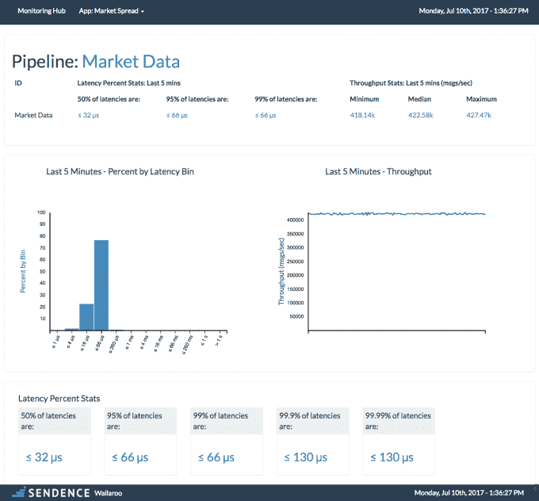

# Sendence 完成 150 万美元的种子期投资，以简化实时应用的部署 

> 原文：<https://web.archive.org/web/https://techcrunch.com/2017/07/11/sendence-closes-1-5m-seed-seed-round-to-simplify-deployment-of-real-time-applications/>

# Sendence 完成了 150 万美元的种子期投资，以简化实时应用的部署

总部位于纽约的新创公司 Sendence 今天宣布了 150 万美元的种子资金。该公司正在开发一个简化实时应用部署的平台。

投资者包括 Boldstart Ventures、Greycroft、Contour Venture Partners、Notation Capital 和 Resolute Ventures。

正如公司首席执行官兼联合创始人 Vid Jain 所看到的那样，越来越多的公司正在雇用数据科学家来开发应用程序，以根据大量数据实时做出决策，但问题是如何处理运行这些应用程序的复杂性，无论是在云还是数据中心。

Sendence 声称要做的是通过处理底层基础设施管道来消除所有的复杂性，并使其在需要新资源时自动扩展。

开发人员在 Sendence Wallaroo 平台上用他们选择的语言编写他们的应用程序，Jain 说这涵盖了最流行的选择，如 C++或 Python——除了 Java 以外的几乎任何东西。其思想是像平常一样简单地创建您的应用程序，让系统知道您的基础设施驻留在哪里，并且它应该用正确的资源级别来处理应用程序的启动和管理——并且随着时间的推移随着需求的变化来修改它。

这些类型的应用程序往往在数十台甚至数百台服务器上运行，员工最终会在基础架构方面花费大量时间来确保数据不丢失、负载平衡以及所有基础架构维护和管理任务。他坚持认为这是对时间和资源的巨大浪费。

应用程序启动后，您可以在分析仪表板中监控性能。

照片:森登斯

对于那些将宝贵的数据科学家时间花在配置基础设施方面的较小公司来说，这可能是一个福音，但即使对于拥有数据工程和基础设施团队的较大公司来说，这也有助于自动化许多目前需要人工管理的活动。

“即使有一个面向数据工程或基础设施的团队，当[数据科学家]开发应用程序时，他们仍然需要考虑底层基础设施以及如何扩展它。当你作为数据科学家在我们的平台上编写应用程序时，你不必考虑这些，”Jain 说。

该公司计划在短期内开源核心技术，并希望围绕开源项目建立一个社区，以帮助产品在今年上市时获得一些牵引力。

Sendence 目前有 10 名员工和几个测试版客户。该公司的短期目标是在年底前获得几个付费客户，然后从那里开始发展公司。