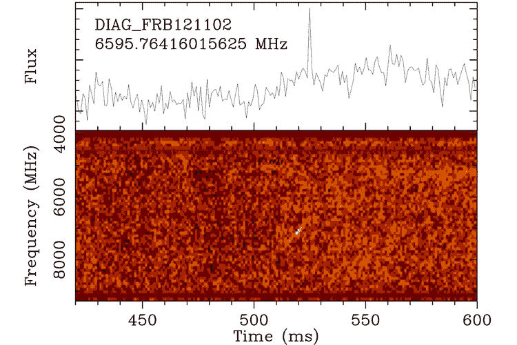

# SETI 神经网络发现了几十个来自遥远星系的神秘信号

> 原文：<https://web.archive.org/web/https://techcrunch.com/2018/09/10/seti-neural-networks-spot-dozens-of-new-mysterious-signals-emanating-from-distant-galaxy/>

搜寻外星智能(SETI)的长期乐观主义者已经加入了世界其他地区部署人工智能来帮助管理庞大的数据集的行列，他们的努力几乎立即取得了成果。通过使用定制的机器学习模型，在先前分析的数据中发现了来自 30 亿英里外神秘嘈杂的星系的 72 个新的“快速无线电爆发”。

需要澄清的是，这不是莫尔斯电码，也不是建造传送点的加密指令，或者至少据我们所知不是。但是，这些快速射电爆发，或 FRB，很少被了解，至少很可能代表了一些迄今未被观察到的宇宙现象。FRB 121102 是已知唯一定期发出信号的恒星物体，也是继续观测的目标。

数据来自西弗吉尼亚州的格林班克望远镜(上图)，该望远镜在 2017 年 8 月被指向这个快速明亮(因此得名)的爆发源，持续了 5 个小时。信不信由你，那五个小时的会话产生了 400 *太字节*的传输数据。

最初的“标准”算法识别了 21 个 FRB，都发生在一个小时的观测中。但加州大学伯克利分校的研究生格里·张(Gerry Zhang)是突破倾听项目的一部分，他创建了一个卷积神经网络系统，理论上可以更有效地搜索数据集。果然，机器学习模型在同一时期挑出了 *72 个*更多的 FRB。

一张伯克利 GIF 图片，显示了一系列爆发的数据。

这是一个相当大的进步，尽管值得注意的是，如果没有手动和传统的方法来寻找一组有趣的初始数据，我们就没有什么可以用来训练这样的神经网络。它们是互补的工具；一个不一定会继承另一个。

由加州大学博士后 Vishal Gajjar 共同撰写的关于这些发现的论文将发表在《天体物理学杂志》上。突破倾听是由亿万富翁尤里和朱莉娅·米尔纳资助的计划之一。组织[为这项工作发布了自己的新闻稿](https://web.archive.org/web/20230330012148/https://breakthroughinitiatives.org/news/22)。

新的数据表明，信号没有以任何我们可以确定的模式被接收，至少没有超过 10 毫秒的模式。这听起来可能令人沮丧，但排除一些东西和发现一些新东西一样重要。

“格里的工作令人兴奋，不仅因为它有助于我们更详细地了解 FRB 的动态行为，还因为它展示了使用机器学习来检测经典算法遗漏的信号的前景，”伯克利大学的安德鲁·西米恩解释说，他是那里 SETI 研究中心的负责人，也是 Breakthrough Listen 的首席研究员。

如果我们富有想象力，没有理由某些超先进的文明不能将一堆有趣的信息塞进这么短的脉冲串中，或者使用我们还没有探索过的模式。毕竟，我们不知道自己不知道什么。

无论是哪种情况，SETI 和 Breakthrough 都将继续把他们的天线固定在 FRB 121102 上。即使它们不是外星人的求救信号，这也是很好的科学依据。你可以在这里了解伯克利 SETI 中心的工作。