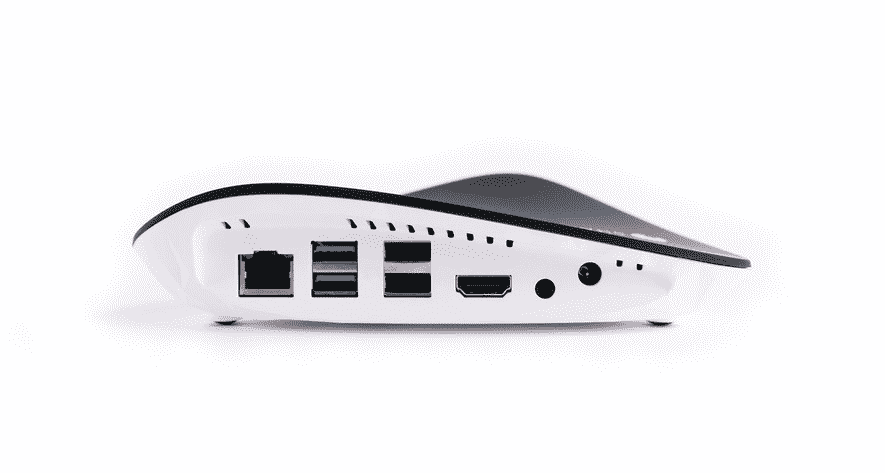
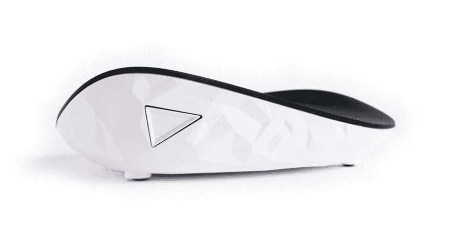

# Shadow 宣布为其云游戏服务 TechCrunch 推出新的盒子

> 原文：<https://web.archive.org/web/https://techcrunch.com/2018/08/23/shadow-announces-a-new-box-for-its-cloud-gaming-service/>

法国创业公司 Blade，影子公司(T1)背后的公司(T0)，正在(T2)更新它的物理盒子(T3)，让你可以连接到你的云计算机实例。Shadow Ghost 是一个微小的设备，它提供了所有的端口和无线技术，您可以将它插入电视或显示器并开始播放。

Shadow 已经为游戏玩家建立了一个[云计算服务](https://web.archive.org/web/20221025222805/https://techcrunch.com/2017/06/14/shadow-raises-57-million-for-its-cloud-computing-service-for-gamers/)。每月 35 美元，你就可以在附近的数据中心获得一台游戏电脑。Shadow 在英特尔至强 2620 处理器上提供 8 个线程，Nvidia Quadro P5000 GPU 的性能或多或少与 Nvidia GeForce GTX 1080 相当，12GB 内存和 256GB 存储。这是一个完整的 Windows 10 实例，你可以用它做任何你想做的事情。

该公司从第一天就开始使用专用盒子。第一个 Shadow box 是一个形状奇怪的黑盒子，有几个 USB 端口和显示端口。这样，你就可以用这个盒子替换家里的电脑，使用同样的外设。

当你打开它时，感觉就像你在启动你的游戏电脑，但实际上你只是启动了一台低功率 CPU 的电脑，它在云中连接到你的游戏电脑。

在过去的几个月里，Shadow 已经慢慢地将服务从您家中的物理设备中分离出来。当你订阅时，默认情况下你不会得到一个盒子。您可以在现有的电脑、手机或平板电脑上安装 Shadow 应用程序并开始播放。

如果你还想让这个盒子在没有现有 PC 的情况下连接到你的影子实例，你可以以每月 10 美元的价格租用它，或者以 140 美元的价格购买它。例如，它对于电视可能特别有用。

与上一代产品相比，Shadow Ghost 完全没有声音，因为风扇不见了——这是我对第一款 Shadow box 的主要抱怨。你也不需要那么多的加密狗，因为默认情况下有一个 HDMI 端口(而不是 DisplayPort)，它支持 Wi-Fi 和蓝牙。它也更加节能，因为它消耗的能量应该比现有的影子设备少三倍。

暗影幽灵将在 2018 年最后一个季度的某个时候以同样的价格上市。这项服务目前已在法国、德国、英国、比利时、瑞士和卢森堡推出。在美国，该公司在旧金山附近有一个数据中心，在东海岸还有一个。

