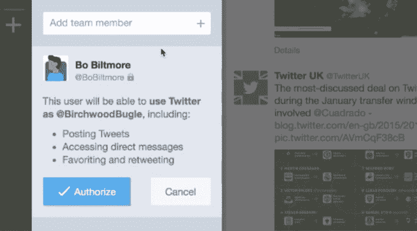

# Twitter 终于让你不用分享密码就能分享团队账号了

> 原文：<https://web.archive.org/web/https://techcrunch.com/2015/02/17/share-twitter-account/>

# Twitter 终于让你不用分享密码就可以分享团队账号了

如果你曾经试图和你的团队分享一个 Twitter 账户，你可能已经知道它很糟糕。

你可以分享密码，但是你会发现一个叫*的家伙*把密码写在笔记本电脑盖上的便利贴上，然后账户就被黑了。或者有人离开，现在 15 个人都需要学习新密码。

您可以使用第三方解决方案，但这样一来，您就会相信另一个第三方不会倒闭、不会被收购和关闭、不会在工作时间停机，而且最重要的是，不会因为自身原因而变得糟糕。

自 Twitter 推出以来的 10 年里，它从未着手构建自己的修复方案——直到现在。

像 Twitter 的许多以高级用户为中心的功能一样，新的团队工具内置在 TweetDeck 中，而不是更标准的 Twitter 客户端。

以下是开始使用它的方法:

*   下载/更新推板。该功能今天在网络/Chrome/Windows 版本上推出，暂时将 Mac 应用程序搁置在一边。(在 Mac 应用尚未准备好的情况下上线似乎……不明智。)
*   选择一个知道主要密码的客户经理，这个密码现在应该只对他们保密。如果你已经和几十个队友分享了你的密码，你就需要修改它，否则这几乎毫无价值。
*   让经理登录 TweetDeck 中的账户，然后让他们…
*   单击导航栏中的“帐户”。
*   在列表中点击您团队的帐户
*   通过输入框添加团队成员，然后设置他们的角色。投稿人可以发推文/转发/删除推文/关注和取消关注/等等。管理员可以添加/删除其他用户。
*   当有人离开时，让管理员将他们从团队列表中删除。Tada！无需批量更改密码。

一个条件:所有贡献的用户/管理员必须*也*使用 TweetDeck。