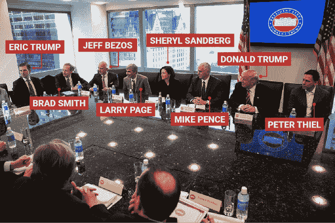

# 硅谷的假女权偶像终于露脸了

> 原文：<https://web.archive.org/web/https://techcrunch.com/2017/01/27/sheryl-sandberg-trump-gag-rule-facebook/>

经过一段时间的沉默，著名的酒肉女权主义者和脸书半神雪莉·桑德伯格终于站出来说话了！

桑德伯格没有反对特朗普政府——这显然是对她的价值观的冒犯，她的价值观已经卖出了 200 多万本《T2·向前一步》(Lean In)——但本周晚些时候，她在自己选择的平台上发帖谴责特朗普的第一天扩大了[全球禁言规则](https://web.archive.org/web/20230331003807/http://www.cnn.com/2017/01/23/politics/trump-mexico-city-policy/)。该法律将取消任何非政府组织的对外援助，即使是讨论堕胎作为病人的一种选择。是的，对于任何对女性健康稍有兴趣的人来说，这个政策是不好的。桑德伯格在这一点上是对的！那么，嗯，关于那个[女子三月](https://web.archive.org/web/20230331003807/https://www.womensmarch.com/)。

桑德伯格最近在脸书发布的唯一其他帖子涉及一个关于长距离游泳运动员的感觉良好的故事(hashtagged #LeanIn)和一个关于叙利亚难民奥运会选手的政治诽谤的感觉良好的故事，后者发生在就职典礼前夕。1 月 21 日，具有明确历史意义的妇女游行那天，桑德伯格没有出现在公众面前，也没有表示支持。相反，她舒适地退回到同样的“[震耳欲聋的 11 月后的沉默中](https://web.archive.org/web/20230331003807/https://pando.com/2017/01/26/lean-out-deafening-post-november-silence-sheryl-sandberg/)”,这种沉默对许多科技界女性来说并没有被忽视。

街上挤满了来自各行各业的女性，但对于桑德伯格来说，她围绕着一种特别致命的非政治化的白人女权主义建立了自己的个人品牌和部分财富，这似乎太政治化了。(谢丽尔，如果你读到这里，拿起一些[铃铛钩](https://web.archive.org/web/20230331003807/http://www.goodreads.com/author/show/10697.bell_hooks)！)

尽管如此，她还是抽出时间与特朗普举行闭门会议，就像硅谷其他卑躬屈膝的精英一样。

图片来自 Getty/商业内幕

在公开敌视女性的政府就职前几天举行的达沃斯世界经济论坛上，桑德伯格只收集了一些关于性别差异的可笑而贫乏的见解，没有一个植根于她周围发生的非常真实的事件，尽管她可能受到名利的影响。

正如《财富》杂志报道的那样:

> 周三，脸书·首席运营官·雪莉·桑德伯格**将她争取性别平等的斗争缩小到一个单一的敌人:广告中的性别刻板印象。**
> 
> “我认为不能夸大刻板印象的重要性，”她在瑞士达沃斯的一个小组讨论会上说，一年一度的世界经济论坛本周在这里举行。她说，这个问题是“我们面临的性别差距的根源”。

周四，她在[《脸书邮报》](https://web.archive.org/web/20230331003807/https://www.facebook.com/sheryl/posts/10158056267730177?pnref=story)上解释了她反对全球言论限制的立场，小心翼翼地踩在被认为是政治地雷的地方:

(值得注意的是，特朗普，或者更确切地说是彭斯，几周前桑德伯格坐在他旁边，已经将这一规则扩展到“前所未有的程度”，将其应用于所有全球健康基金。)

你知道什么比强烈反对国内政策争议更少吗？为其他国家将受到一项政策影响的所有妇女举一个例子，这项政策虽然非常糟糕，但在特朗普政府的背景下并不罕见。尽管这确实与她个人标榜的行善帝国主义非常吻合，这在硅谷类型中并非独一无二。

进入特朗普政府一周，这似乎是她唯一的反对意见(如果不是，请联系！).鉴于其长期以来直截了当的党派记录，桑德伯格反对全球言论自由规则的声明远没有谴责特朗普统治下发生的任何其他真正非常令人担忧的事情那样有争议，因为她的批评是针对彭斯和共和党当权派的。脸书真的不需要他们的任何东西。

正如 Vox 解释的那样:

> 自从罗纳德·里根于 1984 年在墨西哥城的一次联合国人口会议上首次实施全球禁言规则以来，它已经成为一种政治跷跷板(这就是为什么它也被称为“墨西哥城政策”)。比尔·克林顿一上任就立即废除了它。乔治·w·布什上台后立即恢复了它。随后巴拉克·奥巴马立即废除了。

事实上，彭斯是一个对堕胎犹豫不决的人——特朗普只是顺水推舟。桑德伯格的商业交易和税收返还的易变让特朗普担心，而不是他的意识形态更强的副总统。

没错，这更像是你一直听到的自由派内斗。但事实是，作为一名女权主义者，用某些标准来衡量其他女权主义者是完全可以接受的。尤其是那些身居高位的人，他们有时会发现自己坐在这个国家最有权力的人旁边(提示:是便士！).那些卖出了数百万本书，宣传某种淡化了的女权主义形式的公司可能会让[把我们带到这里](https://web.archive.org/web/20230331003807/https://www.nytimes.com/2016/11/10/opinion/white-women-voted-trump-now-what.html?_r=0)。哦，还有那些从假新闻故事的沙箱中发财的人，或者桑德伯格开玩笑地称他们为“[骗局](https://web.archive.org/web/20230331003807/https://techcrunch.com/2016/12/08/facebook-sandberg-2016-year-in-review/)”

桑德伯格的不是交叉的女权主义，也不是真正的女权主义。就像硅谷的许多虚伪一样，它只是嘴上说说，永远不会发展到下一个阶段。利用你在政治上有利的伪女权主义来卖书是很好的，但不要指望我们不叫你出来——当你在世界上最有权力的桌子上有一个真正的座位时。