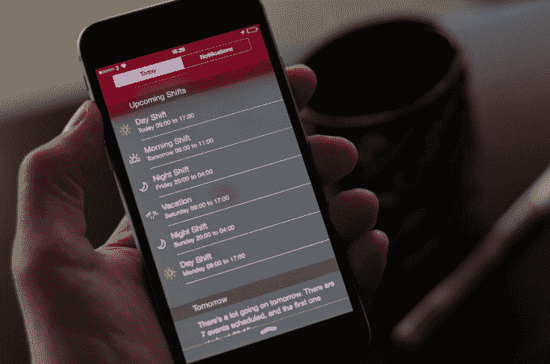

# Shift 是一款漂亮的移动日历应用，专为轮班工作者设计 

> 原文：<https://web.archive.org/web/https://techcrunch.com/2015/01/22/shifts-is-a-beautiful-mobile-calendar-app-designed-for-shift-workers/>

虽然现在的 App Store 上并不缺少移动日历应用程序，但大多数都是为了满足需要腾出时间参加电话会议或会议的办公室工作人员的需求而设计的。今天在 iTunes 上发布的一款名为[shift](https://web.archive.org/web/20221005083335/https://itunes.apple.com/us/app/shifts-shift-worker-calendar/id954023130?mt=8)的新日历应用程序则专注于不同的人群:那些轮班工作的员工，如护士、服务员、调度员、工厂工人等等。

该应用程序允许用户更容易地跟踪和安排他们的班次，与家人和朋友分享他们的时间表，甚至估计他们的月收入。

Shifts 由一家名为[雪人](https://web.archive.org/web/20221005083335/https://itunes.apple.com/us/artist/snowman/id524873456)的公司创建，该公司由瑞安·卡什和童年好友乔丹·罗森伯格在 2012 年共同创立。雪人已经在 App Store 上有了一些成功的应用，包括[提醒应用 Checkmark](https://web.archive.org/web/20221005083335/https://beta.techcrunch.com/2012/07/17/checkmark-brings-better-geofenced-reminders-to-iphone-mac-version-in-the-works/) 和一款名为 [Circles](https://web.archive.org/web/20221005083335/https://itunes.apple.com/us/app/circles-memory-game/id586168287?mt=8) 的记忆游戏，该游戏最近被评为星巴克的本周免费应用。

新班次应用程序的想法来自创始人的朋友，他们抱怨无法使用传统日历跟踪他们的工作日程。因为他们知道 Ryan 和 Jordan 开发了应用程序，所以要求他们考虑专门为他们开发一个解决方案。

Ryan 承认这个想法一开始对他们来说“并不那么令人兴奋”,但他们很快意识到这里有一个很大的痛点，他们可以通过转移来解决。

“…在做了一些研究并与更多人交谈后，我们了解到——根据最近的一项研究——美国有五分之一的员工在晚上、夜间或轮班工作，”他解释道。

一些研究称，在北美，这一比例可能高达 30%。我敢肯定，世界其他地区的数据也是类似的，所以这似乎有一个商业案例。”

[gallery ids="1109127，1109126，1109125，1109119，1109120，1109122，1109123，1109124"]

该团队暂时搁置了他们正在进行的名为 [Alto's Adventure](https://web.archive.org/web/20221005083335/http://altosadventure.com/) 的独立单板滑雪游戏，转而开发了 Shifts。

像该公司的其他应用程序一样，[shift](https://web.archive.org/web/20221005083335/https://itunes.apple.com/us/app/shifts-shift-worker-calendar/id954023130?mt=8)构建良好，设计精美，为轮班工人提供了一种轻松创建自己的定制轮班类型的方式，每个轮班类型都配置有自己的颜色、名称和图标，以便于识别。例如，早班可以用太阳来表示，医院的班可以用红十字来表示，等等。

创建班次类型列表后，您可以点击日历将任何班次添加到给定的一天。你每天最多可以添加两个班次，该应用程序还支持轮换和循环班次。

该应用还为 iOS 提供了一个 Today 小工具，允许员工直接从锁定屏幕或下拉菜单中查看他们的当前日程，而不必直接启动该应用。用户可以通过该应用程序与其他人分享他们的日程安排，即使他们没有注册使用轮班。

此外，因为你可以选择输入与你创建的任何班次相关的支付率，该应用程序还可以帮助你跟踪你那个月的预期收入。

您还可以在应用程序中的班次日历上覆盖您的个人日历，让您可以看到其他重要事件和活动，这可以帮助您进行规划。

在今天的发布会之前，在创始人的朋友和其他人中测试了 Shifts，以便重复这个想法并获得反馈。现在这款应用已经上线，该团队正在考虑未来如何将它扩展到 Apple Watch 上，可能会通过一个小部件来实现。

“我怀疑手表将在医疗行业发挥重要作用，如果有很多医疗专业人员使用它，我们希望让他们的生活更轻松，”Cash 说。

与雪人的许多应用一样，Shifts 是付费下载，因为该公司通过其优质产品创造收入。该应用程序目前在发布时以 1.99 美元的折扣价提供，但在推广期结束后通常会以 4.99 美元的价格出售。