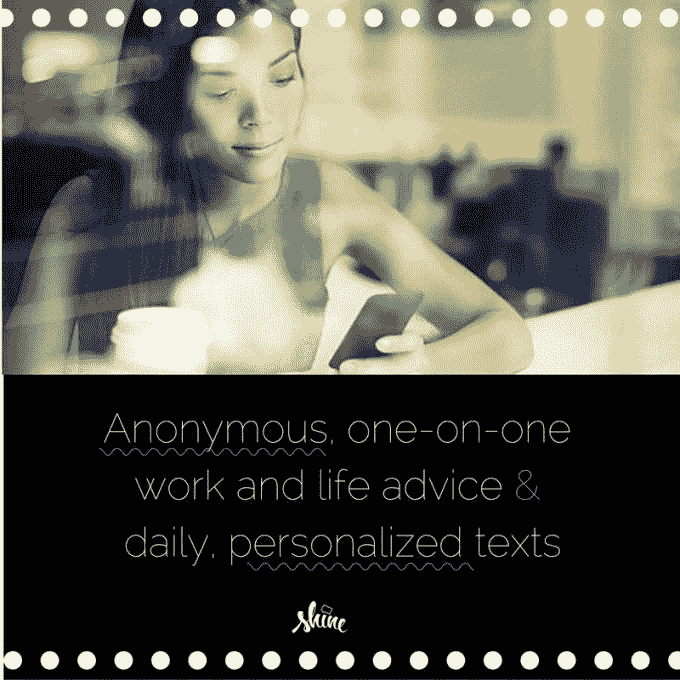
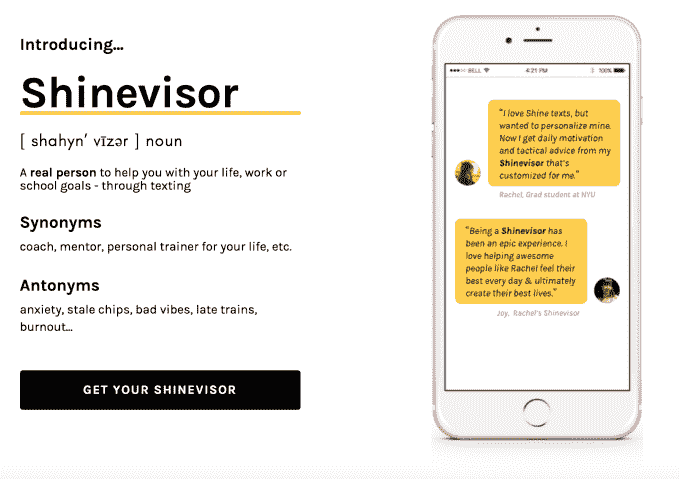

# Shine 通过短信 推出按需生活指导

> 原文：<https://web.archive.org/web/https://techcrunch.com/2016/10/12/shine-is-rolling-out-on-demand-life-coaching-via-text-message/>

一家名为 [Shine](https://web.archive.org/web/20230313195359/http://www.shinetext.com/) 的初创公司推出了一项新服务，通过短信提供[按需生活指导](https://web.archive.org/web/20230313195359/https://talk.shinetext.com/)，作为其免费日常短信服务的付费层。虽然今天的许多聊天机器人和基于短信的礼宾服务一直专注于通过短信帮助人们购物的，但迄今为止，Shine 一直专注于帮助你成为一个更好的人。通过自动短信，Shine 通过 SMS 或 Facebook Messenger 向用户提供日常自助、鼓励和建议。

随着 [Shinevisor](https://web.archive.org/web/20230313195359/https://talk.shinetext.com/) 的首次亮相，它正准备引入一种更加个性化的方式:来自真人的建议和指导，这些人是经过认证的生活、职业和学校教练。

大约一年前推出测试版的 [Shine 免费服务](https://web.archive.org/web/20230313195359/https://techcrunch.com/2016/06/23/shine-facebook-and-sms/)主要面向千禧一代。每天，它都会发送一条自动短信来解决生活中的问题。例如，我最近从 Shine 收到的文本已经深入探讨了一些话题，比如面对批评，试图放下控制一切的需要，克服拖延，练习耐心，学习自我怜悯等等。

许多文本都特别关注你在工作中会遇到的问题，尤其是女性在职业生涯中会遇到的问题。正如联合创始人娜奥米·平原诚司(Naomi Hirabayashi)在去年发布会上解释的那样，一半的女性表示对自己的表现和职业有自我怀疑的经历，相比之下，男性的这一比例为 31%。Shine 想解决这个问题。

每个 Shine 文本都以当天主题的介绍开始，对此您可以回复短信“M”(获取更多信息)。Shine 然后发送额外的见解，包括问题和手的原因和方式，以及通过网络链接进一步阅读。

截至今年夏天，该服务已经向几乎全部(88%)在 35 岁以下的用户群发送了超过 280 万条信息。如今，这个数字已经增长到 1000 万条信息，受众中 70%是女性。

现在，Shine 正在尝试其业务的下一阶段:个人一对一辅导。通过 Shinevisor，用户可以与认证教练联系，他们可以随时发送短信。

根据最近发给早期 Shine 用户的消息，许多成员一直在要求能够与真人交谈，以获得关于工作、学校和生活的建议。

这些顾问和教练在与用户联系之前首先要经过 Shine 的审查。她们必须获得正式教练项目的认证，许多人是通过企业家女性的[梦想家/实干家社区](https://web.archive.org/web/20230313195359/http://www.dreamersdoers.me/)推荐的，她们接受虚拟培训，以确保她们的教练在声音、精力和个性方面都是有品牌效应的。

然而，这项服务的费用并不便宜。Shinevisor 的价格相当高，每周 15.99 美元(按 12 周计费)。这几乎和治疗师的共付额一样贵(对那些有健康保险的人来说)，尽管它不像面对面的治疗。

相反，这位现实世界的生活教练会通过文本倾听你的发泄、你的问题和你的生活目标，然后以定制的建议、反馈和指导进行回复。他们还会发一些关于这个主题的文章，这样你就可以更多地了解你所面临的问题。付费会员保证每天至少发一次短信，而且短信是异步发送的。

Hirabayashi 解释说:“我们在移动平台上与人们会面。“所以你可以随时给你的教练发短信，他们会尽快回复你，反之亦然。因此，这是一次流畅的对话，而传统的辅导是一次固定的会议，”她说。

Hirabayashi 补充说，传统的生活教练一个小时的课程可以高达 250-300 美元，解释了 Shine 如何旨在提供一个更低成本的竞争对手。

然而，看看 Shine 是否真的能够将其年轻用户转化为这种级别的付费点播教练，应该会很有趣。毕竟，网上有如此多的免费支持——从博客和网站到电子邮件时事通讯，再到私人脸书支持团体等等。

与此同时，Shinevisor 介于那些寻求免费建议的人和那些致力于通过治疗或现实世界的导师来认真解决问题的人之间。

这项新服务仍处于测试阶段，目前正在通过文本向 Shine 用户推介，但也可以通过公司网站获得[，在那里你可以注册免费试用。](https://web.archive.org/web/20230313195359/https://talk.shinetext.com/)