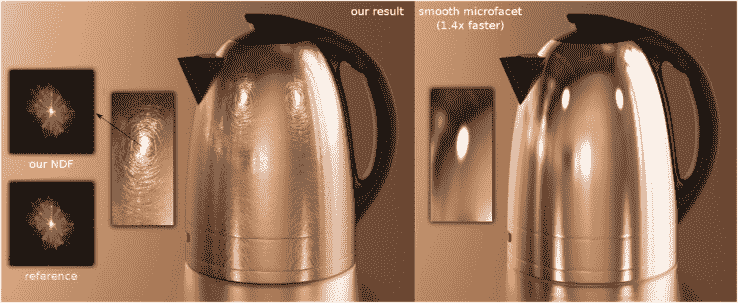

# 闪亮铬！在 CG 中渲染闪亮的表面变得更好了 

> 原文：<https://web.archive.org/web/https://techcrunch.com/2016/07/21/shiny-and-chrome-rendering-sparkly-surfaces-in-cg-just-got-massively-better/>

# 闪亮铬！在 CG 中渲染闪亮的表面变得更好了

随着游戏和电影中的图形越来越接近真实感，即使是最微妙的光线技巧也必须模拟。多年来，一项特别艰巨的任务是再现水、金属和其他材料的闪闪发光的凹凸不平的表面——但由于加州大学圣地亚哥分校计算机科学家的一项新技术，这些闪光现在可以比以前快 100 倍。

渲染这些镜面高光的问题在于，它们太复杂了。近距离观察，表面很少是完全光滑的，而是布满了微小的凸起和划痕——照射到表面的光会四处散射，产生我们非常熟悉的闪闪发光的斑点和线条。

自然，当然，渲染光线的方向是没有问题的，但是计算机必须执行成千上万的计算来创建一个精确的模拟。造假有捷径和方法，但没有真正的解决办法。

UCSD 的 Ravi Ramamoorthi 在新闻发布会上说:“目前还没有算法可以有效地渲染真实镜面的粗糙外观。这在现代计算机图形学中是极不寻常的，在现代计算机图形学中，只要有足够的计算能力，几乎任何其他场景都可以被渲染

使用该技术渲染所有这些小划痕只需要 1.4 倍的时间来渲染完全平滑。

Ramamoorthi 和他的同事在计算机图形学中走了一条不同寻常的路:在更低的层次上模拟这种现象。构成这些不平坦表面之一的每个像素被视为许多反光的“微表面”一些聪明的数学方法允许系统确定哪些微面相对于虚拟观察者反射光，然后根据正态分布在相似的微面中概括该信息。

使用这种“位置正态分布”技术可以产生高度精确的镜面反射效果——因为渲染器免去了检查每条光线如何与每个微小的划痕或凸起相互作用的麻烦，所以速度也快得多。

这种新技术高效呈现的照明和功能的另外两个示例:

 

研究人员将在下周的 SIGGRAPH 上展示他们的工作，但你可以在这里阅读全文(相当技术性的论文)。