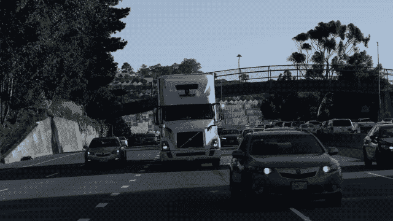
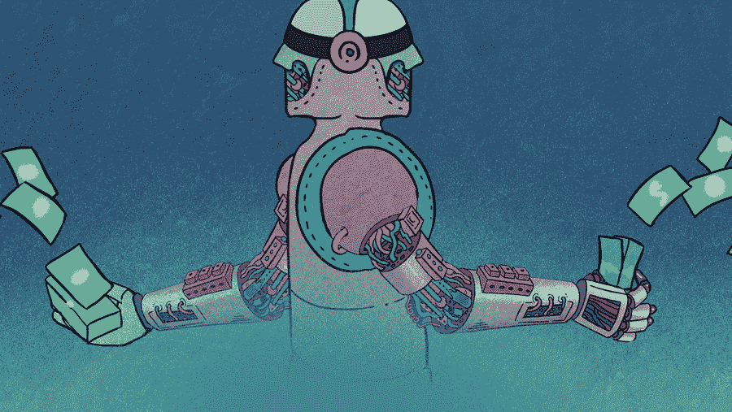

# 令人震惊的是，国会在监管自动驾驶汽车方面表现得很负责...那么下一步是什么？

> 原文：<https://web.archive.org/web/https://techcrunch.com/2017/09/10/shockingly-congress-acted-responsibly-in-regulating-autonomous-cars-so-whats-next/>

# 令人震惊的是，国会在监管自动驾驶汽车方面采取了负责任的行动……那么接下来呢？

More posts by this contributor

周三，不可思议的事情发生了。国会设法以明智的、两党合作的方式采取行动，将消费者、企业和政府的未来置于特殊利益政治和通常支配他们一举一动的考虑因素之前。

它没有得到太多的关注——如今很难与哈维、厄玛、唐纳德和金正恩竞争——但众议院能源和商业委员会一致通过了自驾车法案。

该法案让 NHTSA(美国国家公路交通安全管理局，联邦运输部的一个分支)更容易监管自动驾驶汽车的外观(而不是每个制造商和技术开发商都试图满足 50 个不同的州、数百个城市和数千个县的规则)，也更容易批准数十万辆自动驾驶汽车上路测试(在自动驾驶汽车能够在任何地方完全运行之前，需要进行数百万英里的集体测试)。现在该法案已提交参议院，但在广泛的两党支持下，它的机会看起来很大。

《自我驱动法案》是一个很好的开端，委员会的 54 名成员以明智、深思熟虑的方式行事值得称赞(当他们表现得像政客时，我们会毫不犹豫地批评他们)，但这仍然只是一个开端。

在向消费者提供任何真实世界版本的全自动驾驶汽车之前，监管方面还有很多工作要做。

*   **What about trucking?** Autonomous cars offer myriad benefits to society: far fewer accidents and injuries, far less traffic, far more productivity, and far more efficient use of vehicles. But so does autonomous trucking.The politics are more complicated because there’s at least a perception that autonomous trucking would replace human truck drivers (between the need for humans in the truck somewhere and the shortage of truck drivers anyway, if done right over time, there doesn’t have to be a lot of displacement) and there’s a central entity – the Teamsters – to weigh in politically and oppose any progress.

    但最终，国会需要像众议院委员会刚刚在汽车问题上那样，在卡车运输问题上采取专业和公正的行动，即使这会让吉米·霍法和他的成员不高兴(这是进步的代价)。虽然将卡车运输添加到参议院版本的自动驾驶法案中可能是一个坏主意(不值得拿整个法案冒险)，但最终的立法可能会授权 NHTSA 制定关于自动卡车运输的规则。

*   **Ethics and Insurance:** Beyond ensuring that autonomous vehicles are properly designed and that the rules of the road are logical and uniform, moving into a world of fully autonomous driving means resolving a number of high level policy issues.For example, accidents will still occur sometimes and autonomous cars and trucks will have to react to them. That forces choices for artificial intelligence just like it does for real people. You either swerve left to avoid smashing into the tractor trailer in front of you that just stopped short or you swerve right. On the left are two elderly people. On the right is a teenage girl. Your choice will hurt someone no matter what.

    指示你的自动驾驶汽车的动作的软件必须被编程来做一些事情。正确的答案既不容易也不明显。两辆自动驾驶汽车相撞会发生什么？谁有责任？在一个事故数量骤降的世界里，我们还应该要求每个人都有汽车保险吗？这对消费者公平吗？对经济有好处？有很多事情要解决。

*   **隐私和黑客:**国会采取了一些措施来解决自动驾驶汽车测试中产生的数据的隐私问题，但最终，当汽车本身设定路线并进行驾驶时，你去的任何地方都更容易被跟踪。这些信息可以与任何人分享:想卖给你东西的公司、政府机构、你的老板。有问题吗？应该对数据共享施加什么限制？而黑客把自动驾驶汽车变成武器呢？黑客攻击的威胁可以用来为不推进任何事情辩护，但这仍然是一个必须解决的现实问题。众议院的法案确实略微提到了网络安全(成立了一个网络安全顾问委员会)，但还需要更多。

布莱斯·德宾/

在我们生活在一个全功能自动驾驶汽车和卡车的真实世界之前，这些只是需要裁定和解决的一小部分问题。自治的好处是如此清晰和明显，甚至国会都能够认识到这一点。但是朝着正确的方向迈出一步并不能解决问题或解决问题。让我们走到这一步的势头必须继续下去，为了让监管变革跟上技术变革的步伐，它甚至可能必须加速。换句话说，让我们继续踩油门，这样总有一天，我们就不必踩油门了。