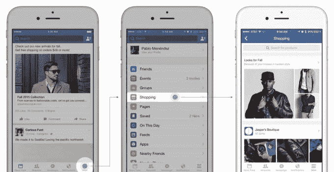
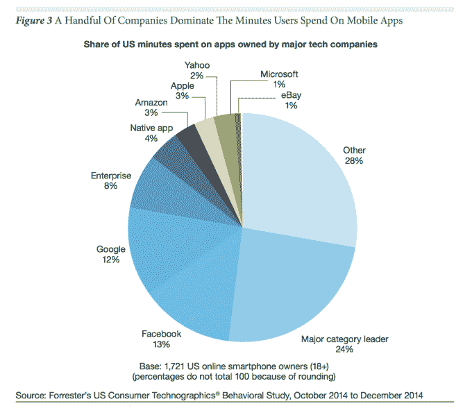
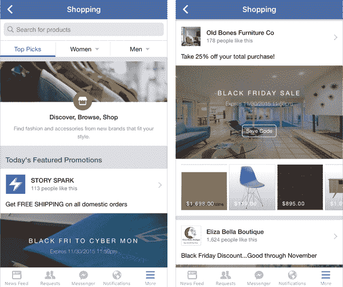
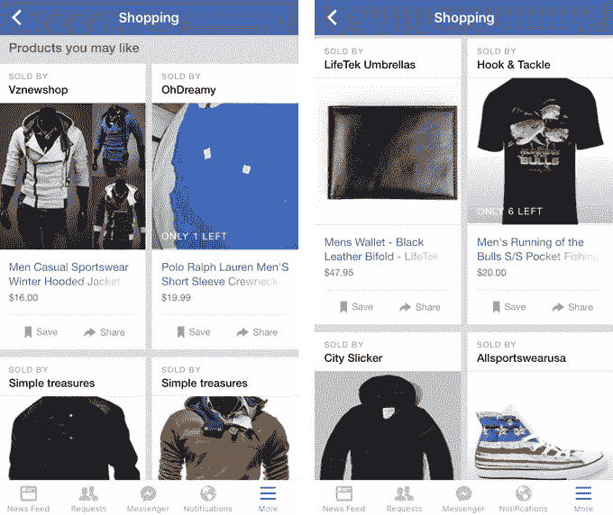
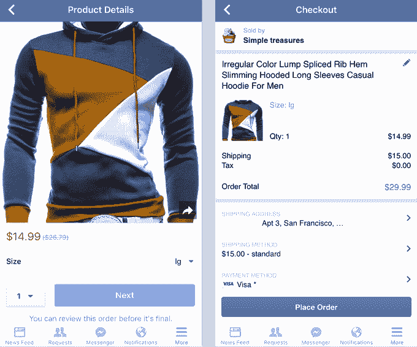
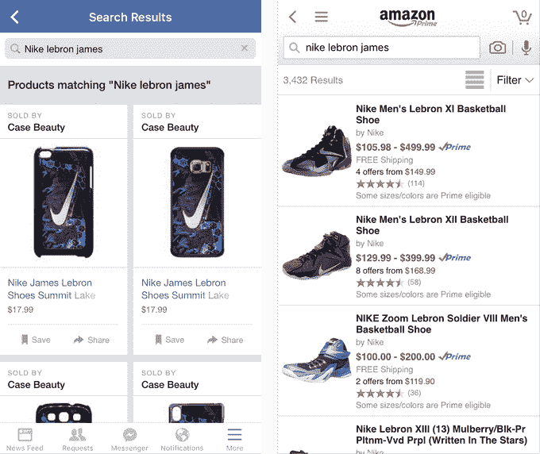
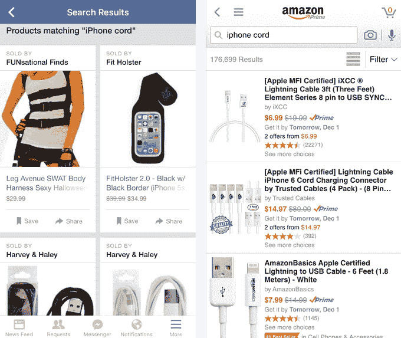
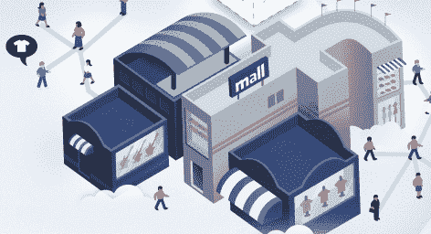

# 脸书不会凭借这种随意的购物信息打败亚马逊或 Pinterest 

> 原文：<https://web.archive.org/web/https://techcrunch.com/2015/11/30/shop-on-facebook__as-if/>

随机是描述脸书试图入侵亚马逊地盘的正确方式。由于产品选择少，没有评论，浏览选项有限，[脸书的专用产品提要](https://web.archive.org/web/20221007031253/https://beta.techcrunch.com/2015/10/12/facebook-commerce-updates)并不是一个购物的好方法。至少现在还没有。但这只是脸书的第一次尝试。它带来了大量关于你的知识，以及它作为人们在线时间最长的地方的地位。

目前，它最能帮助你找到你在新闻订阅中看到的一些很酷的东西。为了在购物方面取得成功，脸书将需要利用其独特的数据集来提供其他服务无法比拟的策展服务。这样，它就不需要索引地球上的每一个产品。只有你真正喜欢的。

## 对融入购物的追求

10 月推出的[脸书购物提要](https://web.archive.org/web/20221007031253/https://beta.techcrunch.com/2015/10/12/facebook-commerce-updates)目前在美国只有一小部分用户可以使用。这是 T2 脸书寻求吸收互联网的一部分。本质上，它希望最受欢迎的在线活动发生在脸书境内，在那里它可以收集数据、提供广告和联系人们，而不是在境外。这一战略的其他分支包括[托管视频](https://web.archive.org/web/20221007031253/https://beta.techcrunch.com/2015/11/04/facebook-video-views/)(而不是 YouTube)[即时文章](https://web.archive.org/web/20221007031253/https://beta.techcrunch.com/2015/10/15/smart-pipes-and-dumb-content)(而不是出版商的网站)[即时广告](https://web.archive.org/web/20221007031253/https://beta.techcrunch.com/2015/10/20/instant-ads/)(而不是品牌的网站)，在线购买按钮[，以及十几个其他功能和独立应用](https://web.archive.org/web/20221007031253/https://beta.techcrunch.com/gallery/the-internet-is-like-a-series-of-facebooks/)。

如果脸书能够吸收购物，并使其成为围墙花园内的一项常见活动，品牌将在社交网络中充斥漂亮的产品和广告资金来推广它们。它只需要利用现有的兴趣，因为脸书说，一项调查显示，50%的用户来脸书寻找产品。

但是很难在一个充斥着朋友照片和其他内容的分散注意力的新闻源中购物。这就是脸书建立购物频道的原因。脸书移动应用广告和商务产品营销负责人 Emma Rodgers 告诉 TechCrunch，这是一个浏览社交网络上展示的不同产品的单一地方。

脸书有几大优势，这让它有机会在网上商务这块蛋糕上分一杯羹。最重要的是，它有大量关于用户的人口统计、兴趣和活动数据，这些数据是从他们的个人资料、社交图表、喜欢和新闻订阅活动中收集的。但是，它缺乏对人们购买意图的了解，这些购买意图通常以关键词搜索的形式流向谷歌和亚马逊。

脸书已经参与其中，它只需要让用户相信购物不会打断他们的 Facebook 预订。这项服务占据了主要移动应用总使用时间的 13 %,位居第一。脸书也在慢慢增加其信用卡数据的收集，这让人们无需输入支付信息就可以立即购买产品。

问题在于，脸书在购物游戏上迟到了 20 年。亚马逊花了这些时间对世界上的商品进行分类，发展与零售商的关系，并建立产品推荐引擎。虽然人们可能对脸书的产品感兴趣，但他们不习惯有目的地在那里购物。偶然发现一件朋友分享的物品或广告可以很自然地融入社交体验。专门浏览搜索要买的东西，是教 15.5 亿老狗的一个很新的招数。

## 随意零售

脸书的购物提要可以从更多抽屉的活动和群组旁边的导航书签中访问。打开后，你会看到一个搜索栏，上面有男士和女士的选项，还有“今日特色促销”和“最佳选择”的商品。

首先，让我们深入了解促销活动。早在 2012 年，脸书就推出了一种让[页面分享优惠](https://web.archive.org/web/20221007031253/https://beta.techcrunch.com/2012/05/08/facebook-ecommerce-offers/)的方式，用户可以点击接收带有折扣促销代码的电子邮件。现在，脸书把它们放在购物提要的前面和中心，上面有一个光滑的优惠图片，上面有来自那个零售商的三个产品，你可以申请折扣。

看起来脸书想强调它能给你在别处得不到的特别优惠，这很聪明。例如，我在不同的商店看到 t 恤衫免运费、礼服衬衫 30%折扣、艺术品 25%折扣，或者我购买的整个家庭装修 25%折扣。

下面是你可能喜欢的产品。脸书告诉我，购物反馈测试主要集中在服装和配饰类别的实体产品上。它是根据你喜欢和做的事情，比如你在脸书的人脉、喜欢和兴趣，来展示与你相关的产品。目前，它没有使用你的活动，比如饼干，来通知你要展示哪些产品。

这些产品被放置在一个与 Pinterest 非常相似的两宽的砖石网格中。每一个都包括哪个商店出售它，一张照片，产品的标题，当前价格(可选删除以前的价格)，以及将商品保存到您的个人资料或与朋友分享的按钮。脸书在这里展示的产品的随机性使得浏览近乎无限的滚动提要显得漫无目的。当浏览随机收集的商品来买东西时，很难不觉得自己是消费主义的爪牙。

轻按产品会提供更多照片、产品详情、尺寸和数量选项、运输和退货政策以及购买按钮。在某些情况下，你会被穿梭到零售商的网站上完成购买，而有些产品可以通过你在脸书的付款细节无缝购买。零售商可以决定在哪里付款，但后者更方便。

重要的是，脸书不会像 2007 年马克·扎克伯格不得不道歉的灾难性的、侵犯隐私的 Beacon 功能那样，自动与朋友分享你的浏览或购买行为。

## 浏览蓝色

如果你对你想买的东西或至少是给谁买的有更多的了解，你可以打开顶部的女士和男士标签。它们揭示了服装、鞋子和箱包等类别，这些类别又进一步细分为包括衬衫、外套和配饰在内的箱子。

但是在这些部分中，偶然的自然再次破坏了体验。价格为 37 美元和 245 美元的西装被陈列在一起。运费在结账前是隐藏的，所以你会发现一些零售商用 15 美元的衬衫来引诱用户，而这些衬衫需要另外 15 美元才能送达。如果没有评论，就很难判断你在购物反馈中发现的一些不知名品牌和零售商的质量。

搜索体验可能更令人失望。我们已经习惯了排名靠前的结果的巨大索引，这些索引接近我们要搜索的内容。但在脸书，有限的产品库存意味着结果参差不齐，不相关的项目有时会出现在顶部。这是因为脸书只在移动页面上展示零售商测试其[商店功能时输入的产品。](https://web.archive.org/web/20221007031253/https://beta.techcrunch.com/2015/09/08/facebook-storefronts/)

脸书(左)不显示评论，与亚马逊(右)相比，它的产品选择非常有限

搜索“耐克·勒布朗·詹姆斯”会出现手机壳，而不是这位篮球明星的签名鞋。“iPhone cord”向我展示了在高价电缆出现之前的万圣节服装和手机套。更具体的品牌搜索带来零或很少的结果。相比之下，亚马逊总是能找到种类繁多、价格合理、评论丰富的商品。

总的来说，如果你想漫不经心地浏览古怪的产品，脸书可能会提供一点乐趣。但现在它肯定不是进行严肃购物、研究购买或寻找特定物品的合适场所。

与亚马逊(右)相比，脸书(左)很难准确地对购物搜索结果进行排名

## 做造型师，而不是商场

将脸书与行业领袖亚马逊相提并论是不公平的。目前的脸书购物频道更像是一个经过精心打造的最小可行产品。这就是为什么它只在一个小团体中测试。脸书正在努力学习。亚马逊是一个精心优化的产品，经过几十年的密集使用而精炼。

不过，这里最大的问题不是脸书如何执行它的购物提要版本，而是高层次的方向。也许有足够的时间，脸书可以达到作为一个综合购物目的地的库存覆盖率。它正在积极尝试为新闻内容建立搜索功能，这将让它更好地了解用户想要什么，而不仅仅是他们是谁。

但是从短期来看，脸书成为亚马逊和谷歌的替代者而不是竞争者可能会更好。

做到这一点最简单的方法可能是专注于使用其数据百宝箱来提出有针对性的建议。脸书可以获取它所知道的关于我们身份和行为的一切，并以匿名、隐私安全的方式显示与我们相似的人在谈论什么、拍照、点赞、点击和购买。这一战略将极大地受益于脸书在人工智能和机器视觉方面的投资。

本质上，脸书应该努力成为专业的店员或时尚的朋友，而不是购物中心本身。我们很忙，没有耐心，犹豫不决。不要给我们一百万种产品来选择。告诉我们有什么特别的。脸书可以依靠并理解其最大的资源:购物者的人性，从而在购物中取胜。