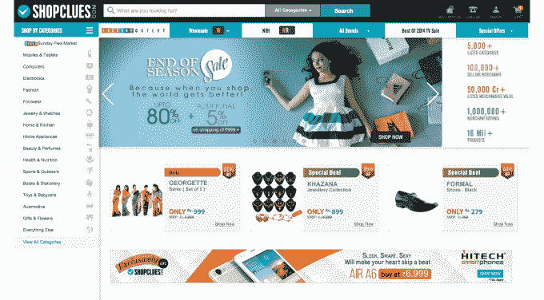

# 印度电子商务市场 ShopClues 获得由 Tiger Global TechCrunch 领投的 1 亿美元融资

> 原文：<https://web.archive.org/web/https://techcrunch.com/2015/01/19/shopclues-100-million/>

# 印度电子商务市场 ShopClues 获得由 Tiger Global 牵头的 1 亿美元融资

如今，印度的电子商务公司获得了更多资金，此前，引领该国采用市场模式的初创公司 ShopClues 完成了 1 亿美元的 D 轮融资。

老虎环球公司[在 2014 年底新筹集了 25 亿美元的资金](https://web.archive.org/web/20221206001034/https://beta.techcrunch.com/2014/11/26/tiger-global-raises-2-5-billion-for-new-deals/)，在这轮融资中处于领先地位。包括 Helion Venture Partners 和 Nexus Venture Partners 在内的现有投资者也参与其中。

ShopClues 成立于 2011 年，当时印度的大多数电子商务服务使用库存导向模式向消费者销售商品。Flipkart、Snapdeal 和其他公司已经采用了基于市场的系统，将第三方零售商和消费者匹配起来，但 ShopClues 是印度最先这样做的公司之一。

该公司表示，它有 10 万名卖家，提供超过 1000 万种产品。它打算在未来几年内将这些数字增长 100 倍，以帮助“为中小企业创造公平的竞争环境，使其能够在线上和线下与其他有组织的零售商竞争。”

ShopClues 声称，每月有 4000 万访客，同期交易量为 150 万笔。它声称其 70%的业务是与印度二三线城市的消费者打交道，并向 25，000 多个城市发货。

ShopClues 与其或许更杰出的竞争对手——如 Flipkart，该公司在 2014 年从投资者那里筹集了近 20 亿美元——之间的一个显著区别是，这家初创公司并不专注于电子产品和时尚等大件商品。相反，它表示“非结构化类别”占其收入的三分之二。

Tiger Global 是 Flipkart 的早期投资者，去年也参与了该公司的融资。它还投资了 Myntra，这是一个专注于时尚的电子商务平台，Flipkart 实际上在去年收购了 T4。Flipkart 正在寻求更多的投资和交易，这轮融资可能会使其与 ShopClues 保持一致，因为它们现在都有 Tiger Global。(Helion 也是 Flipkart 的投资者，通过收购 Letsbuy。)

Flipkart 并不是唯一一家可能会关注商店线索的公司。软银和易贝是 Snapdeal 的投资者，Snapdeal 本身去年筹集了更多资金，并将 Nexus Venture Partners 视为与 ShopClues 一样的投资者。同样，[杰夫·贝索斯给亚马逊印度开出了一张 20 亿美元的增长支票](https://web.archive.org/web/20221206001034/https://beta.techcrunch.com/2014/07/30/amazon-to-invest-2b-in-its-india-marketplace-as-competition-with-flipkart-intensifies/)，而且它[已经与印度的收购交易](https://web.archive.org/web/20221206001034/http://timesofindia.indiatimes.com/business/india-business/Amazon-ups-the-ante-looks-to-acquire-Jabong/articleshow/45303051.cms)联系在一起，包括火箭互联网支持的 Jabong。