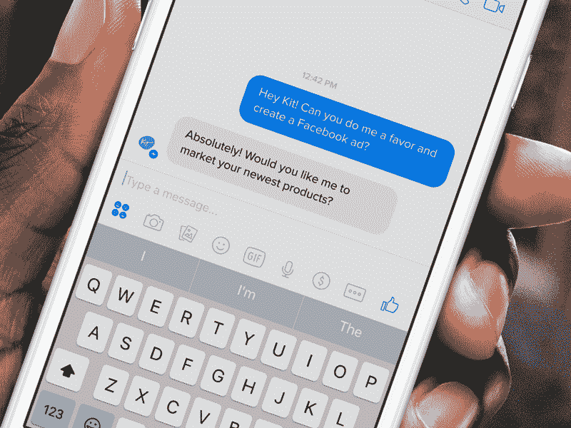

# Shopify 推出 Kit Favors，这是一种免费试用虚拟营销员工的方式 

> 原文：<https://web.archive.org/web/https://techcrunch.com/2016/10/25/shopify-launches-kit-favors-a-way-to-try-its-virtual-marketing-employee-free/>

# Shopify 推出 Kit Favors，这是一种免费试用虚拟营销员工的方式

Shopify 收购 [Kit](https://web.archive.org/web/20230129103741/https://www.kitcrm.com/) 似乎是一个耐人寻味的举动，旨在赋予小店主更多全员零售商的权力，使用虚拟助理来帮助补充营销等功能。现在，Kit 的自动化营销能力已经可供商家测试，他们希望在承诺“雇用”虚拟助手之前，看看这个风度翩翩的机器人有什么能力。

Shopify 针对 Kit 的新优惠功能将让它免费创建两个脸书广告活动，并推广两个脸书社交帖子(当然，你仍需向脸书支付广告费用)，它还会在顾客购买后向顾客发送前五封感谢邮件。这个想法是，它将基本上为店主免费工作，直到它基本上为你做了五次销售。

Kit 创始人迈克尔·佩里(Michael Perry)在接受采访时解释说，与 Kit 服务的基于时间的免费试用相反，进行这种试用的目的是为了帮助清楚地展示营销机器人对客户的潜在价值。佩里告诉我，尽管 Kit 已经取得了成功，但它实际上已经从免费试用期转向了新的 Favors 模式。

“我们从试用用户到付费用户的转化率超过 65%，按照行业标准，这是惊人的，”佩里说。“我们非常、非常有信心，这个比例实际上会上升。小企业主最担心的是，他们实际上一开始就怀疑 Kit 是否有用。”

佩里认为，通过降低门槛，甚至不需要将信用卡细节存档，将有助于说服甚至持怀疑态度的人给基特一个机会，并推动他们的转化率更高。很明显，Shopify 认为虚拟商店援助是它可以为小商家提供的很大一部分，这是有意义的，因为无论销售实际发生在哪里，这种产品仍然有价值，因为它可以与各种在线商店终端配合使用。

Shopify 在谈论和营销 Kit 时使用了很多拟人化的说法，甚至以第一人称撰写博客文章，并使用“租用”一词来指代其订阅选项，包括每月 10 美元的基本计划和每月 25 美元的 Kit Pro 服务。这是帮助 Kit 区别于其他营销自动化软件的一个关键区别，但下面的方法也更多地是帮助那些否则不会看这种产品的商家认识到它的好处。

使用 Shopify 自己的逻辑，新的 Favors 方法几乎就像是正式雇佣前的实习，这似乎是进一步扩大其商店运营机器人范围的一种聪明的方式。