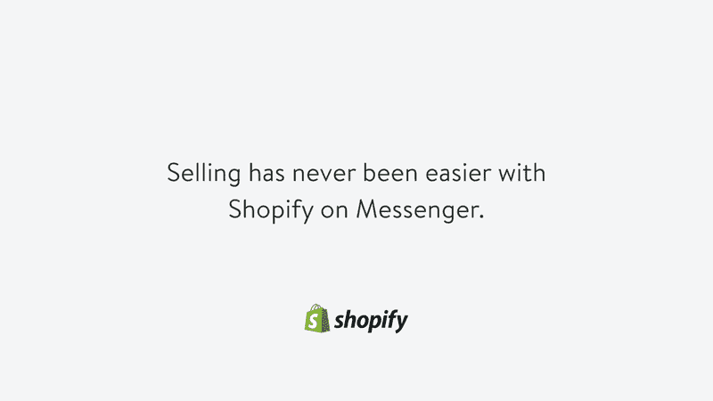

# Shopify 现在允许商店直接在 Facebook Messenger TechCrunch 上销售

> 原文：<https://web.archive.org/web/https://techcrunch.com/2016/10/05/shopify-now-lets-stores-sell-directly-in-facebook-messenger/>

Shopify 很早就为其商家提供了通过 Facebook Messenger 直接与客户对话的能力，现在它又推出了在商店和客户之间的信息中直接销售的能力。

这种集成的工作原理是，当客户使用 [Shopify 的 Messenger 销售渠道](https://web.archive.org/web/20230129103734/https://www.shopify.ca/messenger)与任何脸书商业页面商店开始对话时，为他们提供“立即购买”选项，这将显示该商家的整个产品目录，并让他们浏览和购买，通过 Shopify 的结账门户完成购买，该门户实际上完全在 Messenger 中运行，因此不需要往返。

Shopify 认为使用 Messenger 作为直接销售的载体有很大的潜力，但该公司承认，完全基于消息的购物体验还为时尚早，尤其是在北美市场。

Shopify 产品经理 Brandon Chu 在接受采访时解释说:“从最终消费者的角度来看，当你想与他们互动时，首先想到给企业发消息仍然是非常新颖的，所以这需要一些时间来赶上亚洲常见的一些互动。”“其结果是向过去零售的互联网版本转变，你走进一家商店，与商家分享你的一些问题或你正在寻找的东西。”

【T2

不过，朱棣文表示，对于 Shopify 的其他各种渠道来说，Messenger 是一个“非常好的补充渠道”，因为它允许商家通过该平台向客户发送订单状态收据等事情，这开启了一种直接关系，可能会导致服务内的直接购买等事情。

当我问及在 Messenger 中直接购物的未来潜力时，Chu 指出:“在未来几个月中，我们将利用一些非常重要的平台功能，以在聊天中保持更多的购买流。”。

第一个是不同的支付选项，Messenger 的 1.2 平台更新启用了这一功能，另一个是 web 视图的使用，它使用了 Messenger 提供的一个新功能，让开发人员可以在对话中设置 web 视图的高度。Chu 说这实际上是关键，因为这意味着你可以设置一个半高的 web 视图，为客户提供他们从商家的在线商店中寻找的信息，同时仍然让他们在他们通过 Messenger 进行的对话的上下文中保持可见。

Chu 还表示，他们正在设计尽可能适用于各种平台的消息工具，以方便未来的商家，但他补充说，Shopify 认为 Messenger 目前在北美市场上显然是最具影响力的。

在探索新的平台选项方面，Shopify 无疑是电子商务领域的领导者:最近推出的产品包括一个 [iOS 键盘，作为一个综合的后端工具包](https://web.archive.org/web/20230129103734/https://itunes.apple.com/app/shopkey-ecommerce-keyboard/id1081041575?mt=8)，供通过各种消息和社交应用进行销售的商家使用。在 Messenger 上下更大的赌注似乎是明智的，尤其是如果北美市场(正如许多人所希望的那样)能够更好地反映出亚洲等其他市场的移动状况。