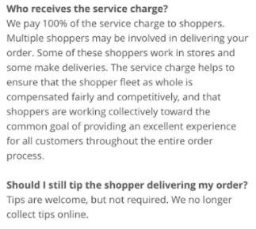
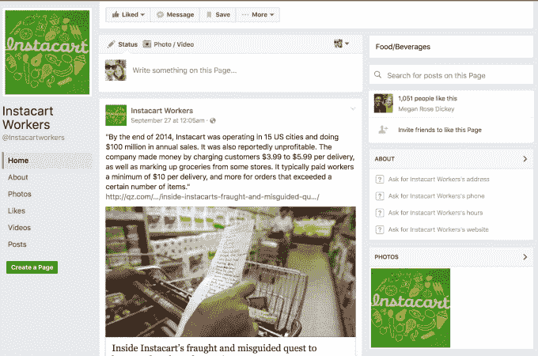
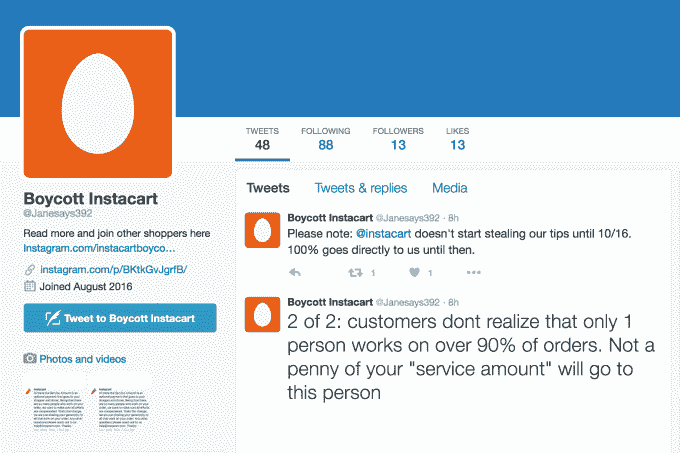
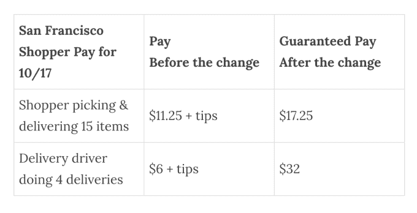

# 承包商正准备抵制 Instacart 取消小费

> 原文：<https://web.archive.org/web/https://techcrunch.com/2016/09/29/shoppers-are-preparing-to-boycott-instacart-over-elimination-of-tips/>

在线杂货服务 [Instacart](https://web.archive.org/web/20230404151039/http://instacart.com/) 正面临购物者的抵制，他们对该公司[决定取消小费](https://web.archive.org/web/20230404151039/https://news.instacart.com/2016/09/22/updates-to-improve-shopper-experience/)以提高保证送货率感到不满。尽管 Instacart [将这一举措定位为平滑其购物者收入曲线的一种方式，但一些受这一变化影响的人表示，这反而会大幅减少他们的收入。他们声称，在顶级购物者的情况下，一些人预计会损失高达 50%的收入。](https://web.archive.org/web/20230404151039/https://techcrunch.com/2016/09/22/instacart-raises-guaranteed-delivery-rates-removing-tipping-option/)

数百名购物者正准备在 10 月 16 日至 17 日进行全国性抵制，届时新的薪酬结构将生效。希望有足够多的人加入进来，影响工作量和交付时间，以迫使 Instacart 重新考虑这些变化。

然而，考虑到美国各地有成千上万的购物者，他们除了社交媒体和口碑之外没有真正的方法组织起来，这可能很难产生相当大的影响。

**没有小费，取而代之的是更高的保证交货佣金**

本月早些时候[公布了修改后的支付结构](https://web.archive.org/web/20230404151039/https://news.instacart.com/2016/09/22/updates-to-improve-shopper-experience/)，并在 TechCrunch Disrupt SF 2016 的采访中讨论了[。](https://web.archive.org/web/20230404151039/https://techcrunch.com/2016/09/22/instacart-raises-guaranteed-delivery-rates-removing-tipping-option/)当时，Instacart 首席运营官·拉维·古普塔[解释说](https://web.archive.org/web/20230404151039/https://techcrunch.com/2016/09/22/instacart-raises-guaranteed-delivery-rates-removing-tipping-option/)购物者可以从每次递送中获得大约 10-12 美元，而不是依靠每次递送加上小费大约 5 美元。他说，20%的 Instacart 顾客不会给小费，这对“购物者来说是一个非常艰难的经历。”

Instacart 的客户现在可以选择填写一个新的“服务金额”字段，这听起来很像小费。

Instacart 的文件称，“服务金额”完全支付给购物者。作为一名观察员，[乔恩·亨德伦在媒体](https://web.archive.org/web/20230404151039/https://piss.io/instacart-renames-tips-to-service-amounts-keeps-them-5b80de24f7d6#.fs63ykhoh)上指出，Instacart 告诉顾客*“小费是受欢迎的，但不是必须的。”*(亨德伦说他不是工人或常客，也没有参与抵制活动。)

自然，顾客可能认为服务金额基本上是新的小费领域，但它实际上更像是某种“小费分享”。资金回到 Instacart，然后 insta cart 将钱分发给订单上的工作人员，但按统一费率。

在某些情况下，店内购物者(员工)准备订单，然后交给司机。但在许多情况下，一个人既购物又送货。此外，店内购物者实际上是一名员工，而不是承包商——这一薪酬变化不会影响他们，因为他们的薪酬不同。

只有提供全面服务的购物者(承包商)受到影响。

https://twitter.com/Janesays392/status/781196999802490881

为了平衡收入， [Instacart 表示，作为从小费转移的一部分，它增加了送货佣金](https://web.archive.org/web/20230404151039/https://news.instacart.com/2016/09/29/clearing-misconceptions-about-the-shopper-payment-model/);在繁忙的日子里，这些佣金也会增加。前 25%的购物者将获得每周 100 美元的奖金。该公司解释说，这是对“大订单、长距离和其他情况”的额外支付。

顶级购物者说他们受到的打击最大

然而，一些购物者表示，该公司故意试图在服务费如何运作的问题上搅浑水。

“虽然有时会有两个人处理一个订单——‘店内购物者’和送货司机——但大多数时候只有一个人处理整个订单，”抵制活动的主要组织者(选择匿名)告诉 TechCrunch。“独立承包商是唯一受到新工资影响的人，而且从来不会有一个以上的独立承包商在处理一份订单。‘泳池’这个词绝对是误导，”他们说。

组织者还解释说，顶级购物者受这一变化的影响最大，因为他们可能会因为取消小费而每天损失 100 多美元。“每周 100 美元的奖金简直是个笑话，”他们嘲笑道。

“[Instacart 的]最忠诚、评价最高的购物者都被激怒了。希望最终实现盈利而降低我们的薪酬并不新鲜。Instacart 已经在 3 月份对我们这样做了，”他们补充道，指的是今年早些时候宣布的影响司机和购物者的减薪。

“但没有人真正关心 Instacart 的费率这么低，因为顾客给的小费太多了。组织者说:“到目前为止，我已经和 100 多名员工进行了一对一的交谈，没人想到会这样。”。

购物者通过口头传播、电子邮件和社交媒体组织抵制活动。有[Change.org 请愿](https://web.archive.org/web/20230404151039/https://www.change.org/p/instacart-com-give-instacart-shoppers-their-tips-back?recruiter=27191805&utm_source=share_for_starters&utm_medium=copyLink)，[推特账号](https://web.archive.org/web/20230404151039/https://twitter.com/janesays392)， [Instagram 账号](https://web.archive.org/web/20230404151039/https://www.instagram.com/instacartboycott/)，还有[公共](https://web.archive.org/web/20230404151039/https://www.facebook.com/Instacartworkers/)和私人脸书团体。

我们被告知，27 人已经签署了在他们当地领导抵制活动，这涵盖了所有主要城市，如纽约、旧金山湾区、洛杉矶和其他市场。

传单也分发给当地的购物者，并通过电子邮件分享。组织者说，昨天，100 多名购物者通过电子邮件收到了可打印的抵制通知。

然而，洛杉矶的组织者肯·巴顿(Ken Barton)表示，通过电子邮件进行组织具有挑战性，因为 Instacart 不会分享其承包商的姓名和电子邮件。与主要组织者合作，两人使用社交媒体将小组联系在一起。

巴顿也参与其中，因为这一变化，不像三月的减薪，影响了他们的小费。

“现在 Instacart 决定窃取我们的提示，以便将它们纳入公司的新收入流，我意识到我已经受够了，”他说。“我觉得我需要尽我所能组织购物者一起说出他们对公司和公众的担忧。”

与此同时，西雅图的一名组织者 Michael Rittman 指出，新的支付结构也会影响客户满意度，因为购物者只根据速度获得报酬，因此没有真正的动力来挑选优质商品或表现友好。

“小费占了我收入的一半左右——如果不是一半以上的话，”里特曼哀叹道。“我向我的老板抱怨过这件事，我会引用他对我的回应，‘我不想撒谎，像你现在这样赚钱会更难’”，他被告知。

在新的薪酬结构下，购物者的基本工资将增加 0.5 美元，每件商品增加 0.2 美元，但没有小费。这在购物者被骗的情况下很有帮助，但在 80%的情况下，购物者得到小费，这通常意味着他们可以赚得比以前少。

Instacart 则邀请购物者来讨论他们关心的问题。在今天发布的一篇新博文中[提到了这一点，文中还称薪酬实际上会增加，如下图所示:](https://web.archive.org/web/20230404151039/https://news.instacart.com/2016/09/29/clearing-misconceptions-about-the-shopper-payment-model/)

我们被告知，各种各样的组织者也报告说被私下邀请去和经理们谈话。然而，在这一点上，该公司并没有放弃其计划。

一封发给不满的购物者的电子邮件基本上解释了这是一个要么接受要么放弃的场景，即:

> 当新的更新在 10 月 24 日生效时，您将获得一份新合同。如果你觉得新系统不适合你，你可以选择不接受它。当然，在这种情况下，您将无法再访问该平台。看到你离开我们会很难过，但那是可行的。

“他们希望，在全公司范围内，所有期待公平待遇的购物者要么被解雇，要么停用他们的账户，这样一个全新的幼稚购物者舰队就可以介入并接管，”巴顿说。“人们总是在找工作。有很多新的购物者准备取代我们的位置，不管他们的报酬有多低，Instacart 正指望这一事实。”

也就是说，很难估计有多少购物者会在 10 月 16 日真正离开，因为没有真正的方法来跟踪那些承诺这样做的人。也就是说，[insta gram 账户](https://web.archive.org/web/20230404151039/https://www.instagram.com/instacartboycott/)拥有超过 100 名粉丝，这是另一个可见的指标。

**【一小部分人】**

Instacart 发言人拒绝具体评论抵制行为，但表示该公司“与购物者有着直接和开放的关系”，它所做的所有改变实际上都是基于购物者的反馈。这位发言人说，事实上，购物者最大的抱怨之一是他们的太多补偿都被绑在了小费上。

“明确地说，我们听到了很多积极的反馈。有一小部分人对此感到愤怒并大声疾呼，这完全是他们的权利。但是我们并不担心。我们认为误解会得到澄清，”他们补充道。

然而，该公司必须非常努力才能实现这一目标。该公司通过电子邮件进行沟通，在电话上与承包商交谈，接受反馈，甚至在美国的许多地方主持开放办公时间。

但最终，Instacart 认为薪酬变化符合所有人的最佳利益。“我们必须做出对所有顾客都有意义的决定，我们不能把它建立在少数顾客的基础上，”一位发言人说。

[这里的](https://web.archive.org/web/20230404151039/http://pastebin.com/f8axprzj)是购物者收到的详细介绍这些变化的电子邮件:

[gallery ids="1394719，1394718，1394717，1394716，1394715，1394714，1394713"]