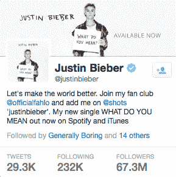

# Shots 又筹集了 400 万美元，努力夺回自拍权 

> 原文：<https://web.archive.org/web/https://techcrunch.com/2015/09/08/shots-raises-another-4m-as-it-strives-to-reclaim-the-selfie/>

自拍可能是我们这一代的社交货币，但围绕自拍的公司仍然需要现金。

因贾斯汀比伯等知名名人支持者而出名的自拍应用，刚刚获得 DCM Ventures 领投的 400 万美元融资，继今年 4 月获得的 850 万美元首轮融资后，又获得了 400 万美元融资。该公司迄今已筹集了 1520 万美元。

沙希迪在 Biebz 上发帖

就这款应用的易用性而言，Shots 无疑是最吸引人的社交媒体应用之一。

一方面，Shots 建立在上传自拍的前提下，这种“现象”经常被老年人与我们这一代人的“猖獗的自恋”联系在一起。但 Shots 也是一款与众不同的应用，它将自拍作为一种自我表达的方式，而不是一种企业自我品牌。

Shots 引以为豪的是，照片和视频比人们对它们的反应更重要。你可以关注像比伯这样的朋友或名人，但在实际使用该应用程序的过程中，你不会被“喜欢”的嫉妒所困扰，因为该应用程序不允许你看到其他用户的关注者或喜欢数。

Shots 由约翰·沙希迪和他的兄弟萨姆于 2013 年创立，主要使命是创建一个反欺凌的社交网络。在创造一个更安全的空间的过程中，最先被抛弃的功能之一就是评论。

约翰发来的一封[中型邮件](https://web.archive.org/web/20221209101347/https://medium.com/@john/the-driving-force-c94a40c6920f):

> 你的社会地位在镜头里并不重要。而是用一张图表达自己的感受，这也是我们不允许评论的原因。我们永远不希望我们的用户因为他们在社交媒体上读到的关于自己的内容而受到伤害或欺凌——这是关于发出你内心感受的信号。

我读过很多这些关于应用程序改变世界的理想主义描述，我的狗屁 o-meter 在这里被大肆宣传，但在实际与 Shahidi 聊天后，很明显他支持这一使命。

整个应用程序专注于这种积极的态度，使用该应用程序的高知名度人物在某种程度上使这种态度更加真实。

[tweet https://Twitter . com/FloydMayweather/status/636709234365870080 align = ' center ']

Shots 试图对社交媒体少用一种“[我的生活是毒品，我做毒品屎](https://web.archive.org/web/20221209101347/https://www.youtube.com/watch?v=OQD_JHHF748)”的哲学。

沙希迪告诉我:“当你查看[名人]的照片时，你会注意到他们都在使用这个应用程序。由于你不能从相机胶卷上传或使用特效，你真的觉得你在非常个人化地观察他们的生活。"

Shots 的社区已经发展到占据了互联网上一个相当有趣的角落，这很大程度上是由于比伯积累的追随者。

从 [Shots 的推特账户](https://web.archive.org/web/20221209101347/https://twitter.com/shots)上的互动来看，该应用的大量用户似乎是想更深入地了解他们崇拜的名人的生活的人。

事实上，大多数积极参与拍摄的人都是十几岁的女孩。Shahidi 告诉我，超过 75%的 Shots 用户是女性，用户的平均年龄只有 16 岁。

这在应用程序上形成了一种奇怪的哲学动态。随着青少年用户在他们最人性化的时刻蜂拥而至去关注和提升名人偶像，该应用经常无法避免喂养与它的使命相矛盾的名人痴迷兽。尽管如此，比起 Instagram 等应用程序延续的“我在出售”文化，Shots 展示的更坚韧、修剪更少的名人形象可能对旁观者更健康。

对于 Shots 销售的所有理念，当您剥离 Instagram 风格的主订阅源时，您会得到一个与 Snapchat 中的 Stories 功能非常相似的应用程序。Snapchat 是一家明显不那么理想化的公司，但仍然取消了公众关注和评论，这是 Shots 的关键卖点。Snapchat 缺少的是一个建立在这种文化基础上的核心社区。

Shots 用户在他们的社区内越来越投入，尽管其用户群可能比人们对一个拥有如此高知名度支持者的应用程序的预期要小。Shots 最近一次发布用户数据是在今年 4 月，当时他们的参与度为 500 万，约有一半的用户每天都会查看该应用。

Shahidi 承认，Shots 的核心理念可能在某些方面限制了它的短期增长，而 Instagram 等应用还没有遇到这种情况，但他也认为，Shots 成功的关键是为其社区创造一种在其他地方找不到的体验。

沙希迪说:“仔细想想，社交网络是关于数字友谊的，最好的友谊是那些真正需要时间来建立的友谊。”