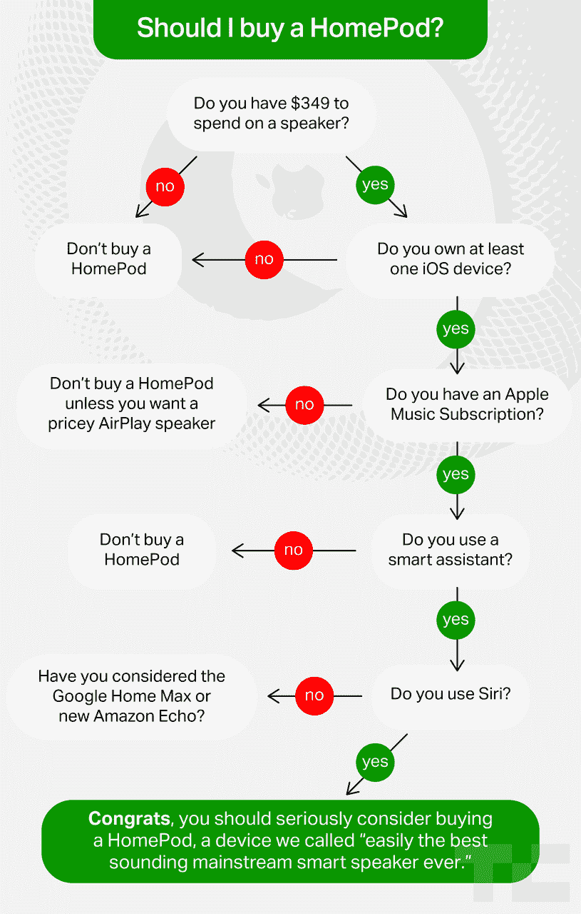

# 我应该买苹果 HomePod 吗？

> 原文：<https://web.archive.org/web/https://techcrunch.com/2018/02/06/should-i-buy-an-apple-homepod/>

# 我应该买苹果 HomePod 吗？

如果你想读很多关于苹果 HomePod 的单词，你可以在这里读[和在这里](https://web.archive.org/web/20221210065643/https://beta.techcrunch.com/2018/02/06/a-four-sentence-homepod-review-with-appendices/)读[。显然，我会建议你在花 350 美元血汗钱购买第一代产品之前这么做，但不管是长是短，事实上都很简单。苹果制造了一个非常好的扬声器——可以说是同类产品中市场上最好的。](https://web.archive.org/web/20221210065643/https://beta.techcrunch.com/2018/01/26/up-close-with-apples-homepod/)

但是有一些警告。通常情况下，苹果公司制造了一款适合其基础的设备——因此，在考虑购买之前，这里包含的几个大星号非常重要。

这里有一个便于理解的流程图。

*布莱斯·德宾的图表设计*