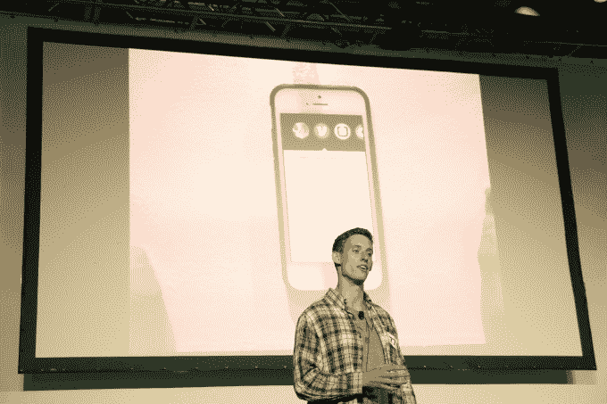

# 与朋友共浴赢得 Disrupt SF 2014 黑客马拉松大奖，闪电战和互动减价获得亚军 

> 原文：<https://web.archive.org/web/https://techcrunch.com/2014/09/07/shower-with-friends-wins-the-disrupt-sf-2014-hackathon-grand-prize-blitz-and-interactive-markdown-are-runners-up/>

# 与朋友一起洗澡赢得 Disrupt SF 2014 黑客马拉松大奖，闪电战和互动减价获得亚军

上周末，132 个团队在 TechCrunch Disrupt SF 2014 黑客马拉松上不知疲倦地工作，提出他们巧妙的黑客和创作。在充满 Nerf 枪支、披萨和睡眠不足的漫漫长夜结束时，各队在 Disrupt 舞台上向世界展示了他们的黑客技术，以进行最终评审。下午快结束的时候，评委们召集起来，决定把大奖颁给和朋友一起洗澡。不，不是你想的那样。

## 赢家

[和朋友一起淋浴](https://web.archive.org/web/20221226064802/https://techcrunch.com/2014/09/07/shower-with-friends-lets-you-gamify-water-consumption/)是一个硬件黑客，通过监控你的淋浴流量来帮助你管理你的用水量。伴随硬件黑客的是一个移动应用程序，让你与你的朋友竞争谁能洗最短的澡。与朋友一起淋浴，你会得到提醒，与前一天或前几天相比，你今天淋浴了多长时间，用了多少加仑的水。然后，你可以与你的朋友圈分享这些数据，并参加比赛。你也可以挑战你的朋友——类似于冰桶挑战——消耗更少(或同样多)的水。

## 亚军:闪电战

[Blitz](https://web.archive.org/web/20221226064802/https://techcrunch.com/2014/09/07/blitz-lets-you-create-shortcuts-to-your-favorite-ios-apps/) 是一款 iOS 应用程序，提供了 iOS 应用程序中特定页面和功能的通知屏幕快捷方式。例如，你可以保存一个快捷方式，点击它，谷歌地图就会显示你家的路线。或者你可以点击优步应用程序的快捷方式，它会显示从你所在位置到另一个位置的优步的当前价格，只需点击一下就可以为你调用服务。该功能利用了深度链接和来自 Venmo、Yelp 等应用的 API。这项功能首次在 iOS 8 中提供，将允许经常在单调乏味的任务上浪费时间的用户以更高的效率使用他们的手机。

## 亚军:互动降价

Interactive Markdown 由、Henry Shi、Kartik Talwar、和 Zach Latta 创建，是一个 Chrome 扩展，允许你在浏览器前端运行后端代码。它是开源的，在 GitHub 上，这意味着你今天就可以使用它。该扩展最令人印象深刻的特性之一是不仅能够在浏览器中运行客户端代码，还能够运行服务器端代码(如 Python、Ruby、Node、Java 等)。)甚至完整的安卓应用。该团队在 DigitalOcean 上建立了一个复杂的 CoreOS 集群，通过优化的 VNC 动态反向代理直接向网络画布提供 Android 移动应用的直播。这种流媒体可以在桌面和移动设备上运行。他们还在 docker 中建立了一个构建过程，允许在用 Go 编写的通用后端平台上运行多种语言。

作为黑客马拉松的获胜者，与朋友共浴将获得 5000 美元的奖金，前三名团队还有机会在 TechCrunch Disrupt SF 的舞台上展示他们的产品。除了这里列出的获奖者，TechCrunch 的 API 合作伙伴还颁发了几个奖项，包括 iPad minis、Xbox One 游戏机等，奖励给那些展示了创造性使用其公司内容的团队。

我们今年黑客马拉松的评委[包括](https://web.archive.org/web/20221226064802/https://techcrunch.com/2014/09/02/announcing-the-disrupt-sf-hackathon-judges-and-api-workshops/)网飞产品创新总监斯蒂芬·加西亚；谷歌 Android 用户研究主管 Jhilmil Jain 博士；Gumroad 创始人兼首席执行官 Sahil Lavingia 摩根·米森，Main 的创始人；AKQA 集团技术总监 Nicholas Mitrousis。